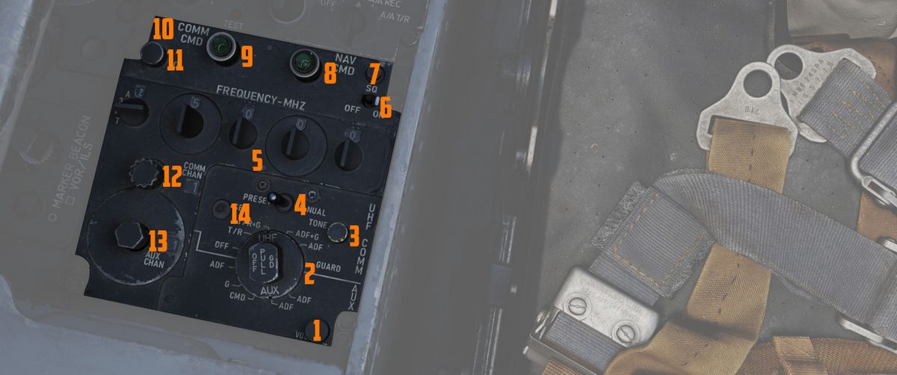

# 后部

左侧控制台的后部装有通信和导航相关的控制开关/按钮。

## TACAN 控制面板

[TACAN](../../../systems/nav_com/tacan.md) 控制面板用于输入所需的
[TACAN](../../../systems/nav_com/tacan.md) 波道、模式和音量，以便机组人员监控所需的波道。两个驾驶舱
中都有塔康面板，机组可通过通信控制面板上的 NAV CMD 按钮选择指令
[TACAN](../../../systems/nav_com/tacan.md) 接收机的面板。

### 波道旋钮

控制面板上有两个导航波道控制旋钮，左侧控制波道值的前两位数（百和十），右侧控制单位数（一）值。右侧
旋钮还包括一个外环，用于设置所需的 [TACAN](../../../systems/nav_com/tacan.md) 波道的 X 或 Y 波段。

### 测试按钮和指示灯

这两个旋钮之间是 TEST 按钮，用于执行预热后的地面测试循环，也可用于对系统性能进行飞行信心测试。

按钮上方的灯亮起指示测试状态。

详见 [7.19.4 导航测试章节](../../../procedures/bit_tests/navigation_tests.md#tacan-test)。

### 音量旋钮

右上方的音量旋钮可用于设置接收到的 [TACAN](../../../systems/nav_com/tacan.md) 台的音量。

### 功能选择旋钮

[TACAN](../../../systems/nav_com/tacan.md) 功能选择旋钮分别决定在
[HSI](../../pilot/flight_director_group.md#horizontal-situation-indicator)、[ADI](../../pilot/flight_director_group.md#attitude-director-indicator),
和 [BDHI](../../wso/upfront_indicators.md#bearing-distance-heading-indicator-bdhi) 上提供的信息类型
和显示方式。

| 名称    | 描述                                                                                                                                                                                                                                                                                                                                  |
| ------- | ------------------------------------------------------------------------------------------------------------------------------------------------------------------------------------------------------------------------------------------------------------------------------------------------------------------------------------- |
| OFF     | [TACAN](../../../systems/nav_com/tacan.md) 接收机断电并脱机。                                                                                                                                                                                                                                                                         |
| REC     | [TACAN](../../../systems/nav_com/tacan.md) 接收机通电，在 [HSI](../../pilot/flight_director_group.md#horizontal-situation-indicator)、[BDHI](../../wso/upfront_indicators.md#bearing-distance-heading-indicator-bdhi) 和 [ADI](../../pilot/flight_director_group.md#attitude-director-indicator) 中提供方位信息。                     |
| T/R     | 激活[TACAN](../../../systems/nav_com/tacan.md) 的收发功能，将为 [HSI](../../pilot/flight_director_group.md#horizontal-situation-indicator)、[BDHI](../../wso/upfront_indicators.md#bearing-distance-heading-indicator-bdhi) 和 [ADI](../../pilot/flight_director_group.md#attitude-director-indicator) 提供海里为单位的距离信息。     |
| A/A REC | [TACAN](../../../systems/nav_com/tacan.md) 接收机解码兼容飞机传输的方位信息并提供给 [HSI](../../pilot/flight_director_group.md#horizontal-situation-indicator)、[BDHI](../../wso/upfront_indicators.md#bearing-distance-heading-indicator-bdhi) 和 [ADI](../../pilot/flight_director_group.md#attitude-director-indicator) 转向显示。 |
| A/A TR  | [TACAN](../../../systems/nav_com/tacan.md) 接收机接受飞机传输的方位和距离信息并在 [HSI](../../pilot/flight_director_group.md#horizontal-situation-indicator) 和 [BDHI](../../wso/upfront_indicators.md#bearing-distance-heading-indicator-bdhi) 中显示。                                                                              |

> 💡 空对空 [TACAN](../../../systems/nav_com/tacan.md) 功能要求将波道 > 设置为高于或低于协作飞机
> 63，但波段相同 - X 或 Y。即，一架 > 加油机在 123Y，F-4 应当设置为 60Y。

## 通信控制面板

WSO 可在通信控制面板中操作 [UHF 电台](../../../systems/nav_com/uhf.md) 开关和模式。

### 指令按钮

两个驾驶舱中的面板是相同的，通过按下各自驾驶舱中的 COMM CMD 按钮来决定电台的控制权；亮绿灯表示为优
先的驾驶舱。同样，NAV CMD 按钮决定了哪个驾驶舱可以控制 [TACAN](../../../systems/nav_com/tacan.md)
设置；拥有系统指挥（控制）权的驾驶舱将量绿灯表示。

### 电台音量

COMM CMD 按钮下方是对应驾驶舱的无线电台音量调整旋钮。

### 静噪开关

靠近 NAV CMD 按钮的是静噪开关，用于启用或禁用接收机静噪。

### 频率和波道

A-3-2-T 选择旋钮设置 [UHF 无线电台](../../../systems/nav_com/uhf.md) 手动选择频率（3 或 2）的首位数
字。

> 💡 由于模拟器的限制，未模拟属于 HAVE-Quick 功能的 > 模式 A 和 T。

四个频率选择旋钮与 A-3-2-T 旋钮和预设/手动开关协同工作。从 A-3-2-T 选择旋钮上的 3 或 2 开始输入频率
，频率输入区间为 225.00 至 399.975 MHz，增量为 0.025。当预设/手动开关处于手动档位时，UHF 电台将直接
设置到显示出的波道。在预设档位，可以将设定的波道输入 COMM CHAN 存储器中，并通过通信波道控制旋钮（预
设/手动开关左侧较小的旋钮）选择所需的档位，然后显示在 COMM CHAN 窗口中。使用 SET 按钮可将波道存储到
显示出的预设波道中。存储波道后，可在预设/手动开关处于预设档位时使用通信波道控制旋钮直接选择预设波道
。

位于通信波道控制旋钮正下方是辅助波道旋钮和指示灯。控制旋钮用于访问 20 个无法在驾驶舱内更改的常用预
设波道。

面板右下方的辅助音量控制旋钮可以提高或降低辅助接收机通道的音量。

### 音调按钮

音调按钮用于向需要更新日分时的友机传输日分时 (TOD) 信号和音调，以确保 HAVE-Quick 功能正常运行。

> 💡 由于模拟器的限制，未模拟属于 HAVE-Quick 功能的 > 音调按钮。

### 通信功能旋钮

通信功能选择旋钮决定无线电台系统的当前配置。

| 名称      | 描述                                         |
| --------- | -------------------------------------------- |
| OFF       | 所有 UHF 电台关闭。                          |
| T/R ADF   | 通信接收机 - 接收通信。                      |
|           | 通信发射机 - 通信传输。                      |
|           | 通信救生接收机 - 待机。                      |
|           | 辅助接收机 - 接收 ADF。                      |
| T/R+G ADF | 通信接收机 - 接收通信。                      |
|           | 通信发射机 - 通信传输。                      |
|           | 通信救生接收机 - 接收救生通信。              |
|           | 辅助接收机 - 接收 ADF。                      |
| ADF+G CMD | 通信接收机 - 接收 ADF。                      |
|           | 通信发射机 - 通信传输。传输时中断 ADF 。     |
|           | 通信救生接收机 - 使用 ADF 天线接收救生通信。 |
|           | 辅助接收机- 接收通信。                       |
| ADF+G     | 通信接收机 - 接收 ADF。                      |
|           | 通信发射机 - 通信传输。传输时中断 ADF 。     |
|           | 通信救生接收机 - 待机。                      |
|           | 辅助接收机- 接收救生通信。                   |
| Guard ADF | 通信接收机 - 接收救生通信。                  |
|           | 通信发射机 - 传输救生。                      |
|           | 通信救生接收机 - 待机。                      |
|           | 辅助接收机 - 接收 ADF。                      |

### 座舱高度表

显示驾驶舱内的当前气压，以 1000 英尺为单位表示平均海平面以上的等效有效座舱高度。

也就是说，如果压力表读数为 5，则座舱内的压力相当于在海拔 5000 英尺（MSL）处。

为防止疾病和缺氧，应观察压力并相应调整供氧：

| 压力区间                | 描述                     |
| ----------------------- | ------------------------ |
| 低于 13000 英尺         | 正常呼吸空气             |
| 13000 英尺 - 40000 英尺 | 通过氧气面罩吸氧         |
| 40000 英尺 - 62000 英尺 | 通过氧气面罩呼吸加压氧气 |
| 超过 62000 英尺         | 需要穿戴代偿服（不可用） |

详见 [氧气章节](../../../systems/utility.md#oxygen-system)。

## 氧气储量表

显示区间为 0 到 10 升。仪表断电时仪表表面将出现断电旗。

## VOR/ILS 音量控制

音量控制由两个旋钮组成：一个方形旋钮——用来调整 VOR 和航向信标音量，而圆形旋钮用来控制指点信标音量。

详细信息见 [3.3.4 VOR/ILS 章节](../../../systems/nav_com/vor_ils.md)。
