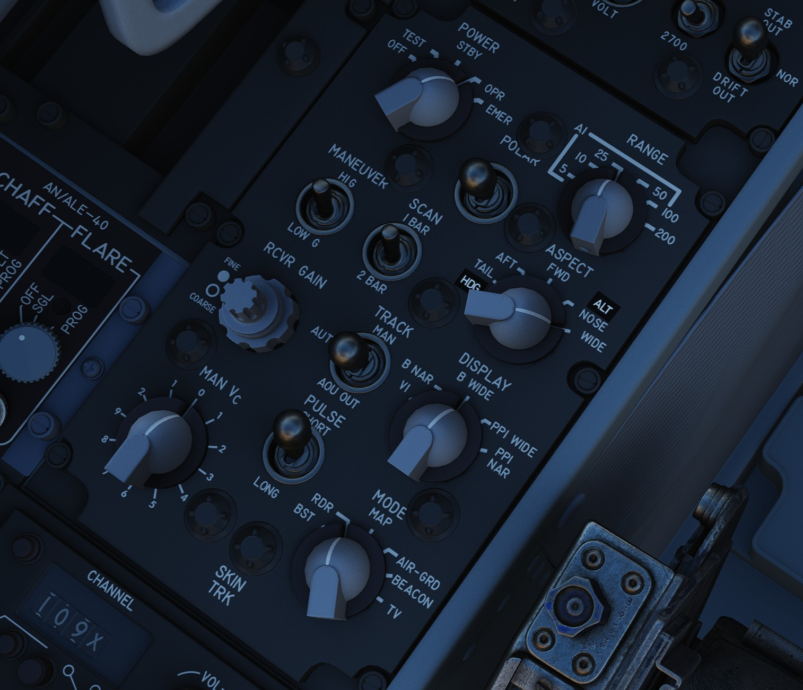
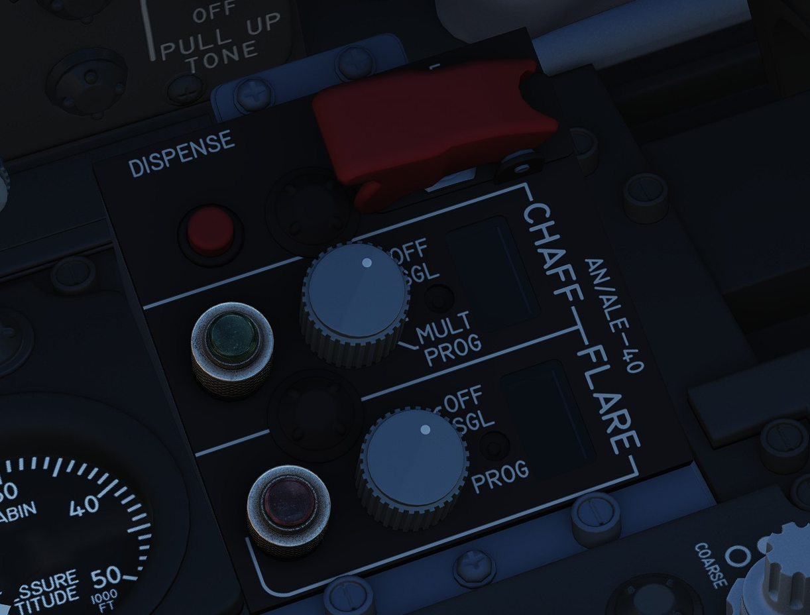

# Center Section

## Radar Set Control Panel

### Power Knob

Five position rotary switch controlling power state of the APQ-120

| Name | Description                                                                                |
| ---- | ------------------------------------------------------------------------------------------ |
| OFF  | Powers radar off.                                                                          |
| TEST | Applies voltage to control monitor power and provides test functions 1 through 6.          |
| STBY | Power applied to radar, remains in a non-transmitting standby state.                       |
| OPR  | System is fully operational.                                                               |
| EMER | Overrides the time delay, pressure, and temperature restrictions to allow radar operation. |

### Polar Switch

Controls polarization of transmitted rf energy.

| Name  | Description                                                                           |
| ----- | ------------------------------------------------------------------------------------- |
| LIN   | RF energy is linerally polarized in a vertical orientation. AIM-7 default mode.       |
| CIR 1 | RF energy is rotated clockwise from the vertical plane. AIM-7 can be fired.           |
| CIR 2 | RF energy is rotated counterclockwise from the vertical plane. AIM-7 cannot be fired. |

### Radar Range Knob

Used to select range sweep of 5, 10, 25, 50, 100, or 200 mile ranges on both
radar displays. First four ranges are air to air intercept positions, final two
are ground mapping modes only, and disengage lockon capability. Selecting a
setting illuminates the applicable range lamp, and displays the value on the
radar scope upper left corner.

### Maneuver Switch

Controls radar tracking response due to acceleration limits and received
countermeasures and clutter.

| Name  | Description                                                                        |
| ----- | ---------------------------------------------------------------------------------- |
| Low G | Default position. Limts track response due to countermeasures and clutter.         |
| HI G  | Allows track loop to respond to high acceleration. Automatically engaged with CAA. |

### Bar Scan Switch

Selects elevation scan pattern. In 2 bar scan, search pattern is separated by
3.75 degrees on each scan. In boresight or air to ground modes, 1 bar scan is
automatically commanded.

### Aspect Switch

Used to program the AIM-7 with a predetermined simulated Doppler instead of
actual received Doppler, so that the WSO can provide an estimated correct
speedgate location when range isn't available.

### Receiver Gain Knobs (RCVR GAIN)

Coarse (outer ring) and Fine (inner knob) gain control for the radar scope
display to increase video output legibility of target returns.

### Track Switch

Enables manual target tracking in heavy clutter environments, or automatic
tracking under normal circumstances.

#### Manual

When in the MAN position, the WSO places the acquisition symbol over the
intended target and triggers half-action on the HCU. The range strobe is
positioned relative to in-range on a closing target, and the WSO selects
full-action. To solidify the track, the WSO uses the Manual Vc knob to place the
range strobe and target return video at the same rate of movement.

#### Automatic

In the AUTO position, the range and closure calculations are performed
automatically. The WSO places the acquisition symbol over the target return and
presses full action. Should the target maneuver in excess of the speed
capability of the radar, the Maneuver switch can be set to HI G and the target
reacquired.

#### AOJ OUT

The AOJ OUT position is used to override the acquisition on jamming function of
the radar. In the event that the radar acquires a HOJ lock, the position can be
selected to place the radar back into a search configuration to initiate a
lockon against the jamming target and initiate a standard angle track lock.

### Display Knob

Sets the display type of the radar scope to access specific mode functionality
in conjunction with the Mode knob. The types are as follows:

| Name     | Description                                                                              |
| -------- | ---------------------------------------------------------------------------------------- |
| B WIDE   | Selects 120 degree B-sweep for search. Half-action places the sweep under manual HCU.    |
| B NAR    | Selects a 45 degree B-sweep sector for search, which is manually shifted with the HCU.   |
| PPI WIDE | Selects a 120 degree wide plan position indicator sweep for MAP mode.                    |
| PPI NAR  | Selects a 45 degree plan position indicator sweep that can be shifted with the HCU.      |
| VI       | Provides pure pursuit guidance to a locked target; a break X will appear at 1000' range. |

### Maneuver Vc Knob

An 12 position switch used to apply estimated range rate of closure (clockwise,
0-9), or estimated opening of range (counterclockwise, 0-2) against a target in
manual track mode.

### Pulse Switch

Three position switch controlling radar pulse width and pulse repetition
frequency in the Air to Air radar search modes. With the APQ-120 placed in CAGE
mode, short pulse operation is automatically selected. In AIR-GND modes, the
pulses are automatically commanded, deactivating the switch.

| Name  | Description                                                                                          |
| ----- | ---------------------------------------------------------------------------------------------------- |
| AUTO  | Commands long pulse width and low PRF; pulse width handled automatically when target is locked.      |
| LONG  | Low PRF and wide pulse width, allowing maximum range detection; no track automatic pulse adjustment. |
| SHORT | Narrow pulse width with high PRF for increased close range performance.                              |

### Mode Knob

A six position switch that determines the current base mode of operation of the
radar.

| Name    | Description                                                                                     |
| ------- | ----------------------------------------------------------------------------------------------- |
| BST     | Air to Air boresight with antenna aligned to optical sight. Permits CAGE and CAA.               |
| RDR     | Air to Air search mode.                                                                         |
| MAP     | Radar ground mapping mode.                                                                      |
| AIR-GRD | Air to Ground boresight, 20 mile range against targets visually established with optical sight. |
| BEACON  | Radar receives and displays signals from ground or airborne beacon transponders for navigation. |
| TV      | Not used with DSCG. Deactivates AIM-7 if selected.                                              |

### Skin Track Light

Green lamp that illuminates when a track is attained with range data. In the
event of HOJ or a range memory situation, the light will go off. Accompanied on
the rear DSCG radar scope with the T symbol that illuminates under the same
circumstances.

## AN/ALE-40 Cockpit Control Unit

### Ripple Switch

When positioned ON, dispenses flares at rate of ten per second until dispensers
are empty, so long as flaps and speed brakes are retracted.

### Dispense Button

Initiates chaff/flare dispensing as selected by CCU and ALE-40 programmer with
flaps and speed brakes retracted and mode knobs out of OFF.

### Counters

Indicate quantity of chaff and flare cartridges remaining, respectively. If
slave dispenser is set to Chaff Double (CD), the chaff counter will display half
of the number of cartridges remaining.

### Chaff Mode Knob

| Name | Description                                                                 |
| ---- | --------------------------------------------------------------------------- |
| OFF  | Chaff system inactive.                                                      |
| SGL  | A single burst commanded when dispense button pressed.                      |
| MULT | A salvo commanded according to program when either dispense button pressed. |

### Flare Mode Knob

| Name | Description                                                                 |
| ---- | --------------------------------------------------------------------------- |
| OFF  | Flare system inactive.                                                      |
| SGL  | A single burst commanded when dispense button pressed.                      |
| MULT | A salvo commanded according to program when either dispense button pressed. |

### Indicator Lights

Illuminates whenever a mode is selected on the respective countermeasure mode
knob.
