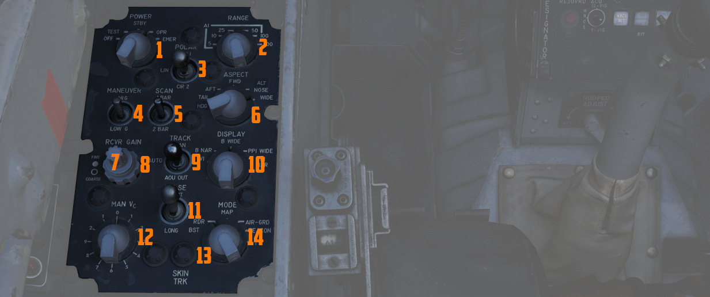
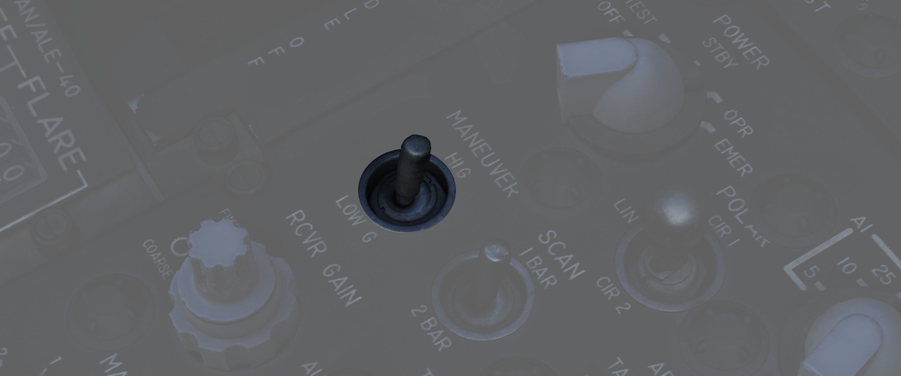
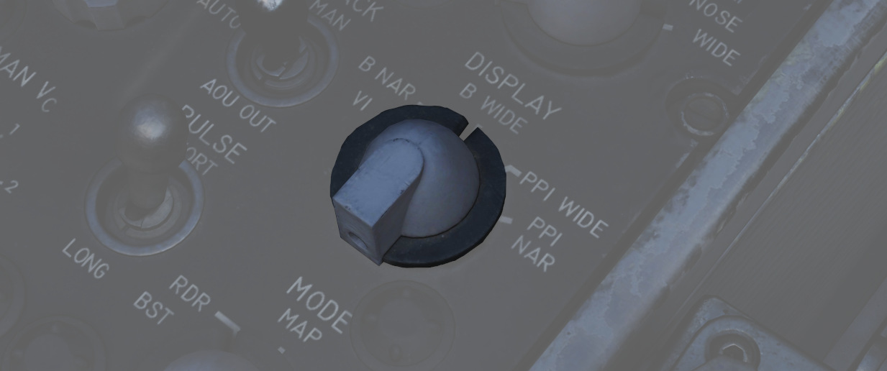
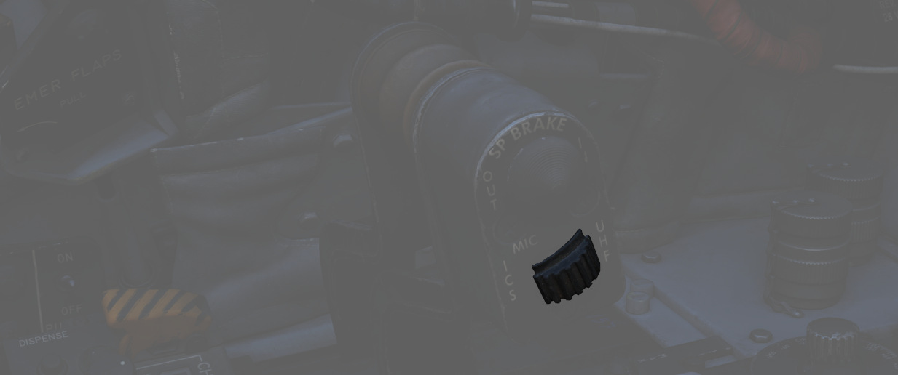

# Center Section

The center area of the left console features the radar control and
countermeasure panel.

## Radar Set Control Panel

See
[Radar Set Control Panel](../../../systems/radar/interface.md#radar-set-control-panel)
section for more detailed description of all the functions below.

### Power Knob

Five position rotary switch (<num>1</num>) controlling power state of the
[APQ-120 Radar.](../../../systems/radar/overview.md)

| Name | Description                                                                                                                        |
|------|------------------------------------------------------------------------------------------------------------------------------------|
| OFF  | Powers radar off.                                                                                                                  |
| TEST | Applies voltage to control monitor power and provides [BIT-test](../../../procedures/bit_tests/overview.md) functions 1 through 6. |
| STBY | Power applied to radar, remains in a non-transmitting standby state.                                                               |
| OPR  | System is fully operational.                                                                                                       |
| EMER | Overrides the time delay, pressure, and temperature restrictions to allow radar operation.                                         |

See the [Radar Power Section](../../../systems/radar/interface.md#power) for
more details.

### Polar Switch

The three position switch (<num>3</num>) controls polarization of transmitted
radio frequency energy. LIN should be used in normal conditions, CIR 1 and CIR 2
can be used to reduce precipitation clutter at the expense of increased ground
clutter.

[See Radar Polarization Knob Section for more details.](../../../systems/radar/interface.md#polarization-control)

### Range Knob

The rotary switch (<num>2</num>) is used to select range sweep of 5, 10, 25, 50,
100, or 200 mile ranges on both radar displays. Ranges up to 50 are displayed on
the [range lamp](../../pilot/dscg_controls.md#range-lights).

See the
[Radar Range Knob Section](../../../systems/radar/interface.md#radar-set-control-panel)
for more details.

### Maneuver Switch

The two position switch (<num>4</num>) controls radar tracking acceleration
response. LOW sets a limit on antenna acceleration and HI removes acceleration
limit.

[See Radar Maneuver Knob Section](../../../systems/radar/interface.md#maneuver-switch)

### Bar Scan Switch

The two position switch (<num>5</num>) selects elevation scan pattern between 1
and 2 bars. Only RDR-B modes can make use of 2 bars.

[See Radar Scan Switch Section for more details](../../../systems/radar/interface.md#scan-switch)

### Aspect Knob

The rotary switch (<num>6</num>) is used to program the
[AIM-7](../../../stores/air_to_air/aim_7.md) with a predetermined simulated
Doppler instead of actual received Doppler, so that the WSO can provide an
estimated correct speed-gate for the Sparrow when not tracking.

[See Aspect Knob Section for more details](../../../systems/radar/interface.md#aspect)

### Receiver Gain Knobs (RCVR GAIN)

Coarse (outer ring, <num>8</num>) and Fine (inner knob, <num>7</num>) gain control for the
radar
receiver. Larger values result in more noise and can cause display to become
saturated. Lower values may result in lower detection ranges.

[See Receiver Gain Knob Section for more details](../../../systems/radar/interface.md#receiver-gain-rcvr-gain)

### Track Switch

The three position switch (<num>9</num>) selects range tracking type for use in
heavy clutter environments, or automatic tracking under normal circumstances.

[See Radar Track Switch Section for more details](../../../systems/radar/interface.md#track-switch)

### Display Knob

The rotary switch (<num>10</num>) sets the display type of the radar scope to
access specific mode functionality in conjunction with the Mode knob. The types
are as follows:

| Name     | Description                                                                                                   |
|----------|---------------------------------------------------------------------------------------------------------------|
| B WIDE   | Selects 120 degree B-sweep for search. Half-action places the sweep under manual Antenna Hand Control stick.  |
| B NAR    | Selects a 45 degree B-sweep sector for search, which is manually shifted with the Antenna Hand Control stick. |
| PPI WIDE | Selects a 120 degree wide plan position indicator sweep for MAP mode.                                         |
| PPI NAR  | Selects a 45 degree plan position indicator sweep that can be shifted with the Antenna Hand Control stick.    |
| VI       | Provides pure pursuit guidance to a locked target for Visual Intercept; a break X will appear at 1000' range. |

### Manual Vc Knob

A 12 position switch (<num>12</num>) used to apply estimated range rate of
closure (clockwise, 0-9), or estimated opening of range (counterclockwise, 0-2)
against a target in manual track mode.

The numbers are multiplied by 100 knots while closure means closing in to the
F-4 and opening means the target is flying away from the F-4.

[See MAN Vc Knob Section for more details](../../../systems/radar/interface.md#manual-vc-man-vc)

### Pulse Switch

Three position switch (<num>11</num>) controlling radar pulse width and pulse
repetition frequency (PRF).

| Name  | Description                                                                                                           |
|-------|-----------------------------------------------------------------------------------------------------------------------|
| AUTO  | Uses Power Level Mode Switching to determine best Pulse selection. Selects short pulse is used for acquire and track. |
| LONG  | Wide pulse width and low PRF, allowing maximum range detection; no track automatic pulse adjustment.                  |
| SHORT | Narrow pulse width with high PRF for increased close range performance.                                               |

[See Pulse Switch Section for more details](../../../systems/radar/interface.md#pulse-switch)

### Mode Knob

A six position rotary switch (<num>14</num>) that determines the current base
mode of operation of the radar.

| Name    | Description                                                                                                                                                                                                  |
|---------|--------------------------------------------------------------------------------------------------------------------------------------------------------------------------------------------------------------|
| BST     | Air-to-Air boresight with antenna aligned radar boresight line and optical sight with sight in A/A.                                                                                                          |
| RDR     | Search Mode with Feedhorn Nutation (wider beam-width) mode.                                                                                                                                                  |
| MAP     | Search Mode without Feedhorn Nutation (narrower beam-width)                                                                                                                                                  |
| AIR-GRD | [Air-to-Ground boresight](../../../systems/radar/interface.md#air-grd-air-to-ground-position), Tracks range of illuminated ground, radar is boresighted to the radar boresight line with drift compensation. |
| BEACON  | Radar receives and displays signals from ground or airborne beacon transponders for navigation.                                                                                                              |
| TV      | Not used with DSCG. De-tunes [AIM-7](../../../stores/air_to_air/aim_7.md) if selected, preventing Sparrows from guiding.                                                                                     |

> 💡 Beacons are currently not implemented in DCS and thus can't be used

[See Mode Knob Section for more details](../../../systems/radar/interface.md#radar-modes-mode)

### Skin Track Light

Lamp (<num>13</num>) that illuminates when a track is attained with range data.
In the event of [HOJ](../../../systems/radar/air_to_air.md#home-on-jam) or a
range memory situation, the light will go off. Accompanied on the rear DSCG
radar scope with the T symbol that illuminates under the same circumstances.

## Throttles

The throttle arrangement for each engine in the F-4E Phantom II is located on
the front and rear cockpit left console. Mechanical linkage transmits throttle
movement to the engine fuel control. The rear cockpit throttle does not enable
the afterburner. Located on the rear throttle is a speed brake switch and a mic
switch.

### Speed Brake

The Speed Brakes are actuated by a three position switch (<num>1</num>) found on
the inboard throttle in both cockpits. Either switch will actuate the brakes.
The positions are Out, Stop, and In; the Out position is momentary and reverts
back to Stop when released.

For further information see the
[3.1.2 Flight Control Surfaces chapter.](../../../systems/flight_controls_gear/flight_controls.md#speed-brakes)

### Mic Switch

The microphone switch (<num>2</num>) for the Intercom System is the aft position
on the inboard throttle grip in both cockpits. When using the intercom, all
audio sans the pull-up tone, stall warning, and ECM are reduced (same as RADIO
OVERRIDE). In the fwd position the switch will enable transmitting over radio.

## AN/ALE-40 Cockpit Control Unit (CCU)

The CCU is a primary control panel of the Countermeasures System.

It is used to select different modes of operation and gives the WSO the ability
to dispense countermeasures.

For further information see
[CCU](../../../systems/defensive_systems/countermeasures.md#cockpit-control-unit-ccu---wso-cockpit).

### Dispense Button

The push button (<num>1</num>) initiates chaff/flare dispensing as selected by
Cockpit control unit and
[AN/ALE-40 programmer](../../../cockpit/pilot/left_console/aft_section.md#anale-40-programmer)

### Ripple Switch

Guarded by a cover (<num>2</num>), when positioned ON, dispenses flares at rate
of ten per second until dispensers are empty, so long as flaps and speed brakes
are retracted.

> 💡 After around 10 seconds, all flares have been dispensed.

### Counters

Indicate quantity of chaff (<num>3</num>) and flare (<num>6</num>) cartridges
remaining, respectively.

They are automatically set by the ground crew when rearming.

### Chaff Mode Knob

A rotary switch knob (<num>7</num>) that controls the amount of dispensed chaff.

| Name | Description                                                                                                                                                                    |
|------|--------------------------------------------------------------------------------------------------------------------------------------------------------------------------------|
| OFF  | Chaff system inactive.                                                                                                                                                         |
| SGL  | A single **burst** commanded when dispense button pressed.                                                                                                                     |
| MULT | A **salvo** commanded according to [programmer](../../../systems/defensive_systems/countermeasures.md#programmer---pilot-cockpit)  when either dispense button pressed.        |
| PROG | Multiple **salvos** commanded according to [programmer](../../../systems/defensive_systems/countermeasures.md#programmer---pilot-cockpit) when either dispense button pressed. |

### Flare Mode Knob

A rotary switch knob (<num>4</num>) that controls the amount of dispensed
flares.

| Name | Description                                                                                                                                                            |
|------|------------------------------------------------------------------------------------------------------------------------------------------------------------------------|
| OFF  | Flare system inactive.                                                                                                                                                 |
| SGL  | A single **burst** commanded when dispense button pressed.                                                                                                             |
| PROG | A **salvo** commanded according to [programmer](../../../systems/defensive_systems/countermeasures.md#programmer---pilot-cockpit) when either dispense button pressed. |

### Indicator Lights

Illuminates (5 and 8) whenever a mode is selected on the respective
countermeasure mode knob.

Can be rotated to dim and pressed to test.
