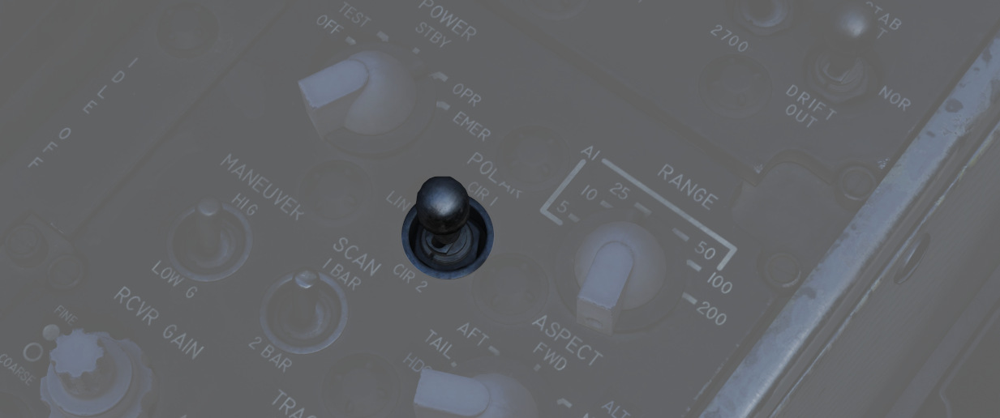
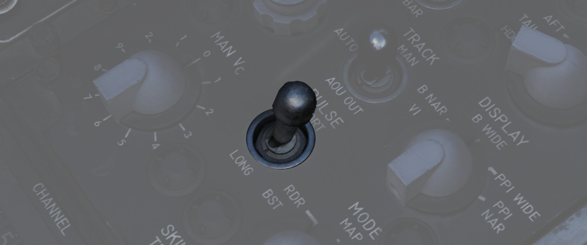
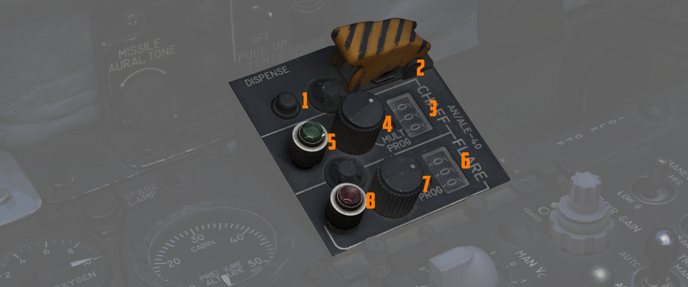

# 中部

左侧控制台的中部区域包括雷达控制和对抗措施面板。

## 雷达套件控制面板

下文中介绍的功能，详情请阅读
[雷达套件控制面板](../../../systems/radar/interface.md#radar-set-control-panel) 部分。

### 电源旋钮

五档旋钮，控制 [APQ-120 雷达](../../../systems/radar/overview.md) 电源的状态

| 名称 | 描述                                                                                        |
| ---- | ------------------------------------------------------------------------------------------- |
| OFF  | 雷达断电。                                                                                  |
| TEST | 向控制监控器供电，并提供[BIT 测试](../../../procedures/bit_tests/overview.md) 功能 1 到 6。 |
| STBY | 雷达通电，保持在无发射待机状态。                                                            |
| OPR  | 系统完整工作。                                                                              |
| EMER | 超控延时、压力和温度限制，允许雷达工作。                                                    |

详见 [雷达电源部分](../../../systems/radar/interface.md#power) 。

### 极化开关

控制发射电磁波能量的极化方式。正常情况下应使用 LIN，CIR 1 和 CIR 2 可用来减少降水杂波，但会增加地面
杂波。

[详见雷达极化旋钮部分。](../../../systems/radar/interface.md#polarization-control)

### 距离旋钮

用于在 5、10、25、50、100 或 200 海里之间选择前后座雷达显示器中的显示距离。
[距离灯](../../pilot/dscg_controls.md#range-lights) 最大可显示 50 海里。

详见 [雷达距离旋钮部分](../../../systems/radar/interface.md#radar-set-control-panel)。

### 机动开关

控制雷达跟踪加速度响应。LOW 设置天线加速度限制，HI 取消加速度限制。

[见雷达机动旋钮部分](../../../systems/radar/interface.md#maneuver-switch)

### 扫描线开关

在 1 和 2 线之间选择仰角扫描线数。仅 RDR-B 模式可使用 2 线。

[详见雷达扫描线开关部分](../../../systems/radar/interface.md#scan-switch)

### 态势旋钮

用于对 [AIM-7](../../../stores/air_to_air/aim_7.md) 进行编程，使用预定的模拟多普勒而不是实际接收到
的多普勒，以便 WSO 在未跟踪面板时为“麻雀”提供预估的正确速度门。

[详见态势旋钮部分](../../../systems/radar/interface.md#aspect)

### 接收机增益旋钮 (RCVR GAIN)

用来控制雷达接收机的粗（外圈）和精（内旋钮）增益。数值越大，噪声越大，可能导致显示器饱和。数值越小
，探测距离越小。

[详见接收机增益旋钮部分](../../../systems/radar/interface.md#receiver-gain-rcvr-gain)

### 跟踪开关

选择在强杂波环境中所使用的距离跟踪类型，或在正常情况下使用自动跟踪。

[详见雷达跟踪开关部分](../../../systems/radar/interface.md#scan-switch)

### 显示旋钮

设置雷达显示器的显示类型来配合模式旋钮访问特定的模式功能。类型如下：

| 名称     | 描述                                                                      |
| -------- | ------------------------------------------------------------------------- |
| B WIDE   | 使用 120 度栅状扫描进行搜索。按下扳机第一段将扫描置于手动天线手控杆下方。 |
| B NAR    | 使用 45 度栅状扫描角度进行搜索，扫描角度跟随天线手控杆移动。              |
| PPI WIDE | 选择一个用于 MAP 模式的 120 度宽平面位置显示器扫描。                      |
| PPI NAR  | 选择一个 45 度宽平面位置显示器扫描——可用天线手控杆来移动扫描角度。        |
| VI       | 为目视拦截锁定目标提供纯追踪引导；在距离 1000 英尺内会出现一个脱离 X。    |

### 手动 Vc 旋钮

一个 12 档位开关，用于在手动跟踪模式下对目标加入预估接近速度（顺时针，0-9）或预估飞离速度（逆时针
，0-2）。

数字乘以 100 海里/小时，接近表示向 F-4 靠近，离开表示目标飞离 F-4。

[详见见 MAN Vc 旋钮部分](../../../systems/radar/interface.md#manual-vc-man-vc)

### 脉冲开关

三档位开关控制雷达脉宽和脉冲重复频率（PRF）。

| 名称  | 描述                                                               |
| ----- | ------------------------------------------------------------------ |
| AUTO  | 使用功率等级模式切换来确定最佳脉冲选择。选择短脉冲用于截获和跟踪。 |
| LONG  | 宽脉宽和低 PRF，可最大化探测距离；无跟踪自动脉冲调整。             |
| SHORT | 窄脉宽和高 PRF 可提高近距离性能。                                  |

[详见脉冲开关部分](../../../systems/radar/interface.md#pulse-switch)

### 模式旋钮

六档位开关，用于确定雷达当前的基础工作模式。

| 名称    | 描述                                                                                                                                       |
| ------- | ------------------------------------------------------------------------------------------------------------------------------------------ |
| BST     | 空对空瞄准轴，天线对准雷达轴线以及光学瞄准具处在 A/A 模式。                                                                                |
| RDR     | 使用带馈源章动（更宽的波束宽）模式的搜索模式。                                                                                             |
| MAP     | 无馈源章动（更窄的波束宽）的搜索模式。                                                                                                     |
| AIR-GRD | [空对地瞄准轴](../../../systems/radar/interface.md#air-grd-air-to-ground-position)，跟踪照射地面的距离，雷达对准雷达轴线，并进行漂移补偿。 |
| BEACON  | 雷达接收并显示导航使用的地面或机载信标应答机的信号。                                                                                       |
| TV      | 在 DSCG 中不使用这一档位。如果选择档位，将去调谐[AIM-7](../../../stores/air_to_air/aim_7.md) 防止麻雀进行制导。                            |

[详见模式旋钮部分](../../../systems/radar/interface.md#radar-modes-mode)

### 蒙皮跟踪灯

当目标锁定并取得距离数据时亮起。如果进入 [HOJ](../../../systems/radar/operation.md#home-on-jam) 或
距离记忆时，指示灯将熄灭。后座 DSCG 雷达显示器上的 T 符号也会跟随亮起。

## AN/ALE-40 驾驶舱控制装置 (CCU)

对抗措施系统的主要在 CCU 中进行控制。

CCU 用来选择不同的工作模式并给予 WSO 布撒对抗措施的能力。

更多信息请查看
[CCU](../../../systems/defensive_systems/countermeasures.md#cockpit-control-unit-ccu---wso-cockpit)。

### 布撒按钮

根据驾驶舱控制装置和
[AN/ALE-40 编程器](../../../cockpit/pilot/left_console/aft_section.md#anale-40-programmer) 的选择，
启动箔条/红外干扰弹弹射。

### 连投开关

带保护盖开关，当拨至 ON 档位时，以每秒十枚的速度进行弹射直到耗尽，开关要求襟翼和减速板收起才可使用
。

> 💡 在大约 10 秒后，所有对抗措施将会耗尽。

### 计数器

分别显示剩余的箔条和红外干扰弹数量。

地勤填装时将系统自动进行设置。

### 箔条模式旋钮

| 名称 | 描述                                           |
| ---- | ---------------------------------------------- |
| OFF  | 停用箔条系统。                                 |
| SGL  | 按下布撒按钮时指令弹射单发箔条。               |
| MULT | 按下任意一个布撒按钮后将根据程序指令一次齐投。 |

### 红外干扰弹模式旋钮

| 名称 | 描述                                           |
| ---- | ---------------------------------------------- |
| OFF  | 停用红外干扰弹系统。                           |
| SGL  | 按下布撒按钮时指令弹射单发箔条。               |
| MULT | 按下任意一个布撒按钮后将根据程序指令一次齐投。 |

### 指示灯

对应的对抗措施模式旋钮选择了一个模式时就将亮起。

可转动来调光并按下测试。
