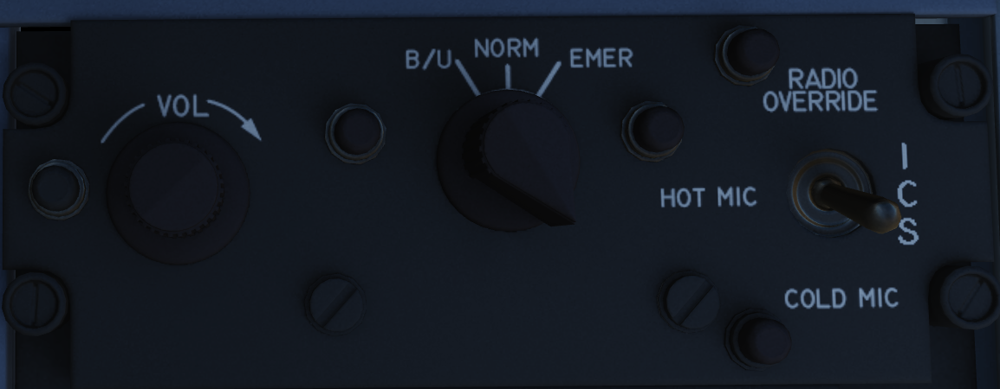
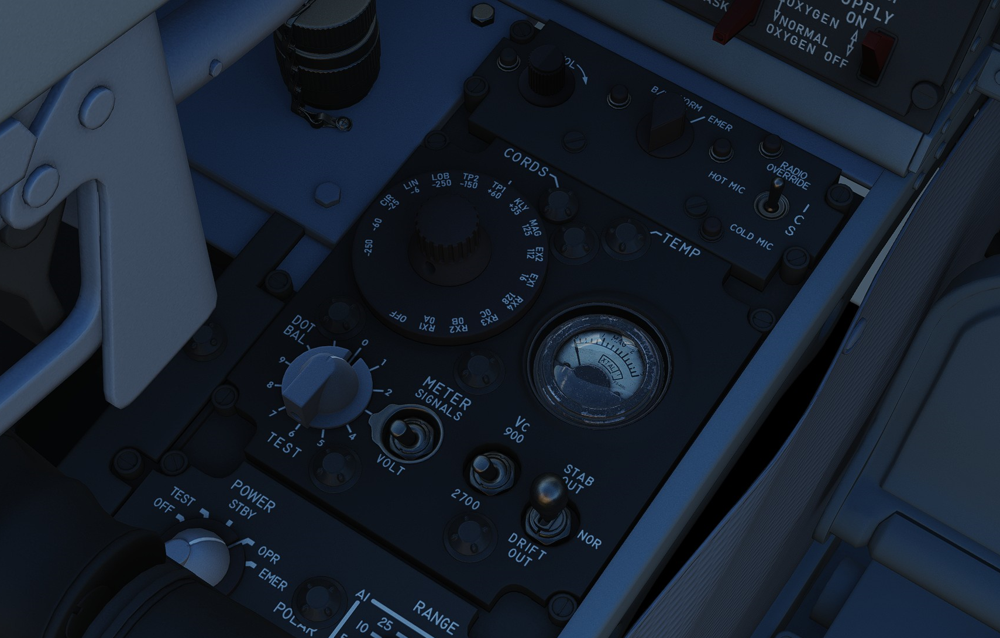

# Front Section

## Intercom Control Panel

### ICS Volume Control Knob

Turned clockwise to increase audio between cockpits, and counterclockwise to
decrease audio between cockpits on the intercom.

### ICS Function Selector Switch

| Name           | Description                                                                  |
| -------------- | ---------------------------------------------------------------------------- |
| COLD MIC       | Mic switch on throttle must be held to activate intercom.                    |
| HOT MIC        | Voice automatically transmitted on intercom.                                 |
| RADIO OVERRIDE | The opposite cockpit’s audio is heard at its set volume using its amplifier. |

### ICS Amplifier Select Knob

Determines current amplifier for intercom function.

| Name | Description                                                                         |
| ---- | ----------------------------------------------------------------------------------- |
| B/U  | Backup headset amplifier provides audio.                                            |
| NORM | Primary headset amplifier provides audio.                                           |
| EMER | Uses amplifier from opposite cockpit; only audio received to that cockpit is heard. |

## Control Monitor Panel

### Cords Light

Not used by the APQ-120 in the F-4E.

### Temp Light

Illuminates amber to indicate an over-temperature situation in the nose radar
avionics bay. Under normal circumstances, an overheat condition requires setting
the radar power to OFF. If circumstances require continued use, the light should
be monitored regularly.

### Test Knob

An eleven position rotary knob used with the radar power knob in TEST to perform
system BIT checks of the APQ-120 radar. Basic test function noted below;
procedural functionality is found in the applicable BIT test section.

| Name    | Description                                                                                 |
| ------- | ------------------------------------------------------------------------------------------- |
| 0       | Displays standard B scope presentation to confirm all elements functioning correctly.       |
| 1       | Confirms break lock timing delay, AIM-7 tuning status, and Range lamp status function.      |
| 2       | Confirms proper AIM-7 head position aim and SHORT pulse function against two targets.       |
| 3       | Confirms angle tracking performance against a locked target that rotates inside ASE circle. |
| 4       | Used while lock achieved in another mode, confirms HOJ and AOJ functionality.               |
| 5       | Checks range rate, lead angle, CAA, and PLMS function.                                      |
| 6       | Confirms proper AIM-7 attack display and interlock function.                                |
| 7       | n/a                                                                                         |
| 8       | n/a                                                                                         |
| 9       | n/a                                                                                         |
| 10      | n/a                                                                                         |
| DOT BAL | Confirms AIM dot centering calibration. Also used for TIRS data transfer.                   |

### Meter Switch

Determines which set of values are utilized from the Meter Selector Knob for the
applicable test sequences; VOLT selects the inner ring of Voltage referencing
values, whereas SIGNALS uses the outer rim of SIGNAL reference values.

### Meter Selector Knob

A sixteen position rotary knob used in conjunction with the Test Knob, with each
position having two values- an outer SIGNAL value, and an inner VOLT value.
Selection of which value determined by the Meter Switch.

### Monitor Meter

Provides voltage, current, and signal indications based on current Meter Switch
and Meter Selector Knob settings.

### Vc Switch

Changes the scale factor of the range rate presentation. DSCG aircraft must
leave the switch in 2700, else the Vc presentation will be in error.

### Stab Switch

Changes the antenna stabilization mode.

| Name      | Description                                                                              |
| --------- | ---------------------------------------------------------------------------------------- |
| NOR       | Normal operation; inputs of pitch and roll are fed to the antenna stabilization circuit. |
| STAB OUT  | Horizon line removed from scopes and stabilization drift servos are zeroed.                |
| DRIFT OUT | INS drift compensation is removed; antenna uses direct pitch and roll input tracking.    |
