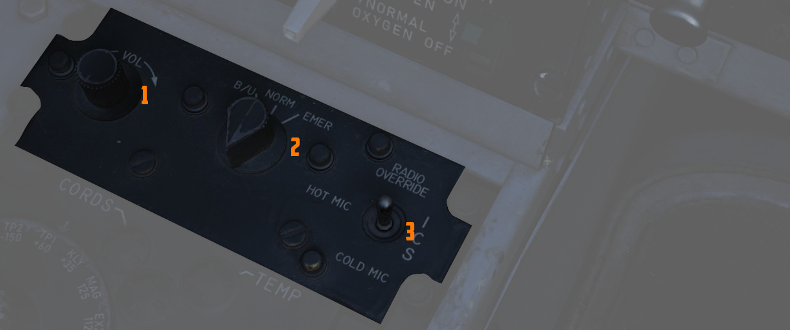
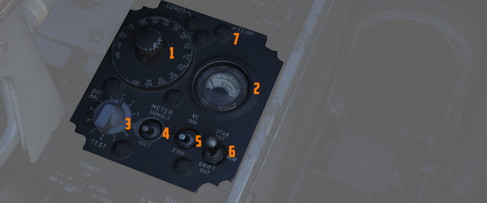

# Front Section

## Intercom Control Panel

### Volume Control Knob

Turned clockwise (<num>1</num>) to increase audio between cockpits, and
counterclockwise to decrease audio between cockpits on the
[intercom](../../../systems/nav_com/intercom.md).

### Function Selector Switch

A three position switch (<num>3</num>) used to set the mode of the
[intercom](../../../systems/nav_com/intercom.md).

| Name           | Description                                                                                                       |
| -------------- | ----------------------------------------------------------------------------------------------------------------- |
| COLD MIC       | Mic switch on throttle must be held to activate intercom.                                                         |
| HOT MIC        | Voice automatically transmitted on intercom.                                                                      |
| RADIO OVERRIDE | Voice automatically transmitted on intercom. All volumes but Shrike tone and Stall Warning are reduced in volume. |

### Amplifier Select Knob

Determines current amplifier (<num>2</num>) for
[intercom](../../../systems/nav_com/intercom.md) function.

| Name | Description                                                                                                     |
| ---- | --------------------------------------------------------------------------------------------------------------- |
| B/U  | Backup headset amplifier provides audio.                                                                        |
| NORM | Primary headset amplifier provides audio.                                                                       |
| EMER | Uses the amplifier from opposite cockpit; all and only audio including radio received to that cockpit is heard. |

## Control Monitor Panel

Tests and monitors the [APQ-120 Radar.](../../../systems/radar/overview.md)

### Cords Light

Not used in the F-4E.

### Temp Light

Illuminates (<num>7</num>) amber to indicate an over-temperature situation in
the nose radar avionics bay. Under normal circumstances, an overheat condition
requires setting the radar power to OFF. If circumstances require continued use,
the light should be monitored regularly.

### Meter Selector Knob

A sixteen position rotary knob (<num>1</num>) used in conjunction with the Test
Knob, with each position having two values- an outer SIGNAL value, and an inner
VOLT value. Selection of which value determined by the Meter Switch.

### Monitor Meter

Provides voltage, current, and signal indications (<num>2</num>) based on
current Meter Switch and Meter Selector Knob settings.

### Test Knob

An eleven position rotary knob (<num>3</num>) used with the radar power knob in
TEST to perform system BIT checks of the
[APQ-120 Radar](../../../systems/radar/overview.md). Basic test function noted
below; procedural functionality is found in the applicable BIT test section
([Air-To-Air Bits](../../../procedures/bit_tests/radar_air_to_air.md),
[Air-To-Ground Bits](../../../procedures/bit_tests/radar_air_to_ground.md)).

| Name    | Description                                                                                 |
| ------- | ------------------------------------------------------------------------------------------- |
| 0       | Displays standard B scope presentation to confirm all elements functioning correctly.       |
| 1       | Confirms break lock timing delay, AIM-7 tuning status, and Range lamp status function.      |
| 2       | Confirms proper AIM-7 head position aim and SHORT pulse function against two targets.       |
| 3       | Confirms angle tracking performance against a locked target that rotates inside ASE circle. |
| 4       | Used while lock achieved in another mode, confirms HOJ and AOJ functionality.               |
| 5       | Checks range rate, lead angle, CAA, and PLMS function.                                      |
| 6       | Confirms proper AIM-7 attack display and interlock function.                                |
| 7       | not available                                                                               |
| 8       | not available                                                                               |
| 9       | not available                                                                               |
| 10      | not available                                                                               |
| DOT BAL | Confirms AIM dot centering calibration. Also used for TIRS data transfer.                   |

### Meter Switch

A two position switch (<num>4</num>) that determines which set of values are
utilized from the Meter Selector Knob for the applicable test sequences; VOLT
selects the inner ring of Voltage referencing values, whereas SIGNALS uses the
outer rim of SIGNAL reference values.

### Vc Switch

A two position switch (<num>5</num>) that changes the scale factor of the range
rate presentation. DSCG aircraft must leave the switch in 2700, else the Vc
presentation will be in error.

### Stab Switch

A three position switch (<num>6</num>) that changes the antenna stabilization
mode.

| Name      | Description                                                                              |
| --------- | ---------------------------------------------------------------------------------------- |
| NOR       | Normal operation; inputs of pitch and roll are fed to the antenna stabilization circuit. |
| STAB OUT  | Horizon line removed from scopes and stabilization drift servos are zeroed.              |
| DRIFT OUT | INS drift compensation is removed; antenna uses direct pitch and roll input tracking.    |

## Throttles

The throttle arrangement for each engine in the F-4E Phantom II is located on
the front and rear cockpit left console. Mechanical linkage transmits throttle
movement to the engine fuel control. The rear cockpit throttle does not enable
the afterburner. Located on the rear throttle is a speed brake switch and a mic
switch.

### Speed Brake

The Speed Brakes are actuated by a three position switch (<num>1</num>) found on
the inboard throttle in both cockpits. Either switch will actuate the brakes.
The positions are Out, Stop, and In; the Out position is momentary and reverts
back to Stop when released.

For further information see the
[3.1.2 Flight Control Surfaces chapter.](../../../systems/flight_controls_gear/flight_controls.md#speed-brakes)

### Mic Switch

The microphone switch (<num>2</num>) for the Intercom System is the aft position
on the inboard throttle grip in both cockpits. When using the intercom, all
audio sans the pull-up tone, stall warning, and ECM are reduced (same as RADIO
OVERRIDE). In the fwd position the switch will enable transmitting over radio.
