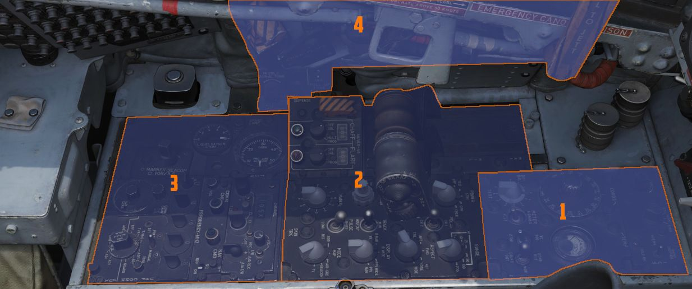

# 左侧控制台

左侧控制台被划分为四个部分。

| 部分 | 名称                        |
| ------: | --------------------------- |
|      1. | [前部](front_section.md)   |
|      2. | [中部](center_section.md) |
|      3. | [后部](aft_section.md)       |
|      4. | [墙板](wall.md)             |
