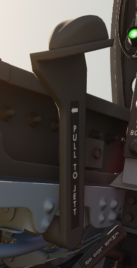
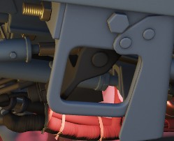
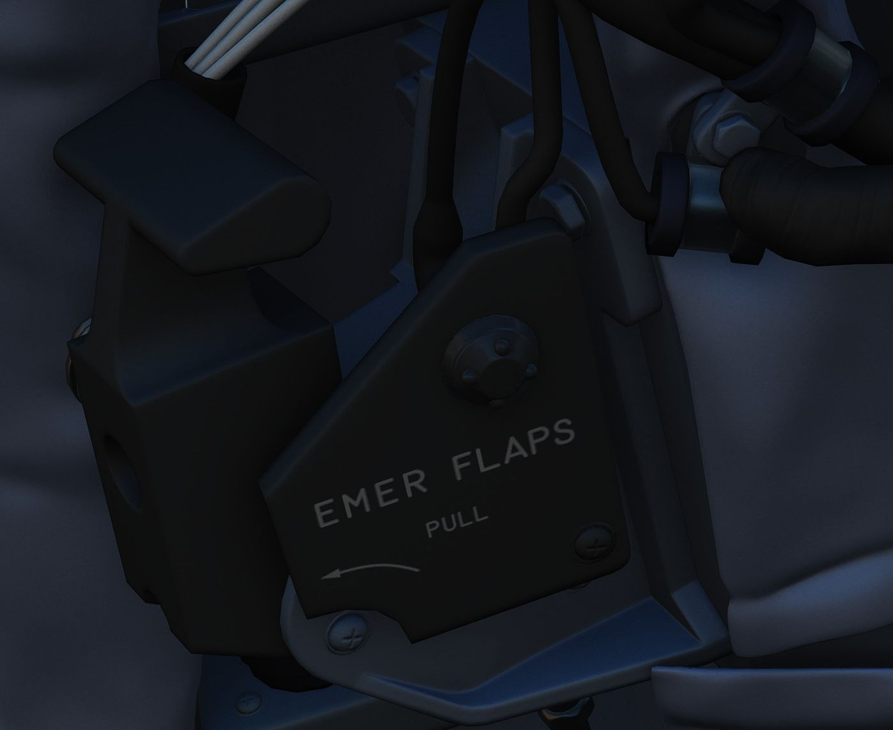

# Left Wall

## Emergency Canopy Jettison Handle

Used for emergency ground extraction, the Emergency Canopy Jettison Handle
releases a compressed oxygen cylinder to open both canopies immediately,
shearing them off at their pivots. The handle only jettisons the respective canopy.

## Canopy Control Switch

Used to open (aft) or close (forward) the WSO canopy.

## Emergency Flaps Handle

Used for emergency deployment of the slats and flaps from the rear cockpit, and
is activated by pulling the handle aft. Pneumatic system powering extension of
the slats flaps system only functions one time. Extend regardless of airspeed,
however flaps will not fully deploy above 230 knots due to air loads on control
surfaces. Will deploy fully when slower.

## LABS Panel

### Aural Tone Volume

Knob to control the volume for weapon tones, such as the Sidewinder seeker head.

### Pull Up Tone

Switch to toggle the tone played by
the [Pull-Up system](../../../systems/weapon_systems/arbcs.md#arbcs-indicators).
