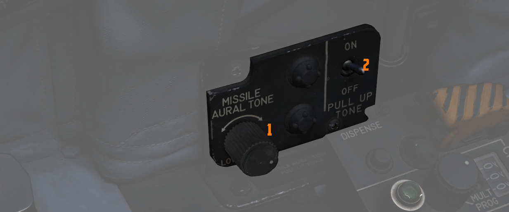

# 左侧防火墙

## 应急座舱盖抛弃手柄

在地面紧急撤离时使用，应急座舱盖抛弃手柄会释放压缩氧气瓶来立即打开对应的座舱盖，并在连接锁处将其剪
断。

## 座舱盖控制开关

用于开（向后）或关（向前） WSO 座舱盖。

### 应急襟翼手柄

后座使用的应急展开缝翼和襟翼手柄，向后拉手柄激活。[气动系统](../../../systems/pneumatics.md) 将驱动
[缝翼襟翼系统](../../../systems/flight_controls_gear/flight_controls.md#slats-flap-system) 伸出，仅
能使用一次。不论空速多快，系统都将伸出缝翼襟翼，但由于操作面上的空气载荷，襟翼在空速 230 节以上时不
会完全放下。空速较低时将完全放下。

## LABS 面板

### 音调提示音量

用来控制武器音调提示音量的旋钮，例如“响尾蛇”导引头。

### 拉起音调提示

开关用来切换 [拉起系统](../../../systems/weapon_systems/arbcs.md#arbcs-indicators) 播放的音调提示。
