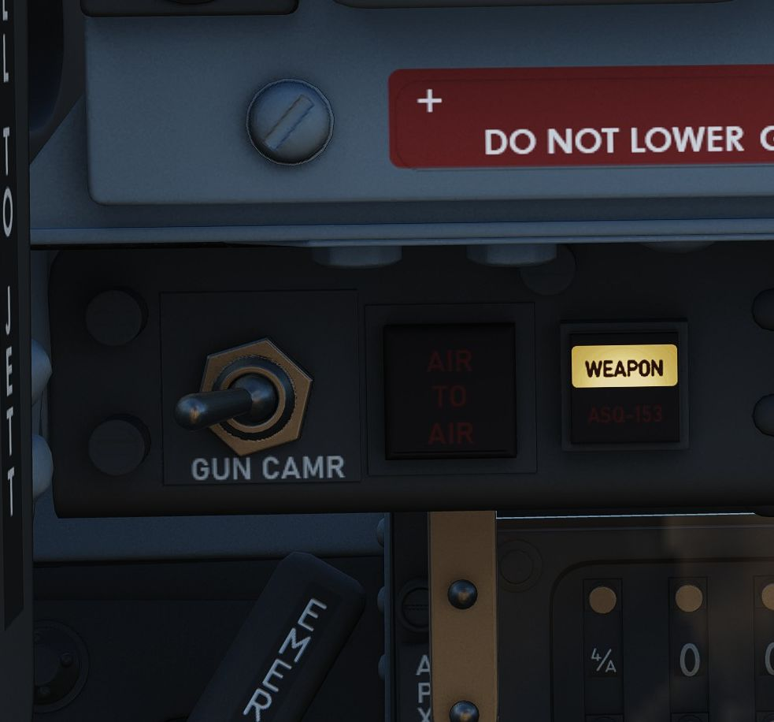
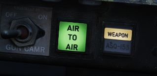
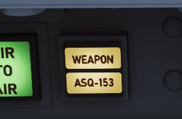
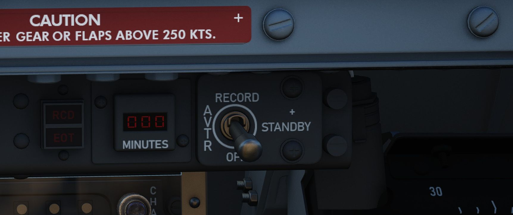
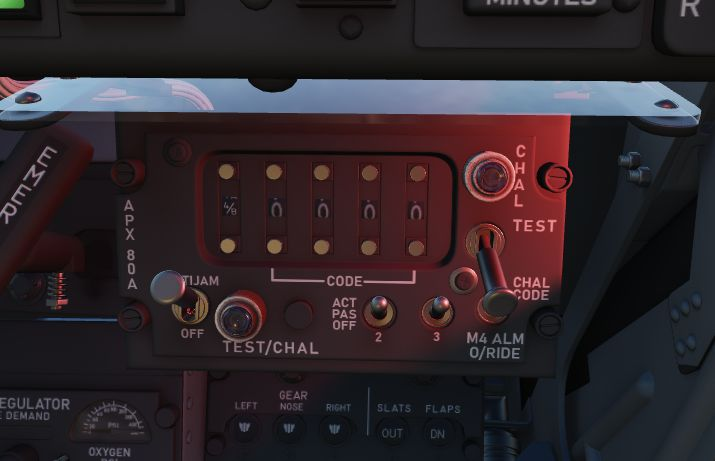
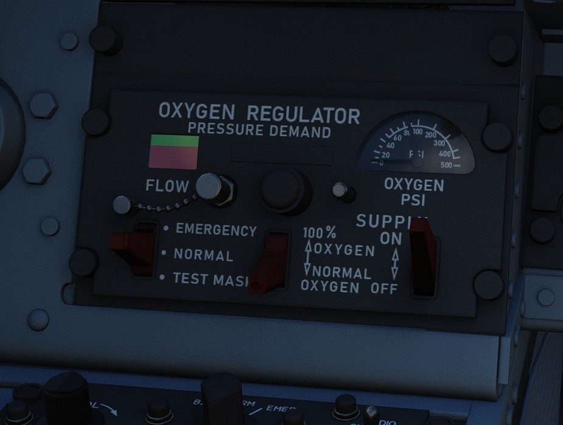

# Left Sub-Panel

## Gun Camera Switch

Activates recording of gun camera footage.

## Air to Air Light

Illuminates when [CAGE](../../stores/air_to_air/acm_modes.md) mode activated; pressing the light
reverts the radar to the original operating condition prior
to CAGE entry.

## Video Select Button

Push button that alternates between WEAPON, such
as [AGM-65 Mavericks](../../stores/air_to_ground/missiles/maverick.md),
and [targeting pod (ASQ-153)](../../systems/weapon_systems/pave_spike/overview.md) television video
on the radar scope display when in TV mode.

## AVTR Control

Controls the Airborne Video Tape recorder system which records the intercom
sound, as well as the rear radar screen.

### AVTR Switch

With the switch in the RECORD position, footage is recorded on the cassette and
the RCD light illuminates. The STANDBY position pauses recording, while the OFF
position will additionally automatically unthread the tape back to the beginning
after 10 seconds.

### AVTR Tape Timer

The cassette can record up to 20 minutes of footage, indicated in the small
display labelled MINUTES.

### EOT Light

Once the end of the tape has been reached, the EOT light illuminates and the
tape must be unthreaded before it can record again.

### RCD Light

Lit to indicate the AVTR system currently recording.

## Emergency Landing Gear Handle

Deploys the landing gear using a pair of compressed air bottles; handle cannot
retract gear, only deploy in an emergency.

## Emergency Brake Handle

In an emergency, discharges a portion of the brake system hydraulic accumulator
to provide emergency braking. Contains a limited number of applications.

## APX-80 Control Panel

The AN/APX-80 combines the IFF Interrogator System APX-76 and the Combat-Tree
system APX-81A. It is used to identify whether an aircraft is friendly or
hostile.

The glass cover has to be lifted in order to reach most switches and knobs on
this panel.

### Code Buttons

The first digit of the code display indicates the current IFF mode, which can be
either of:

- Off (white square)
- Mode 1
- Mode 2
- Mode 3
- Mode 4/A
- Mode 4/B

> 💡 In DCS, only Mode 4 (either A or B) is effective and can be used for
> interrogation.

The other four digits are used to set the IFF code to interrogate for Modes 1
to 3.

The buttons below and above the display are used to decrement and increment the
corresponding setting respectively.

### Challenge Lamp

This dimmable push-to-test lamp illuminates to indicate IFF active interrogation
with the APX-76 system.

### Test/Challenge Code

If set to OFF, the APX-76 interrogation system is powered off. In the CHALLENGE
position, it can be used to interrogate.

TEST is used to test the system. If the lamp above lights up, the test was
successful.

### Anti-Jam

This switch could be used for anti jammer measurements on some systems, but was
never installed and connected on this variant of the F-4E.

### Test/Challenge Lamp

This dimmable push-to-test lamp illuminates to indicate active interrogation
with the APX-81A Combat-Tree system.

### Test Button

Starts the built-in test of the APX-81A Combat-Tree system.

### Mode 2

Used to set Combat-Tree Mode 2 either in ACTIVE, PASSIVE or OFF types.

### Mode 3

Used to set Combat-Tree Mode 3 either in ACTIVE, PASSIVE or OFF types.

### Mode 4

Used to set Combat-Tree Mode 4 into ALARM or OVERRIDE types.

This functionality was never installed and connected on this variant of the
F-4E.

## WSO Oxygen Regulator Panel

### Flow Indicator

Alternates between black and white with each aircrew member breath to indicate
oxygen flow.

### Emergency Flow Control Switch

Three position switch which selects EMERGENCY pressure (100% flow with positive
pressure), NORMAL (standard air/oxygen mix), or TEST MASK (positive pressure
for mask sealing check).

### Diluter Lever

Two position switch that cycles between NORMAL oxygen value or 100% OXYGEN
level. 100% should only be used if fire and/or smoke and fumes occur in the plane.

### Supply Lever

Two position switch (ON and OFF) activating flow of oxygen to the aircrew
member. For further information see [Oxygen chapter](../../systems/utility.md#oxygen-system).

### Oxygen Pressure Gauge

Indicates system pressure from 0 to 500 psi. The Oxygen lasts up to 24.3 Hours with a full 10 litres
at about 35,000 feet. At 10,000 feet 10 litres last about 23.4 hours.

For further information see [Oxygen chapter](../../systems/utility.md#oxygen-system).

## Landing Gear/Flap Indicator Panel

Displays current status of landing gear, flaps, and slat position.

### Landing Gear

Status noted with the word UP (up), a barber pole illustration (in transition),
or an icon of a wheel (down) relative to current position.

See the [Landing gear chapter](../../systems/flight_controls_gear/gear_ground_handling.md) for more
information.

### Slats

Status noted with the word IN and OUT.

### Flaps

Status noted with the word UP (flaps up) or (DN) (down). When transitioning, may
show a barber pole illustration. When transitioning back to the UP position, the
indicator does not change until the flaps are fully retracted.

See
the [Slats and Flaps Chapter](../../systems/flight_controls_gear/flight_controls.md#slats-flap-system)
for more information.
