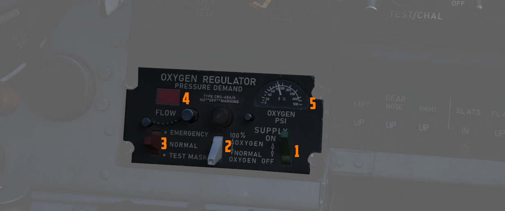

# 左侧子面板

## 照相枪开关

激活照相枪录制。

## 空对空灯

当激活 [CAGE](../../stores/air_to_air/acm_modes.md) 模式时亮起；按下灯光来使雷达返回进入 CAGE 前的
原操作模式。

## 视频选择按钮

当 TV 模式时，在 WEAPON——例如 [AGM-65 “幼畜”](../../stores/air_to_ground/missiles/maverick.md) 和
[瞄准吊舱 (ASQ-153)](../../systems/weapon_systems/pave_spike/overview.md) 之间切换雷达显示器显示的
视频。

## AVTR 控制

控制可记录内话声音以及后座雷达屏幕的机载录像机。

录像系统的详细信息请阅读 [9.6 录像机](../../dcs/recorders.md) 章节。

### AVTR 开关

当开关处于 RECORD 档位时，录像将被录制在磁带上并且 RCD 指示灯亮起。开关拨至 STANDBY 档位将暂停录制
，在开关拨至 OFF 档位 10 秒钟后系统会自动将磁带倒转回到首端。

### AVTR 磁带计时器

磁带可录制时间最长可达 20 分钟，剩余录制时间在标有 MINUTES 的小窗口中指示。

### EOT 灯

EOT 指示灯亮起表示到达磁带的末端，必须先将磁带倒转回首端，然后才能再次录制。

### RCD 灯

亮起表示 AVTR 正在录制。

## 以及起落架手柄

使用一对压缩气瓶来放下起落架；手柄不能用来收上起落架，仅在应急情况下放下起落架。

## 应急刹车手柄

在应急情况下，将液压蓄压器的部分压力释放到刹车系统中来进行应急刹车。制动操作的次数有限。

## APX-80 控制面板

AN/APX-80 结合了 IFF 问询器系统 APX-76 和“战斗树”系统 APX-81A。AN/APX-80 用于识别飞机是友机或敌机。

详见 [问询器系统](../../systems/identification_systems.md#interrogator-systems)。

### 编码按钮

编码显示屏的第一位数字表示当前的 IFF 模式，可以是以下任一种模式：

- Off (白块) - 模式 1 - 模式 2 - 模式 3 - 模式 4/A - 模式 4/B

> 💡 在 DCS 中，只有模式 4 ( A 或 B 其中一个) 有效并且可被用于 > 问询。

其它四位数字用于设置 IFF 编码来在模式 1 至 3 进行问询。

位于显示器下方和上方的按钮分别用于减少和增加相应的设置。

### 问询灯

这种可调光的按下测试灯亮起时，表示正在使用 APX-76 系统进行 IFF 主动询问。

### 测试/问询编码

如果开关设置到 OFF 档位，则关闭 APX-76 问询系统电源。开关拨至 CHALLENGE 档位时，可用于问询。

TEST 档位用于测试系统。如果上面的指示灯亮起，则表示测试通过。

### 抗干扰

开关可用于某些系统的抗干扰机措施，但在该批次的 F-4E 中从未安装并连接到抗干扰措施。

### 测试/问询灯

这种可调光的按下测试灯亮起时，表示正在使用 APX-81A “战斗树”系统进行主动询问。

### 测试按钮

开始 APX-81A “战斗树”系统的机内自检程序。

### 模式 2

用来将“战斗树”模式 2 设置至 ACTIVE、PASSIVE 或 OFF 类型。

### 模式 3

用来将“战斗树”模式 3 设置至 ACTIVE、PASSIVE 或 OFF 类型。

### 模式 4

用来将“战斗树”模式 4 设置至 ALARM 或 OVERRIDE 类型。

在该批次的 F-4E 中从未安装并连接到这一功能。

## WSO 氧气调节杆面板

### 供氧杆

用于激活面罩氧气流量的二档位开关（ON 和 OFF）。详见
[3.7 公用章节，氧气部分](../../systems/utility.md#oxygen-system)。

### 稀释杆

二档位稀释杆，位于调节面板的中部，用来控制氧气和空气混合。

若要使空气与氧气成比例混合，则应选择 NORMAL OXYGEN 档位。

需要纯氧呼吸时，应该选择 100% OXYGEN 档位。如果驾驶舱内发生火灾、出现有毒烟雾或烟尘，最好使用该档位
。

### 应急流量控制开关

开关总共有三个档位可供选择，分别是，NORMAL（正常供养）、 EMERGENCY 压力（纯氧以及持续正压）或 TEST
MASK（正压来测试面罩气密性）。

控制杆应始终保持在中立（NORMAL）档位，除非需要特意增加压力。

### 流量指示器

机组进行呼吸时，黑白交替显示来指示氧气流量（白色表示吸入）。

### 氧气压力表

显示供氧压力，显示区间为 0 到 500 psi。

详见 [3.7 公用章节，氧气部分](../../../systems/utility.md#oxygen-system)。

## 起落架/襟翼指示器面板

显示当前起落架的状态、襟翼和缝翼的位置。

### 起落架

用 UP（上）字样、斜条纹图案（过渡）或“机轮”图标（下）标注起落架当前的状态。

详见 [3.1.3 起落架章节](../../systems/flight_controls_gear/gear_ground_handling.md) 。

### 缝翼

使用 IN 和 OUT 字样标注当前状态。

### 襟翼

使用 UP（襟翼收上） 和 DOWN（襟翼放下） 字样标注当前状态。在过渡时，可能会显示斜条纹图案。当过渡回
UP 档位时，在襟翼完全收上前指示器不会发生变化。

详见
[3.1.2 飞行控制设备 & AFCS、缝翼和襟翼部分](../../systems/flight_controls_gear/flight_controls.md#slats-flap-system)
。
