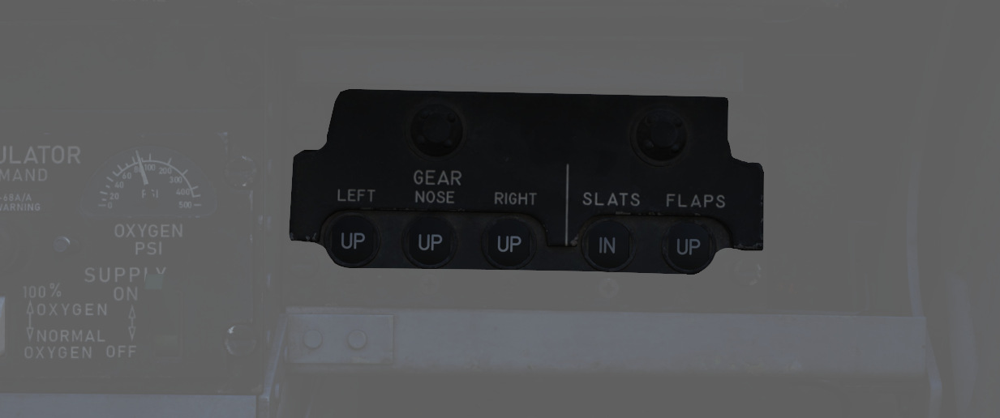

# Left Sub-Panel

The left sub-panel contains the AVTR, Gun Camera, air-to-air indicators (<num>1</num>), the
emergency landing
gear handle (<num>2</num>), the emergency brake handle (<num>3</num>), the APX-80A control
panel (<num>4</num>), the WSO oxygen
regulator panel (<num>5</num>) and the slats and flaps indicators for the WSO (<num>6</num>).

## Gun Camera Switch

The two-position switch (<num>1</num>) activates recording of gun camera footage.

## Air to Air Light

Illuminates (<num>2</num>) when [CAGE](../../stores/air_to_air/acm_modes.md) mode activated;
pressing the light
reverts the radar to the original operating condition prior
to CAGE entry.

## Video Select Button

Push button (<num>3</num>) that alternates between WEAPON, such
as [AGM-65 Mavericks](../../stores/air_to_ground/missiles/maverick.md),
and [ASQ-153 (targeting pod)](../../systems/weapon_systems/pave_spike/overview.md) television video
on the radar scope display when in TV mode.

## AVTR Control

Controls the Airborne Video Tape recorder system, which records the intercom
sound, as well as the rear radar screen.

For further information about the Recorder system, see [9.6 Recorder](../../dcs/recorders.md).

### AVTR Switch

With the switch (<num>6</num>) in the RECORD position, footage is recorded on the cassette and
the RCD light illuminates. The STANDBY position pauses recording, while the OFF
position will additionally automatically unthread the tape back to the beginning
after 10 seconds.

### AVTR Tape Timer

The cassette can record up to 20 minutes of footage, indicated in the small
display (<num>5</num>) labelled MINUTES.

### EOT Light

Once the end of the tape has been reached, the EOT light (4 lower half) illuminates and the
tape must be unthreaded before it can record again.

### RCD Light

Lit (<num>4</num> upper half) to indicate the AVTR system currently recording.

## Emergency Landing Gear Handle

Deploys the landing gear using a pair of compressed air bottles; the handle cannot
retract gear, only deploy it in an emergency.

## Emergency Brake Handle

In an emergency, it discharges a portion of the brake system's hydraulic accumulator
to provide emergency braking. Contains a limited number of applications.

## APX-80 Control Panel

The AN/APX-80 combines the IFF Interrogator System APX-76 and the Combat-Tree
system APX-81A. It is used to identify whether an aircraft is friendly or
hostile.

See [Interrogator Systems](../../systems/identification_systems.md#interrogator-systems)
for details.

### Code Buttons

The first digit of the code display (<num>3</num>) indicates the current mode
for the AN/APX-76 interrogator. It can be either of:

- Off (white square)
- Mode 1
- Mode 2
- Mode 3
- Mode 4/A
- Mode 4/B

> 💡 In DCS, only Mode 4 (either A or B) is effective and can be used for
> interrogation.

The other four digits are used to set the IFF code to interrogate for Mode 1
to 3.

The buttons below and above the display are used to decrement and increment the
corresponding setting, respectively.

### Challenge Lamp

This dimmable push-to-test lamp (<num>1</num>) illuminates to indicate active interrogation
with the APX-76 system.

### Test/Challenge Code

Setting the switch (<num>2</num>) to the CHALLENGE position will send interrogation
challenges by the AN/APX-76 system.

TEST initiates a test of the system, see
[AN/APX-76 Test](../../systems/identification_systems.md#test) for details.

### Anti-Jam

This switch (<num>7</num>) could be used for anti-jammer measurements on some systems, but was
never installed and connected on this variant of the F-4E.

### Test/Challenge Lamp

This dimmable push-to-test lamp (<num>6</num>) illuminates to indicate active interrogation
with the APX-81A Combat-Tree system.

### Test Button

The push button starts the built-in test of the APX-81A Combat-Tree system,
see [AN_APX-81A Test](../../systems/identification_systems.md#self-test) for details.

### Mode 2

This switch (<num>5</num>) is used to set Combat-Tree Mode 2 to either ACTIVE, PASSIVE or OFF types.

The ACTIVE position is required to use the system.

### Mode 3

This switch (<num>5</num>) is used to set Combat-Tree Mode 3 to either ACTIVE, PASSIVE or OFF types.

The ACTIVE position is required to use the system.

### Mode 4

This switch (<num>4</num>) is used to set Combat-Tree Mode 4 into ALARM or OVERRIDE types.

This functionality was never installed and connected on this variant of the
F-4E.

## WSO Oxygen Regulator Panel

### Supply Lever

Two-position switch (<num>1</num>) (ON and OFF) activating flow of oxygen to the mask.
For further information,
see [3.7 Utility chapter, Oxygen section](../../systems/utility.md#oxygen-system).

### Diluter Lever

A two position (<num>2</num>) diluter lever, in the center of the regulator
panel, controls the mixture of air and oxygen.

For a proportional amount of air to oxygen, the NORMAL
OXYGEN position should be selected.

For pure oxygen, the
100% OXYGEN position should be selected. This setting is preferable
if fire, toxic smoke or fumes occur in the cockpit.

### Emergency Flow Control Switch

Three-position switch (<num>3</num>) which permits selection of NORMAL (standard supply),
EMERGENCY pressure (100% oxygen with continuous positive pressure) or
TEST MASK (positive pressure to test the face mask for leaks).

The Emergency Lever should remain in the center (NORMAL) position at all times,
unless an unscheduled pressure increase is required.

### Flow Indicator

Alternates (<num>4</num>) between black and white with each aircrew member's breath to indicate
oxygen flow (white indicates inhalation).

### Oxygen Pressure Gauge

Indicates (<num>5</num>) oxygen supply pressure from 0 to 500 psi.

For further information,
see [3.7 Utility chapter, Oxygen section](../../systems/utility.md#oxygen-system).

## Landing Gear/Flap Indicator Panel

Displays current status of landing gear, flaps, and slat position.

### Landing Gear

Status noted with the word UP (up), a barber pole illustration (in transition),
or an icon of a wheel (down) relative to the current position.

See the [3.1.3 Landing gear chapter](../../systems/flight_controls_gear/gear_ground_handling.md) for
more information.

### Slats

Status noted with the words IN and OUT.

### Flaps

Status noted with the word UP (flaps up) or DN (down). When transitioning, it may
show a barber pole illustration. When transitioning back to the UP position, the
indicator does not change until the flaps are fully retracted.

See
the [3.1.2 FLight Controls & AFCS, Slats and Flaps section](../../systems/flight_controls_gear/flight_controls.md#slats-flap-system)
for more information.
