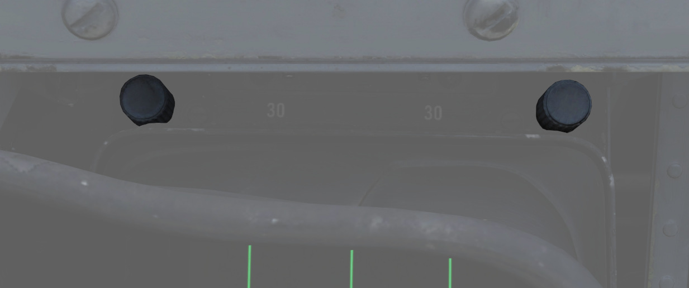
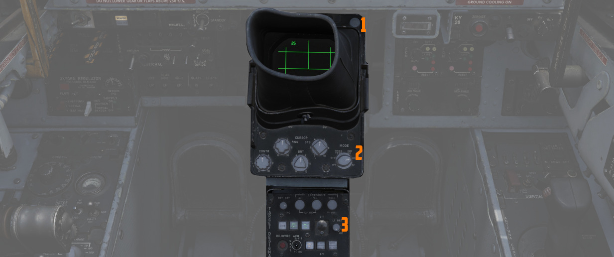
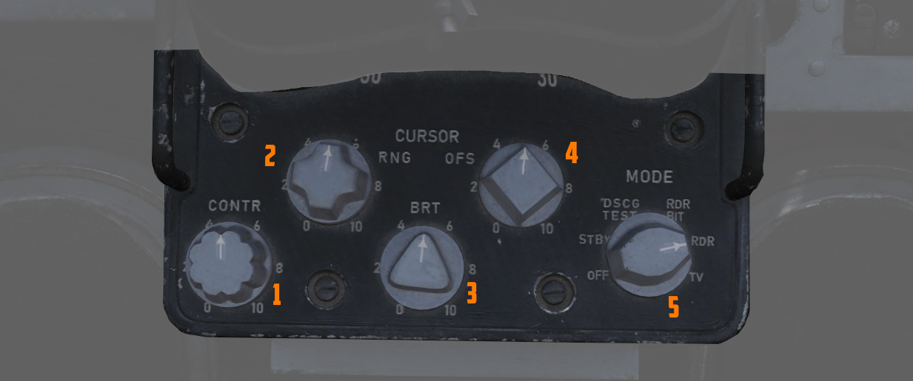
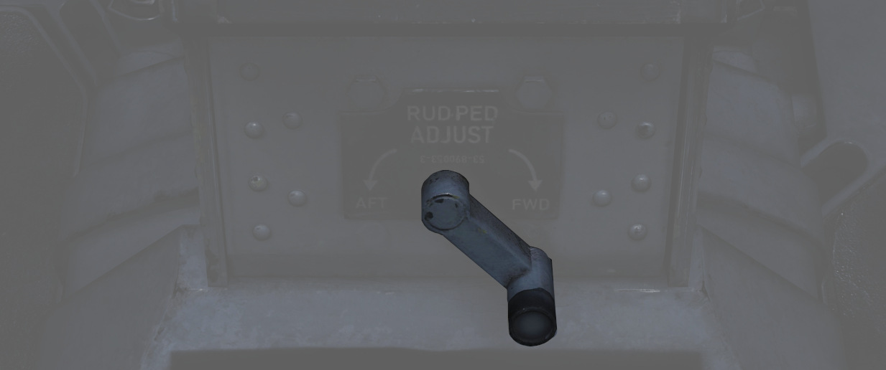

# 底座组

驾驶杆后面的区域包含雷达屏幕以及瞄准吊舱的控制开关/按钮。

## 数字扫描转换器组 (DSCG)

DSCG 用于显示雷达、武器和瞄准吊舱的视频。

点击防眩罩即可将其取下。

### 方格旋钮

方格旋钮位于防眩罩左上方，用于控制 DSCG 显示屏视野中显示方格的亮度；顺时针转动增加亮度，逆时针转动
降低亮度。

### 标度旋钮

位于 DSCG 右上方，旋钮控制 DSCG 显示屏周围板面距离标度的亮度；顺时针转动增加亮度，逆时针转动降低亮
度。

### H - 干扰源寻的灯

位于防眩罩内侧左上角的指示灯，当雷达在干扰源寻的模式下实现角跟踪时亮起。

### T - 跟踪灯

位于防眩罩内侧右上角的指示灯，在实现标准雷达锁定时亮起。如果脱锁，雷达将回退到记忆距离和速度信息，
此时指示灯将熄灭。

### 光标 RNG (距离)

在 MAP PPI 和 信标 PPI 模式下，增加（顺时针）和降低（逆时针）半球形纵向距离光标的相对亮度，设置对两
个显示屏（WSO 和 飞行员）生效。

### 光标 OFS (偏置)

在 MAP PPI 和 信标 PPI 模式下，增加（顺时针）和降低（逆时针）横向光标的相对亮度，设置对两个显示屏
（WSO 和 飞行员）生效。

### 对比度旋钮 - CONTR

旋钮用来控制 DSCG 显示屏的相对对比度；顺时针方向转动来增加对比度，逆时针方向降低对比度。

### 亮度旋钮

增加（顺时针）和降低（逆时针）显示器整体的显示亮度。

### 模式旋钮

设置 DSCG 部件当前的模式。

| 名称      | 描述                                                                                                          |
| --------- | ------------------------------------------------------------------------------------------------------------- |
| OFF       | 关闭 DSCG 显示器并断开所有 DSCG 部件的电源。                                                                  |
| STBY      | 为 DSCG 部件通电，DSCG 显示器保持关闭。起降作业时使用。                                                       |
| DSCG TEST | 显示带有 8 种灰色阴影的测试搜索显示图来确认正常工作。选择距离 10 来确保图片显示大小合适。                     |
| RDR BIT   | 提供用于校正雷达性能的[BIT 序列](../../procedures/bit_tests/radar_air_to_air.md) 测试方格。                   |
| RDR       | 在所有使用模式下雷达显示正常工作的所选档位。                                                                  |
| TV        | 用于显示 EO（光电）武器以及的[瞄准吊舱](../../systems/weapon_systems/pave_spike/overview.md) 的 TV 光栅图像。 |

## 目标指定控制套件

这是与 [Pave Spike 瞄准吊舱](../../systems/weapon_systems/pave_spike/overview.md) 进行交互的主面板
。

### 十字亮度

控制 TV 十字的对比度，调节区间可从黑色（逆时针方向转动到最大档位）到绿色（顺时针方向转动到最大档位
）。在指定和攻击过程中，应将调整好十字和背景的对比度最大化可读性。

### 瞄准轴旋钮

三个旋钮可控制吊舱瞄准轴的位置，分别对应 ±2.5 度方位、仰角以及横滚角度。

方位和仰角在 12-VIS 模式下可取得最佳校正效果，横滚则为 9-VIS 模式下。

> 💡 通常情况下，地勤人员会在上 > 飞机前正确校正吊舱，但由于战斗损伤或大过载机动，吊舱可能会发生漂
> 移，在这种情况下，WSO 需要重新校正 > 吊舱。

### 收起按钮

交替按下可伸出和收起 Pave Spike 吊舱镜头。按钮亮起时，镜头收起。

伸出镜头时，吊舱将根据选定捕获模式进行移动。

为防止损伤系统，必须在起降以及大过载机动期间收起吊舱。

> 🟡 注意：收起位置仅靠电力 > 来保持，在没有电源的情况下，吊舱会自由摆动，如果用力 > 撞击到环架的极
> 限位置，吊舱将会受损。

### 激光就绪选择按钮

如果按下按钮后亮起，将启用指示器激光照射。

如果在互锁条件下（前轮收上并且所有吊舱功能正常）禁止使用，灯光将保持熄灭。再次按下将停用激光系统。

### 通电按钮

按下并松开时为瞄准吊舱供电。再次选择则断开瞄准吊舱电源。镜头收起后，按钮灯将熄灭。

为防止系统受损，只要挂载，即使在不使用吊舱时也应打开系统电源。

### BIT 选择按钮

按下按钮来进入所需的 [BIT](../../systems/weapon_systems/pave_spike/other.md#bits) 模式，BIT 模式将
在相邻的窗口显示。

[BIT 1]是吊舱的常规模式，必须选择该模式才能正常工作。

### 灯光亮度旋钮

控制该面板上所有灯光的亮度，过热灯除外。

### 断开/超控按钮

当吊舱探测到激光测得的斜距与 INS 计算出的距离相差太大时，它会自动放弃前者，选用后者。

在这种情况下，可以使用按钮来强制使用激光测得的斜距。

### 捕获模式选择开关

一个三档位开关，用来决定吊舱的主工作模式。

| 名称                                         | 描述                                                                                                                                                        |
| -------------------------------------------- | ----------------------------------------------------------------------------------------------------------------------------------------------------------- |
| 12-VIS                                       | 吊舱 LOS 平行隶属至光学瞄准具准星。                                                                                                                         |
| [WRCS](../../systems/weapon_systems/wrcs.md) | 除非停用[WRCS](../../systems/weapon_systems/wrcs.md) 一体化，否则 LOS 将隶属至 [WRCS](../../systems/weapon_systems/wrcs.md) 光标；其它情况下将恢复到 12-VIS |
| 9-VIS                                        | 将 LOS 隶属至 FRL 下方 90 度处并向左横滚 90 度。                                                                                                            |

### WRCS 脱机

如果亮起，表示 [WRCS](../../systems/weapon_systems/wrcs.md) 未与吊舱进行一体化，无法使用一体化的功
能。

除非是通过其它方式解除一体化，否则 WSO 可以按下按钮来手动断开或接通一体化。

### BIT 状态指示器

根据所选 BIT 序列的通过情况亮起；GO 确认正常工作，MALF 表示特定测试循环的
[BIT](../../procedures/bit_tests/overview.md) 未通过。

### 过热灯

OVHT 灯亮起表示吊舱处于过热状态。

为防止受损，请关闭吊舱，冷却一段时间后再继续使用。忽略 OVHT 灯会导致吊舱零件融化，造成无法修复的损
坏。

为延长吊舱的使用时间并防止出现过热，应避免低空低速飞行以及连续使用激光。根据经验，在两次使用之间没
有进行冷却的情况下，连续使用激光的时间不要超过 15 分钟。在操作吊舱时，将持续低空低速飞行的时间限制
在 30 分钟以内。对于极端的室外温度，请相应调整时限。

### INS 脱机

亮起表示 [INS](../../systems/nav_com/ins.md) 未与吊舱进行一体化，无法使用一体化的功能。

除非是通过其它方式解除一体化，否则 WSO 可以按下按钮来手动断开或接通一体化。

## 方向舵脚蹬调整转轮

用于前后调整方向舵脚蹬到合适的位置。

调整到对向最大行程之间需要转动 12 次转轮。
