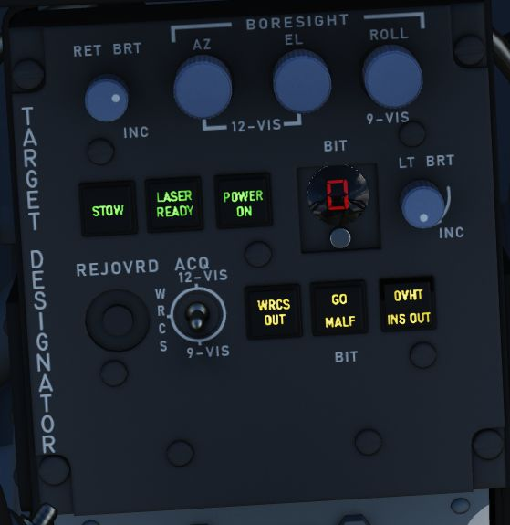

# Pedestal Group

## Digital Scan Converter Group (DSCG)

### Grid Knob

Controls brightness of the display grid on the visual field of the DSCG display;
clockwise increases brightness, counterclockwise decreases.

### Scale Knob

Controls brightness of the bezel range scales surrounding the DSCG display;
clockwise increases brightness, counterclockwise decreases.

### H - Home on Jam Lamp

Illuminates when the radar has achieved angle tracking in Home on Jam mode.

### T - Track Lamp

Illuminates when a standard radar lock on is achieved. Will go out in the event
the radar falls back to memorized range and rate information should the lock be
lost.

### Contrast Knob - CONTR

Controls relative contrast level of DSCG display; clockwise increases contrast,
counterclockwise reduces contrast.

### Cursor RNG (Range)

Increases (clockwise) and decreases (counterclockwise) the relative brightness
of the hemispherical Along Track range cursor in MAP PPI and Beacon PPI modes on
both displays (WSO and Pilot).

### Cursor OFS (Offset)

Increases (clockwise) and decreases (counterclockwise) the relative brightness
of the Cross Track cursor in the MAP PPI and Beacon PPI modes on both displays
(WSO and Pilot).

### Brightness Knob

Increases (clockwise) and decreases (counterclockwise) the brightness of the
overall scope display.

### Mode Knob

Sets the current mode of the DSCG components.

| Name      | Description                                                                      |
| --------- | -------------------------------------------------------------------------------- |
| OFF       | Turns off DSCG display and de-powers all DSCG components.                        |
| STBY      | Powers DSCG components, DSCG display remains off.                                |
| DSCG TEST | Displays search display image with 8 shades of grey to confirm normal operation. |
| RDR BIT   | Provides BIT sequence test grids for calibration of radar performance.           |
| RDR       | Used for radar display functionality in all employment modes.                    |
| TV        | Used for TV raster imagery with EO weapons.                                      |

## Target Designator Control Set

This is the main panel to interact with the Pave Spike Targeting Pod.

### Reticle brightness

Controls contrast of the TV reticle from black (full counter-clockwise) to green
(full clockwise). Should be set to attain maximum contrast in the display window
during the designation and attack procedure.

### Boresight knobs

Three knobs to control the boresight position of the pod in azimuth, elevation
and roll within 2.5 degrees in either direction.

Azimuth and Elevation can best be calibrated in the 12-VIS mode, while roll is
best calibrated in 9-VIS.

### Stow Button

Alternating presses un-stows and stows the Pave Spike pod head. The head is
stowed when the button is illuminated.

When un-stowed, the pod will move accordingly to the selected acquisition mode.

To prevent damage to the system, the pod must be stowed during takeoff, landing
and any High-G maneuvers. Note that the stowed position is held electrically
only and without power, the pod swings freely and gets damaged when forcefully
bumped into its gimbal limits.

### Laser Ready Select Button

Enables designator laser firing if illuminated after pressing.

Light remains off if interlocks (nose gear up and all pod functions working)
inhibit use. Subsequent press deactivates laser system.

### Power On Button

Applies power to the targeting pod when pressed and released. Selected again to
power off targeting pod. Button lamp will turn off once head is stowed.

To prevent damage to the system, whenever equipped, power to the system should
be turned on even when not using the pod.

### BIT Selector Button

Pressed to advance to the desired BIT mode as displayed in the adjacent window.

BIT 1 is the regular mode of the pod and must be selected for normal operations.

### Light Brightness Knob

Controls brightness of all lamps on this panel, except the Overheat lamp.

### Reject/Override Button

When the pod detects a too huge discrepancy between the laser measured slant
range and the INS based computed ranged, it automatically rejects former and
prefers latter.

In this case, the button can be used to force the use of the laser measured
slant range instead.

### Acquisition Mode Selector Switch

Three position switch determining the pods main operation mode.

| Name   | Description                                                                                         |
| ------ | --------------------------------------------------------------------------------------------------- |
| 12-VIS | Slaves LOS parallel to the optical sight pipper.                                                    |
| WRCS   | Slaves LOS to the WRCS cursors unless WRCS integration is deactivated; reverts to 12-VIS otherwise. |
| 9-VIS  | Slaves LOS to 90 degrees below FRL and rolled 90 degrees left.                                      |

### WRCS Out

If lit, the WRCS is not integrated into the pod and functionalities requiring
its integration are not available.

Can be pressed to manually disengage or engage integration, unless it was
disintegrated by other means.

### BIT Status Indicator

Illuminates based on completion of the selected BIT process; GO confirms
functionality, MALF shows BIT failure for a given test cycle.

### Overheat Lamp

The OVHT lamp illuminates to indicate an overheat condition in the pod.

To prevent damage, turn off the pod and give it some time to cool before further
use. Ignoring the lamp will cause parts of the pod to melt, damaging it
irreparably.

To prolong use of the pod and prevent overheating, limit slow and low-level
flight, as well as continuous use of the laser. As a rule-of-thumb, do not use
the laser for longer than 15 minutes without allowing for cooling between uses.
Limit continued slow and low level flight while operating the pod to 30 minutes.
For extreme outside temperatures, adjust the limits accordingly.

### INS Out

If lit, the INS is not integrated into the pod and functionalities requiring its
integration are not available.

Can be pressed to manually disengage or engage integration, unless it was
disintegrated by other means.

## Rudder Pedal Adjustment Crank

Used to adjust ergonomic position of the rudder pedals forward or back from the
WSO.

Requires 12 full turns to move the pedals across the entire range.
