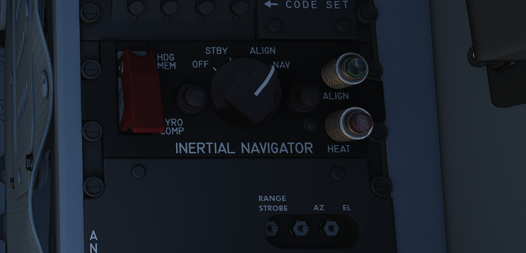
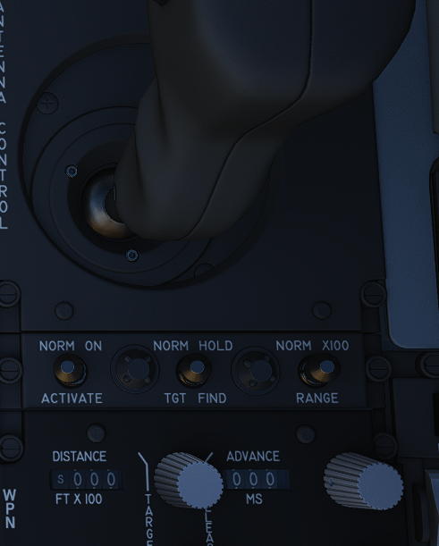
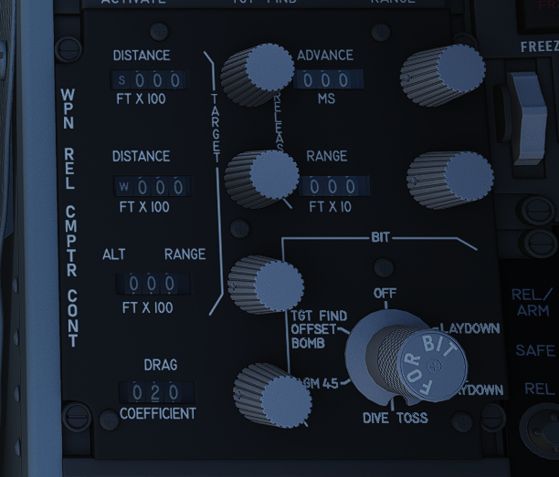
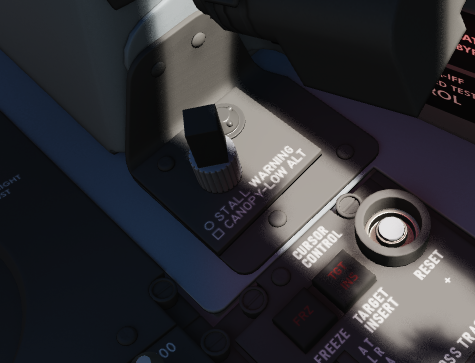
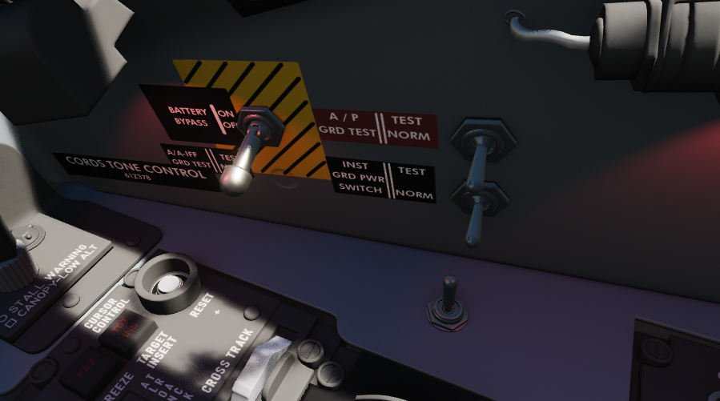

# Right Console

## Laser Coder Control

The WSO can set the laser code used by the targeting pod by using the four small
push-buttons on this panel.

### Code Buttons

Each press will advance the corresponding digit by one.

Codes directly relate to lasers frequencies, resulting in them having to be
between 1111 and 1788 and not use digits 0 or 9 in order to be valid.

### Enter Button

Once a code has been set, it can be transferred to the Pave Spike by pressing
the ENTER button to the right.

When power is applied to the system, it automatically initiates a transfer of
the currently set code.

### No Go Lamp

Validation of an entered code takes about 5 seconds. If the NO-GO lamp is lit,
the code is invalid.

## Inertial Navigation Control Panel

The Inertial Navigation Control Panel provides the rear pilot mode selection and
system alignment command selection.

### Mode Selector Switch

The HDG MEM-GYRO COMP switch, located under a cover, primarily stays in the GYRO
COMP position for Gyro Compass type of alignment. Switching it to HDG MEM,
before turning on the INS, allows, if previously stored, heading memory
alignment.

### Power Control Knob

Knob positions are:

| Name  | Description                                                                                                                                       |
| ----- | ------------------------------------------------------------------------------------------------------------------------------------------------- |
| OFF   | System off.                                                                                                                                       |
| STBY  | Standby- power is applied to the heaters and temperature control system, and initiates Coarse alignment (if GYRO COMP is selected on the toggle). |
| ALIGN | Performs fine platform and gyro leveling and BATH (or HDG MEM) alignment. Then, if available, performs Gyrocompassing (Fine) Alignment.           |
| NAV   | Activates the INS for navigation function, performance of which is based on the alignment quality.                                                |

### HEAT Lamp

The HEAT lamp illuminates when the system is placed into STBY mode, and remains
illuminated for 110 seconds after the gyros have reached operating temperature.
The system will not allow Gyrocompassing alignment if switched out of STBY
before this lamp has shut off.

### ALIGN Lamp

The ALIGN lamp provides current INS alignment through illuminating steady (BATH
alignment complete), or flashing at the completion of GYRO COMP or HDG MEM
alignment.

## Weapon Delivery Panel

### ACTIVATE Switch

Only available after the Target Insert button is pressed, placing the switch to
ON provides power to the weapon release computer's circuits for a LABS release
using the WRCS release range data.

### TGT FIND Switch

Used to combine the delivery functionality of the ARBCS/LABS system with the
WRCS TGT FIND mode. NORM is selected for the standard function of the WRCS
without LABS delivery capability. Selecting HOLD and an ARBCS setting from the
pilot's Delivery Mode Knob provides WRCS Target Offset search capability, and
the attack is completed using the normal ARBCS procedures from the IP.

### RANGE Switch

Selecting x100 changes the release range multiplier on the WRCS panel to a
factor of 100; in NORM, the standard factor of 10 is applied to the release
range.

## Weapon Release Computer Set (WRCS) Panel

### Target Distance Controls

A pair of four position drum roller windows with matching analog knobs. The top
window references distances in the North-South orientation (with the first
roller marked N/S), and the lower window references distances in the East-West
orientation (with the first roller marked E/W).

The rollers reference the distance shown in increments of 100 feet, thus a
distance of offset in the East direction for 4000' would be entered as E0040.

The rollers do function in an analog fashion, thus fractions of 100' can be
attained by moderating the last roller accordingly; as an example, a value of
250 feet would be attained with the space between the 2 and 3 value halfway in
the window in the last digit position.

### Target/IP Altitude Control

A three position drum roller window with matching analog knob used to enter the
altitude of either the RIP or the actual target itself, and is referenced in
increments of 100'. Fractional values can be entered as described previously.
This value can be changed once RIP or VIP is properly defined to increase
release system accuracy.

### Drag Coefficient Control

Used to enter the drag coefficient value for the weapon being used from the
bombing tables for the intended release mode. This is not the stores table
reference drag number.

### Release Advance Control

Used to advance the release signal given from the WRCS to the fire control
system relative to the WRCS target point, in any duration from 0 to 999
milliseconds. Also functions in conjunction with ARBCS/LABS programmed release
timing.

### Release Range Control

Used to manually set bomb range in accordance with the weapon's bomb release
schedule entry in the bomb tables.

### NO GO/GO Lamps

Provides results of the WRCS BIT tests for the selected WRCS delivery mode.
Illumination of NO GO when not in a BIT test cycle reports an INS system
failure.

### WRCS BIT Knob

A six position knob utilized to perform BIT checks against the individual WRCS
delivery modes. The BIT check is performed by selecting the desired mode for
testing, pressing the knob for five seconds, then pressing the Freeze button on
the Cursor Control Panel while keeping the BIT knob held down to confirm
function. The result will illuminate in the NO GO/GO placard.

## Volume Panel

A small panel to the right of the antenna hand control stick contains two
combined knobs to control volume.

### Canopy/Low Altitude Warning

Sets audio level for canopy open and low altitude voice warnings.

This system is not installed on this variant of the F-4E.

### Stall Warning

The Stall Warning knob controls the volume of the AoA tones that play when
flying at certain angles.

Under certain conditions, the system can override the volume to ensure the cue
is always audible in dangerous situations.

## Cursor Control Panel

Used for WRCS radar bombing mode target entry. Functions only with MAP-PPI mode
selected and applicable bombing mode selected on the Delivery Mode Knob.

### Freeze Button

Used in air to ground bombing with the WRCS to initiate velocity tracking of the
aircraft from the INS, as well as maintain a hold of the target position defined
by the Along Track and Cross Track cursor gates, thus defining the RIP (Radar
Initial Point). The button illuminates, and remains lit, until the reset button
is pressed, or another delivery mode is selected.

### Target Insert Button

Inserts the North-South and East-West offset values entered into the WRCS
control panel into the WRCS computer, performing the offset against the RIP
defined by the Along Track and Cross Track cursor gates and currently tracked
with the Freeze Button. This offset inclusion performs a shift of the Along
Track and Cross Track cursors to define the actual target defined by the WRCS
offsets on the radar scope. This action initiates target steering information
from the WRCS to the navigational displays.

### Reset Button

Pressing the Reset Button drops the currently tracked ground target location
from WRCS computer memory, returns the Along and Cross Track cursors to their
default positions, and resets the velocity tracking system values to zero.

### Along Track Wheel

Used to define relative range of the aircraft to the RIP, using an
expanding/contracting hemisphere cursor on the radar display. This hemisphere
presents true range to the target via the hemispherical PPI projection, thus
allowing the RIP to be detected in an offset approach to the target. Close
approximation of range to the RIP should be prepared first with the Along Track
wheel prior to using the Cross Track Wheel for best system accuracy- ie, the
cursor should be placed below the intended RIP return on the radar scope, and
the Cross Track wheel brought to the return point.

### Cross Track Wheel

Used to define the heading to the RIP on the radar display in PPI mode,
presented as a vertical line. The intersection of the Along Track and Cross
Track cursors defines the RIP when the Freeze button is pressed.

## Nuclear Stores Consent Switch

Used to arm nuclear stores. In the SAFE position, release is inhibited. REL
allows releasing stores unarmed, while REL/ARM allows dropping nuclear stores
armed.

## Aft Cockpit Lighting Control Panel

The Cockpit Lighting Control Panel provides control of all panel edge lighting,
flight instrument panel lighting, the console floodlights, the white floodlights
found under the canopy sill over each console, and also includes the Warning
Light Test and Standby Compass Light switch.

The White Floodlight switch acts independent of all other controls on the panel,
and is either ON or OFF. It activates a separate emergency floodlight (also
called Thunderstorm Light) that illuminates the cockpit in white. The lamp is
energized through the Battery Bus to ensure it is always operational, even in
case of total power loss. Do not forget to turn off the light before parking the
aircraft for a longer time, as it will otherwise drain the battery.

The Flight Instrument Light Knob (marked INSTR PANEL), when moved to the right
of the OFF detent, controls illumination of the following six instrument lights
in unison:

- Airspeed/Mach Indicator
- Attitude Director Indicator
- Angle of Attack Indicator
- Vertical Velocity Indicator
- Altimeter
- Horizontal Situation Indicator

When in the OFF position, these indicators are independently controlled for
illumination by the knobs on the Flight Instrument Lights Intensity Panel.

The Indexer Lights brightness knob controls relative illumination of the AoA
indexers on both sides of the windscreen. Marked positions are DIM and BRT
(bright), with highest level to the right of the knob.

The Console Light Control Knob, with range from OFF to BRT, controls
illumination level for all panel edge lighting and the console floodlights.

The console floodlights (CONSOLE FLOOD) are triggered independently of the knob
when it is placed to the right of the OFF detent position, and offer three
settings- DIM, MED, or BRT. The floodlights will remain on until the Console
Light Control knob is returned to the OFF position, and the floodlight switch is
placed in DIM. All three positions are powered by different buses to ensure
maximal availability:

| Lamp   | Bus                   |
| ------ | --------------------- |
| Bright | Essential 28V DC Bus  |
| Medium | Left Main 14V AC Bus  |
| Dim    | Left Main 115V AC Bus |

The Warning Light Test Switch if set to the TEST position, confirms function of
the various emergency indicators in the cockpit.

The STBY COMP switch illuminates the light for the Standby Compass.

## Right Wall

### Battery Bypass

When toggled ON, de-energizes the battery relay, disconnecting the battery from
the essential 28-volt de bus and ceasing charging. Particularly used in
suspected cases of thermal runaway.

### Autopilot Ground Test

### Instrument Ground Power

In the TEST position, connects external electrical power to the instrument buses
(115/200 volt ac, 28 volt ac, and 14 volt ac) , contingent upon the generator
switches being set to EXT ON.

### Skyspot Mode

This switch would allow to select the mode of the Combat Skyspot system used for
ground-directed bombing.

The system was never installed on this variant of the F-4E.

## Seat Position

The vertical position of the seat can be changed in either direction for about
5cm using this spring-loaded switch.

Operation of the motor must be limited to 30 seconds within 10 minutes to
prevent it from overheating and breaking.
