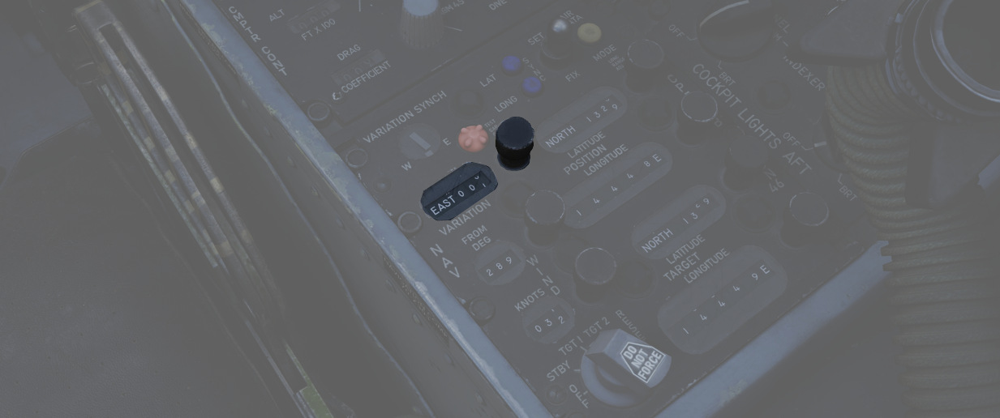
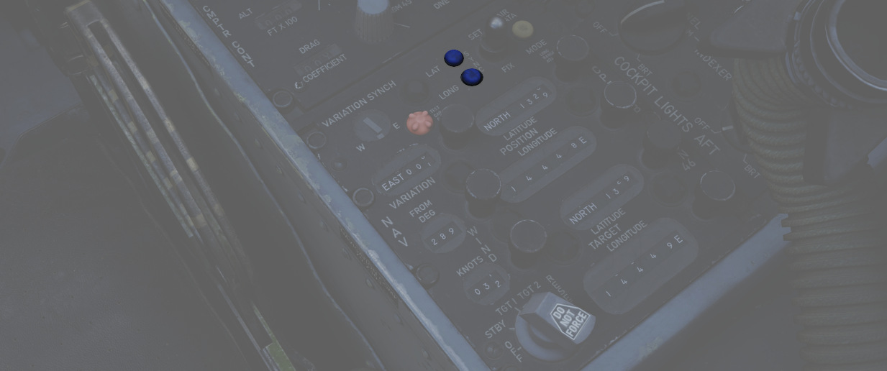

# 后部

右侧控制台的后部设有导航和照明面板。

## 导航面板

导航计算机控制面板是管理飞机导航的接口——管理包括飞机位置以及 HSI 和 BDHI 等导航仪表的目标。导航计算
机可以在两种模式下运行： INERTIAL 模式和 AIR DATA 模式。

详见 [导航计算机](../../../systems/nav_com/ins.md#navigation-computer)。

面板上配备了一系列对导航计算机操作至关重要的控制旋钮和开关。

### 功能选择旋钮

| 档位     | 模式                                                                |
| -------- | ------------------------------------------------------------------- |
| OFF      | 系统断电。                                                          |
| STBY     | 系统通电但经纬度位置集成关闭。                                      |
| TARGET 1 | 计算目标滚筒上选定坐标的距离和方位。                                |
| TARGET 2 | 计算记忆坐标的距离和方位。                                          |
| RESET    | 清除记忆坐标。当移回目标 2 时，在目标滚筒上设置的选定坐标将被存储。 |

### 风向风速控制旋钮与计数器

可手动设置计数器上显示的风速（单位：节）和风向（单位：度，来向）。由导航计算机在 AIR DATA 模式下使
用。

### 磁差旋钮与计数器

允许手动设置磁差（度）。对于在 AIR DATA 模式下进行导航计算和初始（BATH）INS 对准至关重要。

### 位置控制旋钮与计数器

这些旋钮用于手动更改计数器上显示的飞机当前的经纬度位置（度和分）。按下按钮后生效。

> 💡 在 INERTIAL 模式下，位置更新开关必须结合位置控制旋钮 > 使用才能更新位置坐标。

### 目标控制旋钮与计数器

目标控制旋钮用于设置目标经纬度计数器，这些计数器既可用作直接航路点目标（当功能选择钮设置为 TARGET 1
时），也可用于记忆 TARGET 2 坐标（选择 RESET 档位后）。

### 位置更新开关

| 位置   | 模式                                                                                                |
| ------ | --------------------------------------------------------------------------------------------------- |
| SET    | 断开位置计数器的更新机构，允许自动转动计数器至所需位置。                                            |
| NORMAL | 在惯性模式下，位置计数器根据 INS 信号更新；在大气数据模式下，位置计数器根据系统自身的计算结果更新。 |
| FIX    | 以每秒约 3 弧分的速度更新 INS 位置。                                                                |

> 💡 该开关在设置为 NORM 档位时会有约 0.5 秒的延时，以防止计数器在从 SET 拨到 FIX 档位的过渡过程中
> 出现不必要的 > 更新。

### 同步指示器

在惯性模式下，仪表显示 INS 计算出的磁差与手动设置的磁差之间的差值。在 AIR DATA 模式下，手动设置的磁
差不会影响该指示器。

### 测试盖断开灯

当来大气数据计算机提供的真空速回路出现故障时亮起，表示电路开路。

### 经纬度同步灯

当纬度或经度的位置计数器与 INS 提供的坐标不一致（相差超过 1.5 弧分）时亮起。

### 大气数据模式灯

指示灯亮起表示导航计算机处在 AIR DATA 模式。

## 驾驶舱照明控制面板

驾驶舱照明控制面板中包括控制所有面板边缘照明、飞行仪表板照明、控制台泛光灯、每个位于控制台上方的白
色泛光灯以及告警灯测试/备用罗盘灯的开关。

### 白色泛光灯

白色泛光灯开关独立于面板上的所有其它控制开关/旋钮进行工作，可以拨至 ON 或 OFF 档位。开关将打开一个
单独的应急泛光灯（也称为灯），以白光照亮驾驶舱。

### 备用罗盘开关

STBY COMP 开关用于控制开关备用罗盘的照明灯光。

### 控制台泛光灯

控制台泛光灯开关用来控制控制台整体照明红色泛光灯的亮度。有三个档位可供选择，分别是： DIM、MED 和
BRT。

> 💡 如需关闭红色泛光灯，将开关拨至 DIM > 并将控制台旋钮转至 OFF。

> 💡 仪表板泛光灯照明由飞行员控制， > 见
> [仪表泛光灯开关](../../pilot/right_console/wall.md#instrument-flood)。

### 告警灯测试开关

将告警灯测试开关拨至 TEST 档位可确认驾驶舱内各种应急指示灯是否正常工作。

### 仪表板旋钮

仪表板旋钮可控制仪表板的背光以及大部分仪表的边缘照明。

> 💡 主要飞行仪表通过飞行员驾驶舱中的 >
> [飞行仪表亮度旋钮](../../pilot/weapon_management.md#flight-instrument-brightness-knob) > 进行控制
> 。

### 分度器旋钮

用来控制位于风挡两侧 AoA 分度器的亮度。

### 控制台旋钮

控制台照明控制旋钮的可从 OFF 转动到 BRT，用于控制左右控制台的照明亮度。
