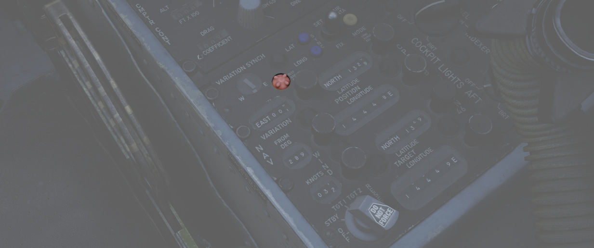
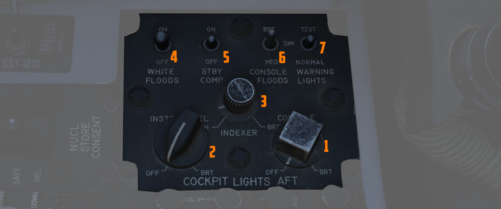

# Aft Section

The aft section of the right console features the navigation and lighting panel.

## Navigation Panel

The Navigation Computer Control Panel serves as an interface for managing the aircraft's
navigation, including its position and targets for navigation instruments like the HSI and BDHI.
It can operate in two modes: INERTIAL and AIR DATA.

See [Navigation Computer](../../../systems/nav_com/ins.md#navigation-computer) for details.

The panel is equipped with a range of control knobs and switches essential for the operation
of the Navigation Computer.

### Function Selector Knob

A five position rotary switch (<num>(<num>1</num>)</num>) used to set the function of the navigation
system.

| Position | Description                                                                                                                      |
|----------|----------------------------------------------------------------------------------------------------------------------------------|
| OFF      | System powered down.                                                                                                             |
| STBY     | System is powered but the latitude and longitude position integration is off.                                                    |
| TARGET 1 | Computes range and bearing to the selected coordinates set on the TARGET rollers.                                                |
| TARGET 2 | Computes range and bearing to the memorized coordinates.                                                                         |
| RESET    | Clears the memorized coordinates. When moved back to TARGET 2, the selected coordinates set on the TARGET rollers are memorized. |

### Wind Control Knobs and Counters

Two rotary knobs (<num>2</num>) that enable manual setting of wind velocity (in knots) and
direction (in
degrees, from), displayed on the counters. Utilized by the Navigation Computer in AIR DATA mode.

### Magnetic Variation Knob and Counters

A rotary knob (<num>3</num>) that allows manual setting of magnetic variation (in degrees).
Essential for
navigation computations
in AIR DATA mode and for initial (BATH) INS Alignment.

### Position Control Knobs and Counters

These knobs (<num>9</num>) are used to manually change the current aircraft position in terms of
latitude
and longitude, as displayed on the counters (in degrees and minutes). They must be pressed
in to be effective.

> 💡 In INERTIAL mode, the Position Update Switch must be used in conjunction with these knobs
> to update the position coordinates.

### Target Control Knobs and Counters

The target controls (<num>10</num>) enable the setting of target latitude and longitude counters,
which can be
used either as direct waypoint targets (when the Function Selector Knob is set to TARGET 1) or to
memorize TARGET 2 coordinates (after the RESET position has been selected).

### Position Update Switch

A three position switch (<num>7</num>) to set the position updating.

| Position | Description                                                                                                                   |
|----------|-------------------------------------------------------------------------------------------------------------------------------|
| SET      | Disengages the updating mechanism of position counters, allowing them to be freely rotated to the desired position.           |
| NORMAL   | Position counters are updated based on the INS signal in Inertial Mode, or by the system's own computations in Air Data Mode. |
| FIX      | Updates the INS position at a rate of approximately 3 minutes of arc per second.                                              |

> 💡 The switch features an approximate 0.5-second delay when set to NORM, designed to prevent
> unwanted
> updates of the counters during the transition from SET to FIX.

### Variation Sync Meter

In Inertial mode, this meter (<num>5</num>) displays the discrepancy between the INS-computed and
manually set
magnetic variation. In AIR DATA mode, the manually set variation does not affect this indicator.

### Test Cap Off Light

Illuminates (<num>4</num>) when there is a failure in the true airspeed circuit from the Air Data
Computer,
indicating an open circuit condition.

### Latitude and Longitude Sync Lights

Illuminate (<num>6</num>) when the position counters for latitude or longitude do not match the
coordinates
provided by the INS (difference above 1.5 arc minutes).

### Air Data Mode Light

Illumination (<num>8</num>) indicates that the Navigation Computer is operating in AIR DATA Mode.

## Cockpit Lighting Control Panel

The Cockpit Lighting Control Panel provides control of all panel edge lighting,
flight instrument panel lighting, the console floodlights, the white floodlights
found under the canopy sill over each console, and also includes the Warning
Light Test and Standby Compass Light switch.

### White Floodlight

The White Floodlight switch (<num>4</num>) acts independent of all other controls on the panel,
and is either ON or OFF. It activates a separate emergency floodlight (also
called Thunderstorm Light) that illuminates the cockpit in white.

### Standby Compass Switch

The STBY COMP switch (<num>5</num>) illuminates the light for the Standby Compass.

### Console Floodlight

This switch (<num>6</num>) controls the lighting level of red floodlights
providing general lighting for the consoles. Three settings are available: DIM, MED and BRT.

> 💡 To turn them off, place the switch in DIM
> and the Console Knob in OFF.

> 💡 Floodlights for the Instrument Panel are controlled by the pilot,
> see the [Instrument Flood Switch](../../pilot/right_console/wall.md#instrument-flood).

### Warning Light Test Switch

The Warning Light Test Switch (<num>7</num>) if set to the TEST position, confirms function of
the various emergency indicators in the cockpit.

### Instrument Panel Knob

This knob (<num>2</num>) controls the background illumination of the instrument panel,
as well as edge lighting for most of its gauges.

> 💡 The main flight instruments are controlled by the pilot via the
> [Flight Instrument Brightness Knob](../../pilot/weapon_management.md#flight-instrument-brightness-knob)
> instead.

### Indexer Knob

Controls the brightness (<num>3</num>) of the AoA Indexer lights to the left and right
of the canopy bow.

### Console Knob

The Console Light Control Knob (<num>1</num>), with range from OFF to BRT, controls the
illumination level for the left and right console.
