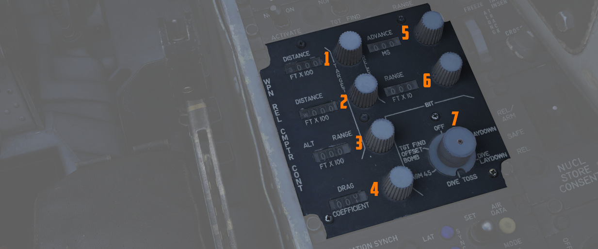

# Center Section

The center section of the right console is dominated by
the [WRCS](../../../systems/weapon_systems/wrcs.md) panel for weapon delivery. For more detailed
information see the [WRCS chapter](../../../systems/weapon_systems/wrcs.md).

## Weapon Release Computer Set (WRCS) Panel

### Target Distance Controls

A pair of four position drum roller windows with matching analog knobs. The top
window references distances in the North-South orientation (with the first
roller marked N/S), and the lower window references distances in the East-West
orientation (with the first roller marked E/W).

The rollers reference the distance shown in increments of 100 feet, thus a
distance of offset in the East direction for 4000' would be entered as E0040.

The rollers do function in an analog fashion, thus fractions of 100' can be
attained by moderating the last roller accordingly; as an example, a value of
250 feet would be attained with the space between the 2 and 3 value halfway in
the window in the last digit position.

### Target/IP Altitude Control

A three position drum roller window with matching analog knob used to enter the
altitude of either the Radar initial Point or the actual target itself, and is referenced in
increments of 100'. Fractional values can be entered as described previously.
This value can be changed once Radar Initial Point (RIP) or Visual Ingress Point (VIP) is
properly defined to increase release system accuracy.

### Drag Coefficient Control

Used to enter the drag coefficient value for the weapon being used from the
bombing tables for the intended release mode.

> 🚧 Lookup tables will soon be provided. However,
> the [bombing calculator](../../../dcs/bombing_computer.md)
> provides working solutions for all weapons regardless.

### Release Advance Control

Used to advance the release signal given from the [WRCS](../../../systems/weapon_systems/wrcs.md) to
the fire control system relative to the WRCS target
point, in any duration from 0 to 999 milliseconds. Also functions in conjunction
with [ARBCS/LABS](../../../systems/weapon_systems/arbcs.md) programmed release
timing.

This can be used to spread out a bombing run over a target area,
for example to place the 3-th bomb of a 10-bomb salvo on the target.

The release advance control can be calculated with
the [bombing calculator](../../../dcs/bombing_computer.md).

### Release Range Control

Used to manually set bomb range in accordance with the weapon's bomb release
schedule entry in the bomb tables.

The range can be calculated with
the [bombing calculator](../../../dcs/bombing_computer.md).

### WRCS BIT Knob

A six position knob utilized to perform BIT checks against the
individual [WRCS](../../../systems/weapon_systems/wrcs.md)
delivery modes. The BIT check is performed by selecting the desired mode for
testing, pressing the knob for five seconds, then pressing the Freeze button on
the Cursor Control Panel while keeping the BIT knob held down to confirm
function.

See [WRCS BITs](../../../procedures/bit_tests/wrcs.md) for details.

## Cursor Control Panel

Used for [WRCS](../../../systems/weapon_systems/wrcs.md) radar bombing mode target entry. Functions
only with [MAP-PPI](../../../systems/radar/operation.md#map-mode-ppi) mode selected and
applicable bombing mode selected on
the [Delivery Mode Knob](../../../cockpit/pilot/weapon_management.md#delivery-mode-knob).

### Freeze Button

Used in air to ground bombing with the [WRCS](../../../systems/weapon_systems/wrcs.md) to initiate
velocity tracking of the
aircraft from the [INS,](../../../systems/nav_com/ins.md) as well as maintain a hold of the target
position defined by the Along Track and Cross Track cursor gates, thus defining the Radar initial
Point.
The button illuminates, and remains lit, until the reset button
is pressed, or another delivery mode is selected.

### Target Insert Button

Inserts the North-South and East-West offset values entered into
the [WRCS](../../../systems/weapon_systems/wrcs.md)
control panel into the [WRCS](../../../systems/weapon_systems/wrcs.md) computer, performing the
offset against the Radar initial Point
defined by the Along Track and Cross Track cursor gates and currently tracked
with the Freeze Button. This offset inclusion performs a shift of the Along
Track and Cross Track cursors to define the actual target defined by
the [WRCS](../../../systems/weapon_systems/wrcs.md)
offsets on the radar scope. This action initiates target steering information
from the [WRCS](../../../systems/weapon_systems/wrcs.md) to the navigational displays.

The [Pave Spike](../../../systems/weapon_systems/pave_spike/overview.md)
system also utilizes the Target Insert functionality for its Memory Mode.

### Reset Button

Pressing the Reset Button drops the currently tracked ground target location
from [WRCS](../../../systems/weapon_systems/wrcs.md) computer memory, returns the Along and Cross
Track cursors to their default positions, and resets the velocity tracking system values to zero.

### Along Track Wheel

Used to define relative range of the aircraft to the Radar initial Point, using an
expanding/contracting hemisphere cursor on the radar display. This hemisphere
presents true range to the target via the hemispherical PPI projection, thus
allowing the Radar initial Point to be detected in an offset approach to the target. Close
approximation of range to the Radar initial Point should be prepared first with the Along Track
wheel prior to using the Cross Track Wheel for best system accuracy- ie, the
cursor should be placed below the intended Radar initial Point return on the radar scope, and
the Cross Track wheel brought to the return point.

### Cross Track Wheel

Used to define the heading to the Radar initial Point on the radar display in PPI mode,
presented as a vertical line. The intersection of the Along Track and Cross
Track cursors defines the Radar initial Point when the Freeze button is pressed.

## Nuclear Stores Consent Switch

Used to arm nuclear stores. In the SAFE position, release is inhibited. REL
allows releasing stores unarmed, while REL/ARM allows dropping nuclear stores
armed.

## Skyspot Mode

On the outer right side of the right console is a switch which would allow
to select the mode of the Combat Skyspot system used for ground-directed bombing.

The system was never installed on this variant of the F-4E.
