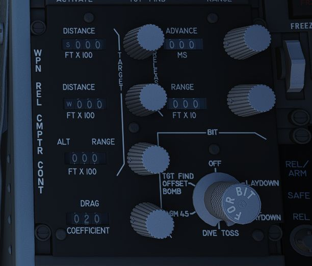
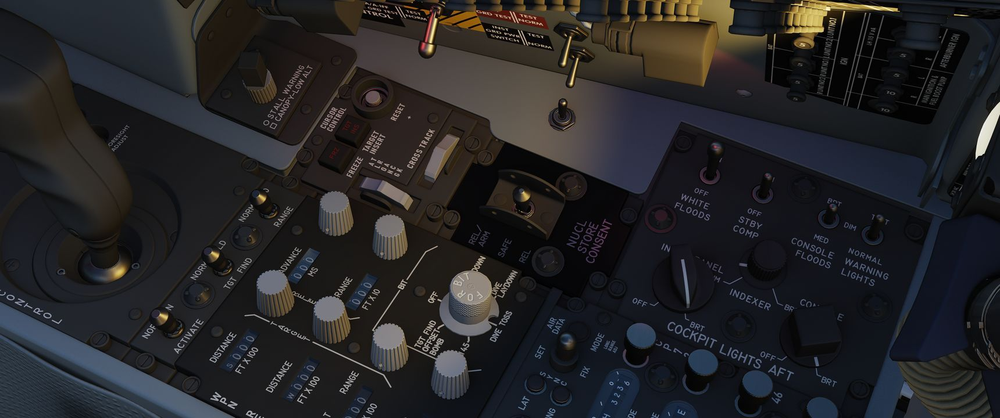

# Center Section

## Weapon Release Computer Set (WRCS) Panel

### Target Distance Controls

A pair of four position drum roller windows with matching analog knobs. The top
window references distances in the North-South orientation (with the first
roller marked N/S), and the lower window references distances in the East-West
orientation (with the first roller marked E/W).

The rollers reference the distance shown in increments of 100 feet, thus a
distance of offset in the East direction for 4000' would be entered as E0040.

The rollers do function in an analog fashion, thus fractions of 100' can be
attained by moderating the last roller accordingly; as an example, a value of
250 feet would be attained with the space between the 2 and 3 value halfway in
the window in the last digit position.

### Target/IP Altitude Control

A three position drum roller window with matching analog knob used to enter the
altitude of either the RIP or the actual target itself, and is referenced in
increments of 100'. Fractional values can be entered as described previously.
This value can be changed once RIP or VIP is properly defined to increase
release system accuracy.

### Drag Coefficient Control

Used to enter the drag coefficient value for the weapon being used from the
bombing tables for the intended release mode. This is not the stores table
reference drag number.

### Release Advance Control

Used to advance the release signal given from the WRCS to the fire control
system relative to the WRCS target point, in any duration from 0 to 999
milliseconds. Also functions in conjunction with ARBCS/LABS programmed release
timing.

### Release Range Control

Used to manually set bomb range in accordance with the weapon's bomb release
schedule entry in the bomb tables.

### NO GO/GO Lamps

Provides results of the WRCS BIT tests for the selected WRCS delivery mode.
Illumination of NO GO when not in a BIT test cycle reports an INS system
failure.

### WRCS BIT Knob

A six position knob utilized to perform BIT checks against the individual WRCS
delivery modes. The BIT check is performed by selecting the desired mode for
testing, pressing the knob for five seconds, then pressing the Freeze button on
the Cursor Control Panel while keeping the BIT knob held down to confirm
function. The result will illuminate in the NO GO/GO placard.

## Cursor Control Panel

Used for WRCS radar bombing mode target entry. Functions only with MAP-PPI mode
selected and applicable bombing mode selected on the Delivery Mode Knob.

### Freeze Button

Used in air to ground bombing with the WRCS to initiate velocity tracking of the
aircraft from the INS, as well as maintain a hold of the target position defined
by the Along Track and Cross Track cursor gates, thus defining the RIP (Radar
Initial Point). The button illuminates, and remains lit, until the reset button
is pressed, or another delivery mode is selected.

### Target Insert Button

Inserts the North-South and East-West offset values entered into the WRCS
control panel into the WRCS computer, performing the offset against the RIP
defined by the Along Track and Cross Track cursor gates and currently tracked
with the Freeze Button. This offset inclusion performs a shift of the Along
Track and Cross Track cursors to define the actual target defined by the WRCS
offsets on the radar scope. This action initiates target steering information
from the WRCS to the navigational displays.

### Reset Button

Pressing the Reset Button drops the currently tracked ground target location
from WRCS computer memory, returns the Along and Cross Track cursors to their
default positions, and resets the velocity tracking system values to zero.

### Along Track Wheel

Used to define relative range of the aircraft to the RIP, using an
expanding/contracting hemisphere cursor on the radar display. This hemisphere
presents true range to the target via the hemispherical PPI projection, thus
allowing the RIP to be detected in an offset approach to the target. Close
approximation of range to the RIP should be prepared first with the Along Track
wheel prior to using the Cross Track Wheel for best system accuracy- ie, the
cursor should be placed below the intended RIP return on the radar scope, and
the Cross Track wheel brought to the return point.

### Cross Track Wheel

Used to define the heading to the RIP on the radar display in PPI mode,
presented as a vertical line. The intersection of the Along Track and Cross
Track cursors defines the RIP when the Freeze button is pressed.

## Nuclear Stores Consent Switch

Used to arm nuclear stores. In the SAFE position, release is inhibited. REL
allows releasing stores unarmed, while REL/ARM allows dropping nuclear stores
armed.
