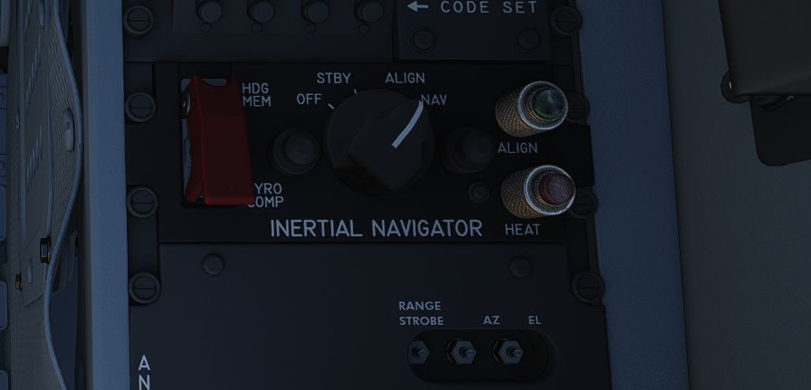

# Front Section

## Laser Coder Control

The WSO can set the laser code used by the targeting pod by using the four small
push-buttons on this panel.

### Code Buttons

Each press will advance the corresponding digit by one.

Codes directly relate to laser frequencies, resulting in them having to be
between 1111 and 1788 and not use digits 0 or 9 in order to be valid.

### Enter Button

Once a code has been set, it can be transferred to the Pave Spike by pressing
the ENTER button to the right.

When power is applied to the system, it automatically initiates a transfer of
the currently set code.

### No Go Lamp

Validation of an entered code takes about 5 seconds. If the NO-GO lamp is lit,
the code is invalid.

## Inertial Navigation Control Panel

The Inertial Navigation Control Panel provides the rear pilot mode selection and
system alignment command selection.

### Mode Selector Switch

The HDG MEM-GYRO COMP switch, located under a cover, primarily stays in the GYRO
COMP position for Gyro Compass type of alignment. Switching it to HDG MEM,
before turning on the INS, allows, if previously stored, heading memory
alignment.

### Power Control Knob

Knob positions are:

| Name                                                       | Description                                                                                                                                                                                                                                                                                                                  |
|------------------------------------------------------------|------------------------------------------------------------------------------------------------------------------------------------------------------------------------------------------------------------------------------------------------------------------------------------------------------------------------------|
| OFF                                                        | System off.                                                                                                                                                                                                                                                                                                                  |
| STBY                                                       | Standby- power is applied to the heaters and temperature control system, and initiates Coarse alignment (if [GYRO COMP](../../../systems/nav_com/ins.md#gyrocompass-alignment) is selected on the toggle).                                                                                                                   |
| [ALIGN](../../../systems/nav_com/ins.md#alignment-options) | Performs fine platform and gyro leveling and [BATH](../../../systems/nav_com/ins.md#best-available-true-heading) (or [HDG MEM](../../../systems/nav_com/ins.md#heading-memory-alignment)) alignment. Then, if available, performs [Gyro-compassing](../../../systems/nav_com/ins.md#gyrocompass-alignment) (Fine) Alignment. |
| NAV                                                        | Activates the INS for navigation function, performance of which is based on the alignment quality.                                                                                                                                                                                                                           |

### HEAT Lamp

The HEAT lamp illuminates when the system is placed into STBY mode, and remains
illuminated for 2 minutes after the gyros have reached operating temperature.
The system will not allow Gyro-compassing alignment if switched out of STBY
before this lamp has shut off.

### ALIGN Lamp

The ALIGN lamp provides current INS alignment through illuminating steady (BATH
alignment complete), or flashing at the completion of GYRO COMP or HDG MEM
alignment.

## Weapon Delivery Panel

### ACTIVATE Switch

Only available after the Target Insert button is pressed, placing the switch to
ON provides power to the weapon release computer's circuits for a LABS release
using the WRCS release range data.

### TGT FIND Switch

Used to combine the delivery functionality of
the [ARBCS/LABS](../../../systems/weapon_systems/arbcs.md) system with the
[WRCS](../../../systems/weapon_systems/wrcs.md) TGT FIND mode. NORM is selected for the standard
function of the [WRCS](../../../systems/weapon_systems/wrcs.md)
without [LABS](../../../systems/weapon_systems/arbcs.md) delivery capability. Selecting HOLD and
an [ARBCS](../../../systems/weapon_systems/arbcs.md) setting from the
pilot's Delivery Mode Knob provides [WRCS](../../../systems/weapon_systems/wrcs.md) Target Offset
search capability, and the attack is completed using the
normal [ARBCS](../../../systems/weapon_systems/arbcs.md) procedures from the IP.

### RANGE Switch

Selecting x100 changes the release range multiplier on
the [WRCS](../../../systems/weapon_systems/wrcs.md) panel to a
factor of 100; in NORM, the standard factor of 10 is applied to the release
range.

## Volume Panel

A small panel to the right of the antenna hand control stick contains two
combined knobs to control volume.

### Canopy/Low Altitude Warning

Sets audio level for canopy open and low altitude voice warnings.

This system is not installed on this variant of the F-4E.

### Stall Warning

The Stall Warning knob controls the volume of
the [AoA tones](../../../systems/flight_controls/flight_controls.md#aural-tone-system) that play
when flying at certain angles.

Under certain conditions, the system can override the volume to ensure the cue
is always audible in dangerous situations.
