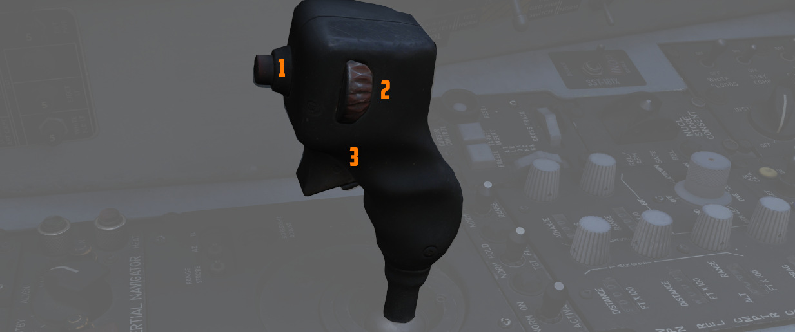

# 前部

前部包括用于武器投放以及 [INS](../../../systems/nav_com/ins.md) 的控制开关/按钮。

## 激光编码器控制

WSO 可以通过面板上的四个小按钮设置瞄准吊舱使用的激光编码。

### 编码按钮

每按一次，相应的数字将加一。

编码与激光频率直接相关，因此编码必须介于 1111 和 1788 之间，并且无数字 0 或 9 才能生效。

### 输入按钮

设置好编码后，按下右侧的 ENTER 按钮即可将其传输至 Pave Spike。

系统通电后，会自动开始传输当前设置的编码。

### No Go 灯

验证输入的编码大约需要 5 秒钟。如果 NO-GO 指示灯亮起，则表示编码无效。

## 惯导控制面板

惯性导航控制面板用于进行模式选择和系统对准指令选择。

详情见 [3.3.2 INS 导航](../../../systems/nav_com/ins.md)。

### 模式选择开关

带保护盖的 HDG MEM-GYRO COMP 开关，主要保持在 GYRO COMP 档位来进行陀螺罗盘类型对准。如有预存参考对
准的话，在打开 INS 之前，将其拨至 HDG MEM 档位执行预存航向对准。

> 💡 可在 > [任务编辑器](../../../dcs/mission_editor.md#ins-reference-alignment-stored) 中预存参考
> 航向。

### 电源控制旋钮

旋钮档位分别为：

| 名称                                                       | 描述                                                                                                                                                                                                                                                                                |
| ---------------------------------------------------------- | ----------------------------------------------------------------------------------------------------------------------------------------------------------------------------------------------------------------------------------------------------------------------------------- |
| OFF                                                        | 系统关闭。                                                                                                                                                                                                                                                                          |
| STBY                                                       | 待机——加热器和温度控制系统通电，并开始粗对准（如果选择了[GYRO COMP](../../../systems/nav_com/ins.md#gyrocompass-alignment) ）。                                                                                                                                                     |
| [ALIGN](../../../systems/nav_com/ins.md#alignment-options) | 执行精平台和陀螺调平以及[BATH](../../../systems/nav_com/ins.md#best-available-true-heading) （或 [HDG MEM](../../../systems/nav_com/ins.md#heading-memory-alignment)）对准。接着，如果可用的话，执行 [陀螺罗盘](../../../systems/nav_com/ins.md#gyrocompass-alignment) （精）对准。 |
| NAV                                                        | 激活 INS 来使用导航功能，性能取决于对准质量。                                                                                                                                                                                                                                       |

### HEAT 灯

当系统进入 STBY 模式时，HEAT 灯亮起，陀螺仪达到工作温度后，HEAT 灯将持续亮起 2 分钟。如果在 HEAT 灯
熄灭之前切换出 STBY 模式，系统将无法执行陀螺罗盘对准。

### ALIGN 灯

ALIGN 灯通过常亮（[BATH 对准](../../../systems/nav_com/ins.md#best-available-true-heading) 完成）或
在 [GYRO COMP](../../../systems/nav_com/ins.md#gyrocompass-alignment) 或
[HDG MEM](../../../systems/nav_com/ins.md#heading-memory-alignment) 准完成时闪烁来指示当前
[INS 对准](../../../systems/nav_com/ins.md#alignment-options) 状态。

## 天线手控

手控杆与 [雷达](../../../systems/radar/overview.md) 集成一体，可在空对空模式下对雷达显示器上的截获
符号进行距离（前后）和方位（左右）定位控制，还可控制
[AGM-65 “幼畜”](../../../stores/air_to_ground/missiles/maverick.md) 和
[Pave Spike](../../../systems/weapon_systems/pave_spike/overview.md) 导引头/EO 传感器的指向。

### 天线仰角控制

位于手控杆左侧的拨轮可控制雷达天线的仰角，并通过 DSCG 显示器上的 EL 射线进行显示。

### 问询按钮

如果正控制雷达，启动一次 IFF 问询。

使用 [Pave Spike 瞄准吊舱](../../../systems/weapon_systems/pave_spike/overview.md) 时用按钮来切换
WIDE 和 NARROW 视场。

### 动作开关（扳机）

使用二段式扳机来锁定目标。具体行为取决于当前是在控制
[雷达](../../../systems/radar/overview.md)、[武器](../../../stores/overview.md) 或是
[瞄准吊舱](../../../systems/weapon_systems/pave_spike/overview.md)。

### 瞄准轴调整

天线手控杆的瞄准轴位置可使用位于其底座的螺钉进行调整。设置好后，按下位于其下方的按钮来存储新数值。

仅限地勤人员进行调整。

## 武器投放面板

### ACTIVATE 开关

仅在按下目标插入按钮后可用，将开关拨至 ON 将为武器投放计算机的回路通电，来使用
[WRCS](../../../systems/weapon_systems/wrcs.md) 投放距离数据执行
[LABS](../../../systems/weapon_systems/arbcs.md) 投弹。

### TGT FIND 开关

用于将 [ARBCS/LABS](../../../systems/weapon_systems/arbcs.md) 系统的投放功能与
[WRCS](../../../systems/weapon_systems/wrcs.md) TGT FIND 模式相结合。选择 NORM 时，WRCS 使用无 LABS
投放能力的标准功能。选择 HOLD 并在飞行员的投放模式旋钮选择一个 ARBCS 设置时将提供 WRCS 目标偏置搜索
能力，并且将基于 IP 来完成正常 ARBCS 程序攻击。

### RANGE 开关

选择 x100 会将 [WRCS](../../../systems/weapon_systems/wrcs.md) 面板上的投放距离乘数更改为 100；在正
常状态下，投放距离采用标准系数 x10。

## 音量目标

天线手控杆右侧的小面板上有两个用于控制音量的组合旋钮。

### 座舱盖/低高度告警

设置座舱盖打开和低高度话音告警的音量。

该批次 F-4E 中未安装该系统。

### 失速警告

失速警告旋钮用来控制在特定迎角播放的
[AoA 音调提示](../../../systems/flight_controls_gear/flight_controls.md#stall-warning-vibrator) 的
音量。

在某些情况下，系统可以超控音量，以确保在险情时始终能听到提示音。
