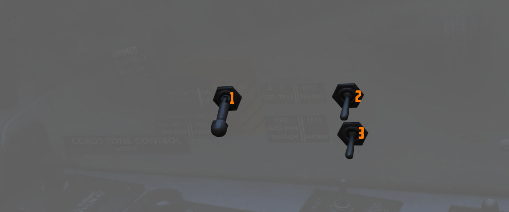

# Right Wall

The right wall has auxiliary switches for testing and starting the aircraft.

## Canopy Manual Unlock Handle

The manual unlock
handle is used in the event of [pneumatic system](../../../systems/pneumatics.md) failure.

The handle, when pulled aft, unlocks the canopy so that it may be pushed open. Before manual
unlocking of the canopy, the normal control lever must be placed in the OPEN position.

For normal operation, the handle should be left in the forward position.

If the canopy is not properly locked, the _CANOPY UNLOCKED_
warning light on
the [telelight panel](../../../systems/emergency.md#telelight-panel)
illuminates.

## Ground Test Panel

### Battery Bypass

When toggled ON (1), de-energizes the battery relay, disconnecting the battery from
the essential 28-volt de bus and ceasing charging. Particularly used in
suspected cases of thermal runaway.

### Autopilot Ground Test

The autopilot ground test switch (2), located on the No. 2 circuit breaker panel, connects external
electrical power to the [AFCS](../../../systems/flight_controls_gear/flight_controls.md#auotmatic-flight-control-system-afcs)
circuits. It disengages if there's a loss of external power or when a
generator comes online. When operating on external power, the AFCS circuit can be de-energized by
placing the switch in the NORM (down) position.

### Instrument Ground Power

In the TEST position (3), connects external electrical power to the instrument buses
(115/200 volt ac, 28 volt ac, and 14 volt ac), contingent upon the generator
switches being set to EXT ON.

This can be used during a cold-start after applying ground power and before starting the engines,
to already setup the aircraft and operate some systems that require
power on these buses.
