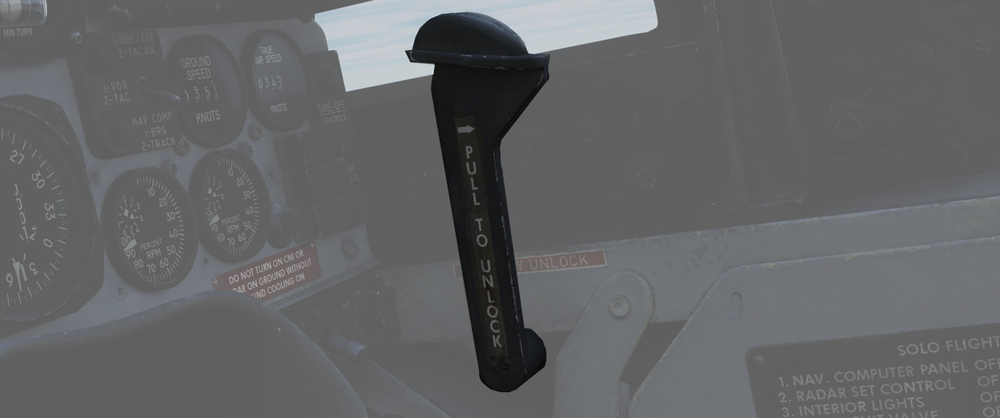

# 右侧防火墙

右侧防火墙上包括用于测试和起动飞机的辅助开关。

## 座舱盖手动解锁手柄

手动解锁手柄用于在 [气动系统](../../systems/pneumatics.md) 失效时使用。

向后拉动手柄解锁座舱盖，从而允许手动推开座舱盖。在手动解锁座舱盖之前，必须将正常控制杆置于 OPEN 档
位。

正常操作时，应将手柄置于向前档位。

如果座舱盖未能正确锁定，[远传信号灯面板](../../../systems/emergency.md#telelight-panel) 中的
_CANOPY UNLOCKED_ 告警灯将会亮起。

## 地面测试面板

### 电池旁通

拨至 ON 档位时，电池继电器断开，使电池断开与应急 28 伏直流总线的连接并停止充电。特别适用于可疑的热
失控情况。

### 自动驾驶地面测试

自动驾驶地面测试开关位于 2 号断路器面板上，将地面电源连接至
[AFCS](../../../systems/flight_controls_gear/flight_controls.md#auotmatic-flight-control-system-afcs)
电路。如果地面电源断电或发电机上线，开关将回到正常档位。使用地面电源时，可将开关置于 NORM（向下）档
位，使 AFCS 电路断电。

### 仪表地面电源

在 TEST 档位，地面电源将连接至仪表总线（115/200 伏交流、28 伏交流和 14 伏交流），取决于发电机开关是
否设置到 EXT ON 档位。

在冷启动过程中，接通地面电源后以及发动机起动前使用该功能，以便设置好飞机，并操作一些需要上述总线通
电的系统。
