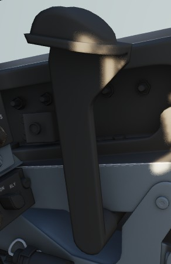

# Right Wall

The right wall has auxiliary switches for testing and starting the aircraft.

## Canopy Unlock Lever

Used to manually unlock the canopy by pulling aft. For normal operation,
the handle should be left in the forward position to allow the canopy
to seal when closed.

If the canopy is not properly locked and sealed, the _CANOPY UNLOCKED_
warning light on the main panel right next to it illuminates.

## Ground Test Panel

### Battery Bypass

When toggled ON, de-energizes the battery relay, disconnecting the battery from
the essential 28-volt de bus and ceasing charging. Particularly used in
suspected cases of thermal runaway.

### Autopilot Ground Test

The autopilot ground test switch, located on the No. 2 circuit breaker panel, connects external
electrical power to the AFCS circuits. It disengages if there's a loss of external power or when a
generator comes online. When operating on external power, the AFCS circuit can be deenergized by
placing the switch in the NORM (down) position.

### Instrument Ground Power

In the TEST position, connects external electrical power to the instrument buses
(115/200 volt ac, 28 volt ac, and 14 volt ac) , contingent upon the generator
switches being set to EXT ON.
