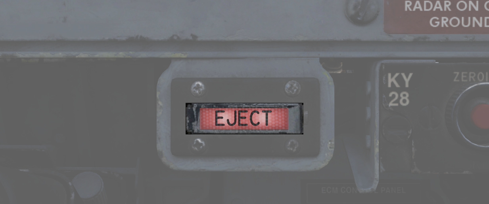
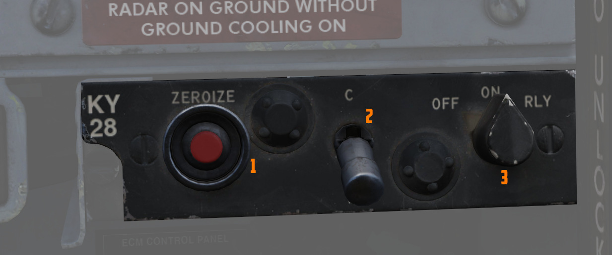
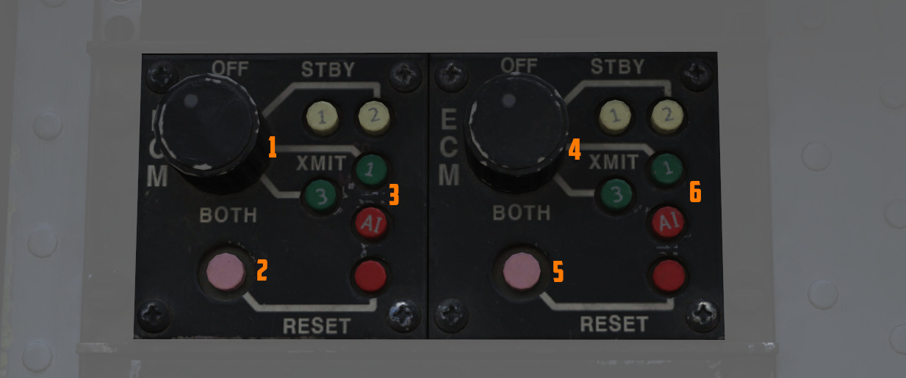
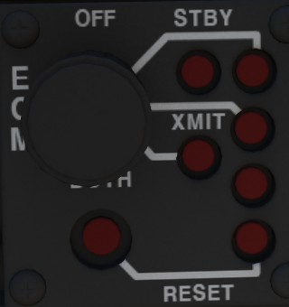
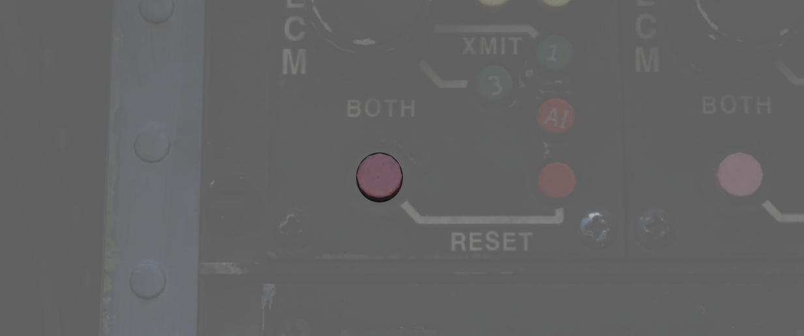
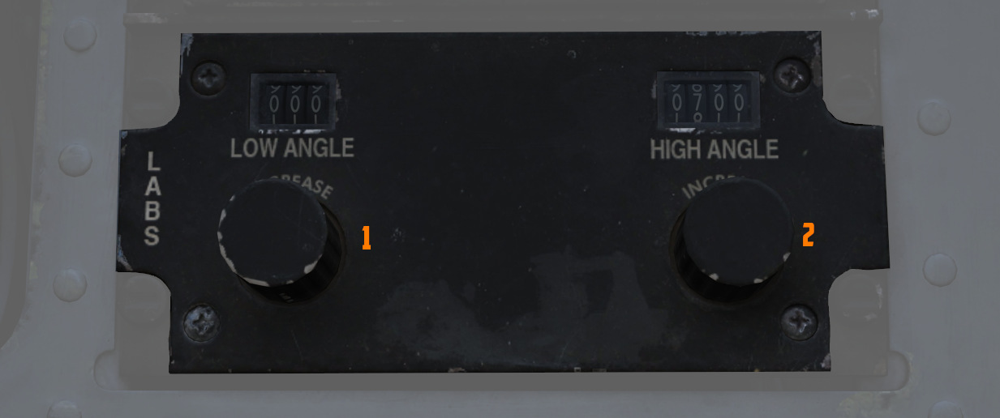
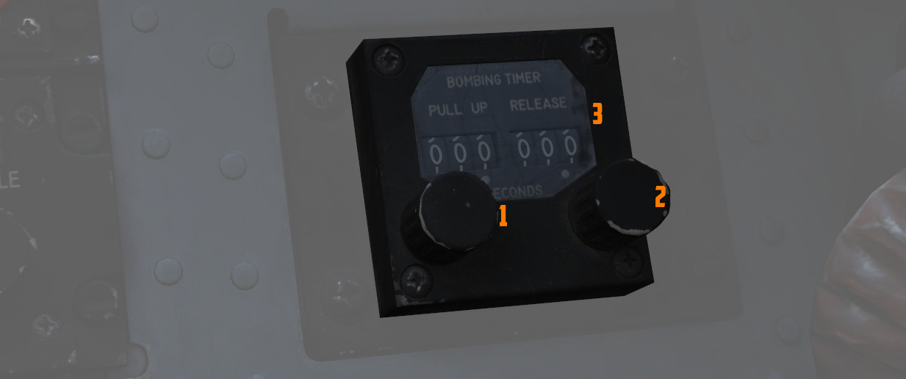

# 右侧子面板

右侧子面板包含干扰、加密和手动投弹的各种设置控制开关/按钮。

## 弹射灯/开关

在需要弹射出飞机的紧急情况下，由 WSO 按下，飞行员驾驶舱内的
[EJECT 灯](../../systems/emergency.md#eject-light) 亮起，警告飞行员做好准备立即弹射。

飞行员按下对应的弹射灯时也会亮起，以警告 WSO 进行弹射。

## KY-28 控制开关/按钮

控制 KY-28 密话系统。更多信息，请参阅 [加密章节](../../systems/nav_com/encryption.md)。

## ECM 控制开关/按钮

电子对抗和干扰系统的控制开关/按钮。

左侧面板与左侧挂点上的任意一个吊舱相连，右侧面板与右侧挂点上得吊舱相连。

模式、技术和指示灯具体操作的解释取决于所挂载的干扰机型号。详见
[ECM 部分](../../systems/defensive_systems/ecm.md)。

### 模式旋钮

设置干扰机的工作模式：

| 模式   | 模式                                       |
| ------ | ------------------------------------------ |
| OFF    | 关闭，无信号发射                           |
| STBY   | 开始预热，无信号发射 (ALQ-131 耗时 200 秒) |
| XMIT 1 | 使用技术 1 发射并干扰                      |
| XMIT 2 | 使用技术 2 发射并干扰                      |
| BOTH   | 使用技术 1 和 2 发射并干扰                 |

禁止在地面使用，否则会危及人生安全。

### STBY 灯

这两个指示灯表示对应得干扰机技术已完成预热，现在即可切换到 XMIT 进行使用。

ALQ-131 吊舱预热时间大约为 200 秒。

### XMIT 灯

这两个指示灯表示对应的干扰机技术被激活并正在发射。

### AI 灯

表示已探测到一台雷达并对其进行主动干扰。

> 💡 由于 DCS 的限制，目前无法在游戏中模拟。

### 复位按钮和灯光

复位指示灯亮起时表示干扰机系统出现故障。闪烁表示干扰机过热，此时应关闭吊舱以防止受损。

出现故障时，可按下复位按钮来复位干扰机系统（类似于将其关闭再重新打开），在这种情况下，干扰机系统将
重新进入预热阶段。如果可以排除故障，指示灯将熄灭。

## 航弹投放角度计算机

用于输入 [ARBCS/LABS](../../systems/weapon_systems/arbcs.md) 轰炸模式所需的角度值；低角度控制可设置
值为 0 至 89.9 度，高角度控制可设置值为 70 至 179.9 度。

高角度控制用于
[越肩轰炸](../../stores/air_to_ground/bombs/employment.md#instantaneous-over-the-shoulder---inst-os)
，低角度用于 [LOFT 轰炸](../../stores/air_to_ground/bombs/employment.md#loft) 。有关角度的计算，请
查看 [轰炸计算器](../../dcs/bombing_computer.md) 。

## 轰炸计时器

使用轰炸计时器来输入适用于上仰信号或投放信号的定时。

上仰计时器的设置区间为 0 至 60 秒，投放计时器的设置区间为 0 至 30 秒。每个计时器的精度为 0.1 秒。

轰炸计时器可在各个 [计时投放法](../../stores/air_to_ground/bombs/employment.md) 中使用。

如果计算数值，请阅读 [9.4 轰炸计算器章节](../../dcs/bombing_computer.md) 。
