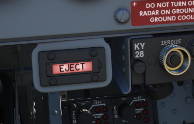
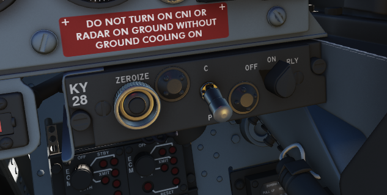
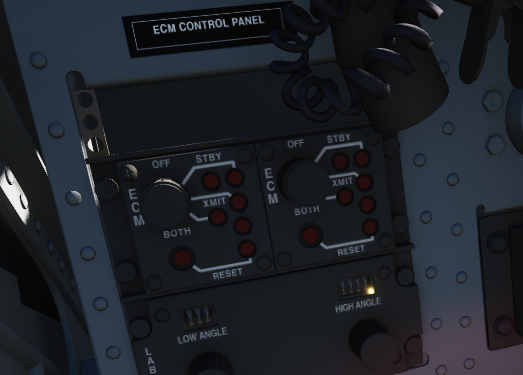

# Right Sub-Panel

## Eject Light/Switch

Pressed by the WSO in an emergency condition requiring ejection from the
aircraft, which illuminates the EJECT lamp in the front cockpit warning the
Pilot to prepare for immediate ejection.

Also lights up when the Pilot presses their respective Eject Light to warn the
WSO for ejection.

## KY-28 Controls

Controls for the KY-28 encryption system.

## ECM Controls

Controls for the electronic countermeasurement and jamming system.

## Bomb Release Angle Computer

Used to enter in the required angle values for ARBCS/LABS bombing modes; the Low
Angle control may be set from 0 to 89.9 degrees, and the High Angle control may
be set from 70 to 179.9 degrees.

## Bombing Timers

Entry of applicable timing for pullup signal or release are performed with the
Bombing Timers. The Pullup timer may be set from 0 to 60 seconds, and the
Release timer may be set from 0 to 30 seconds. Minimum increment for each timer
is 0.1 seconds.
