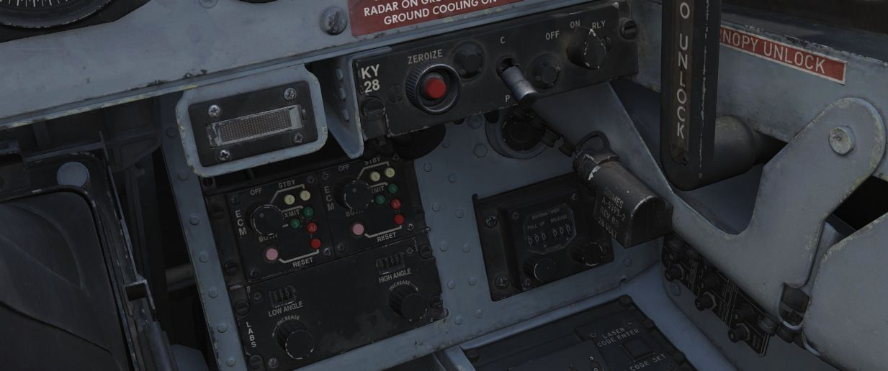

# Right Sub-Panel

The right sub panel contains controls for jamming, encryption and various
settings for manual bomb delivery.

## Eject Light/Switch

The EJECT light provides a positive visual command from the pilot to the WSO to
prepare for ejection. The light is controlled only from the front cockpit. If
the [EJECT lamp](../../systems/emergency.md#eject-light) in the front cockpit is
pressed it signals the WSO to prepare for immediate ejection.

> 💡 Only the pilot can signal ejection. If the WSO presses the light, it serves
> as a lamp test only and does not trigger the pilots lamp as well.

## KY-28 Controls

Controls for the KY-28 encryption system. For further information see the
[Encryption chapter](../../systems/nav_com/encryption.md).

## ECM Controls

Controls for the electronic counter-measurement and jamming system.

The left panel is connected to any pods carried on left stations, the right
panel to stations on the right.

Interpretation of the modes, techniques and exact operation of the lights depend
on the loaded jammer model. See the
[ECM section](../../systems/defensive_systems/ecm.md) for details.

### Mode Knob

The rotary dial (1, 4) the mode of the jammer to operate in:

| Mode   | Description                                             |
| ------ | ------------------------------------------------------- |
| OFF    | Turned off, no transmission                             |
| STBY   | Starting the warmup, no transmission (200s for ALQ-131) |
| XMIT 1 | Transmitting and jamming using technique 1              |
| XMIT 2 | Transmitting and jamming using technique 2              |
| BOTH   | Transmitting and jamming using technique 1 and 2        |

Use on the ground is prohibited since it could otherwise endanger personnel.

### STBY Lights

The two lights (3 and 6, upper white ones) indicate that the corresponding
jammer technique is done warming up and can now be used by switching to XMIT.

The warmup period is roughly 200s for the ALQ-131 pod.

### XMIT Lights

The two lights (3 and 6, middle green ones) indicate that the corresponding
jammer technique is currently active and transmitting.

### AI Light

Indicates (3 and 6, lower red ones) that a radar has been detected and is
actively jammed.

> 💡 Due to engine limitations, this is currently not simulated in-game.

### Reset Button and Lamp

The reset lamp (2 and 5), if lit, indicates a fault in the jammer system.
Flashing indicates an overheating condition, in which case the pod should be
turned off to prevent damage.

In case of a fault, the reset button can be pressed to reset the jammer system
(similar to turning it OFF and back ON), in which case it will run through the
warmup period again. If the fault could be cleared, the light will go off.

## Bomb Release Angle Computer

Used to enter the required angle values for
[ARBCS/LABS](../../systems/weapon_systems/arbcs.md) bombing modes; the Low Angle
control (<num>1</num>) may be set from 0 to 89.9 degrees, and the High Angle
control (<num>2</num>) may be set from 70 to 179.9 degrees.

The high Angle control is used for
[over-the-shoulder bombing,](../../stores/air_to_ground/bombs/employment/lofting_tossing.md#instantaneous-over-the-shoulder---inst-os)
whilst low angle is used for
[LOFT bombing](../../stores/air_to_ground/bombs/employment/lofting_tossing.md#loft).
For calculations of the angles see the
[bombing calculator](../../dcs/bombing_computer.md).

## Bombing Timers

Entry of applicable timing for pull-up signal or release are performed with the
Bombing Timers.

The Pull-up timer (<num>1</num>) may be set from 0 to 60 seconds, and the
Release timer (<num>2</num>) may be set from 0 to 30 seconds. Minimum increment
for each timer is 0.1 seconds. Both values are shown by two three digit rollers
(<num>3</num>) above the knobs.

The Bombing timers may be used for every
[timed employment method](../../stores/air_to_ground/bombs/employment/overview.md).

See [9.4 bombing calculator chapter](../../dcs/bombing_computer.md) for how to
calculate the number.
