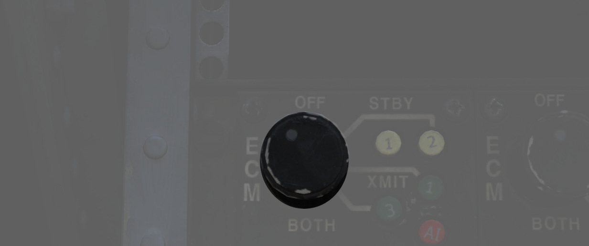
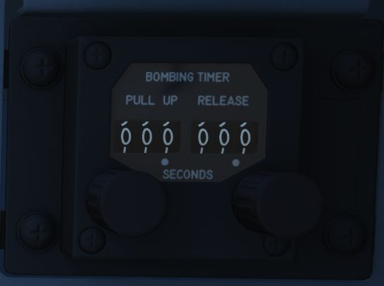

# Right Sub-Panel

The right sub panel contains controls for jamming, encryption and
various settings for manual bomb delivery.

## Eject Light/Switch

Pressed by the WSO in an emergency condition requiring ejection from the
aircraft, which illuminates the [EJECT lamp](../../systems/emergency.md#eject-light) in the front
cockpit warning the Pilot to prepare for immediate ejection.

Also lights up when the Pilot presses their respective Eject Light to warn the
WSO for ejection.

## KY-28 Controls

Controls for the KY-28 encryption system. For further information see
the [Encryption chapter](../../systems/nav_com/encryption.md).

## ECM Controls

Controls for the electronic counter-measurement and jamming system.

The left panel is connected to any pods carried on left stations, the right panel
to stations on the right.

Interpretation of the modes, techniques and exact operation of the lights
depend on the loaded jammer model. See the [ECM section](../../systems/defensive_systems/ecm.md)
for details.

### Mode Knob

Sets the mode of the jammer to operate in:

| Mode   | Description                                             |
|--------|---------------------------------------------------------|
| OFF    | Turned off, no transmission                             |
| STBY   | Starting the warmup, no transmission (200s for ALQ-131) |
| XMIT 1 | Transmitting and jamming using technique 1              |
| XMIT 2 | Transmitting and jamming using technique 2              |
| BOTH   | Transmitting and jamming using technique 1 and 2        |

Use on the ground is prohibited since it could otherwise endanger personnel.

### STBY Lights

The two lights indicate that the corresponding jammer technique is
done warming up and can now be used by switching to XMIT.

The warmup period is roughly 200s for the ALQ-131 pod.

### XMIT Lights

The two lights indicate that the corresponding jammer technique is
currently active and transmitting.

### AI Light

Indicates that a radar has been detected and is actively jammed.

> 💡 Due to DCS limitations, this is currently not simulated in-game.

### Reset Button and Lamp

The reset lamp, if lit, indicates a fault in the jammer system.
Flashing indicates an overheating condition, in which case the pod
should be turned off to prevent damage.

In case of a fault, the reset button can be pressed to reset the
jammer system (similar to turning it OFF and back ON), in which case it will
run through the warmup period again. If the fault could be cleared, the light will go off.

## Bomb Release Angle Computer

Used to enter the required angle values for [ARBCS/LABS](../../systems/weapon_systems/arbcs.md)
bombing modes; the Low Angle control may be set from 0 to 89.9 degrees, and the High Angle control
may be set from 70 to 179.9 degrees.

The Angle control is used
for [over-the-shoulder bombing,](../../stores/air_to_ground/bombs/employment.md#instantaneous-over-the-shoulder---inst-os)
whilst low angle is used for [LOFT bombing](../../stores/air_to_ground/bombs/employment.md#loft).
For calculations of the angles see the [bombing calculator](../../dcs/bombing_computer.md).

## Bombing Timers

Entry of applicable timing for pull-up signal or release are performed with the
Bombing Timers.

The Pull-up timer may be set from 0 to 60 seconds, and the
Release timer may be set from 0 to 30 seconds. Minimum increment for each timer
is 0.1 seconds.

The Bombing timers may be used for every
[timed employment method](../../stores/air_to_ground/bombs/employment.md).

See the [bombing calculator](../../dcs/bombing_computer.md) for how to calculate the number.
