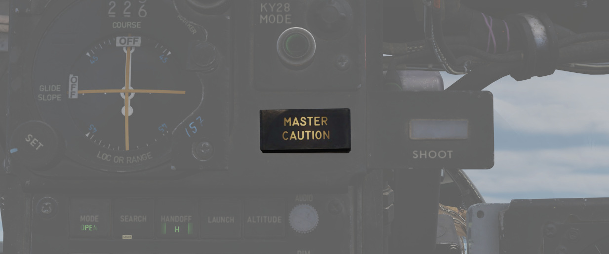
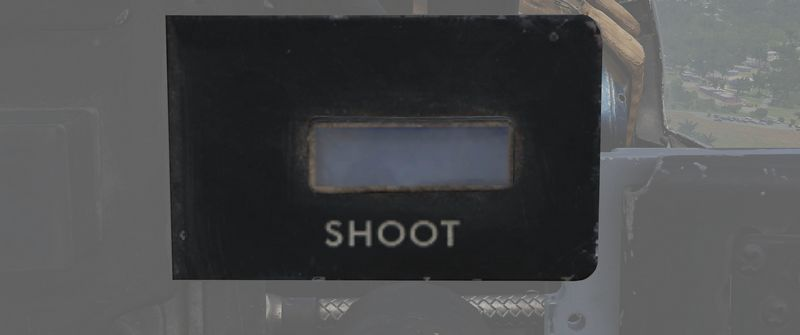
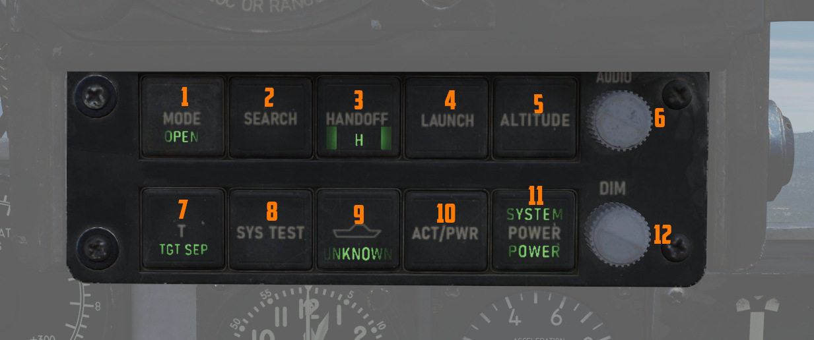
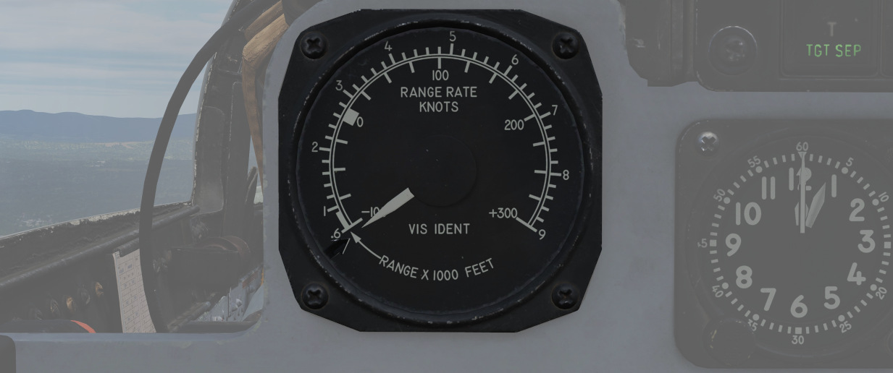
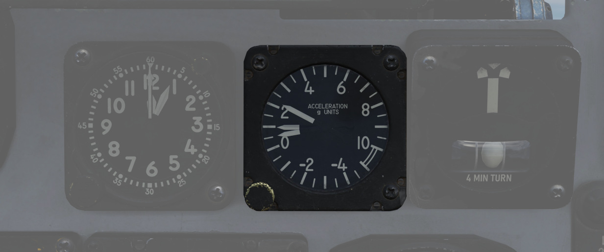
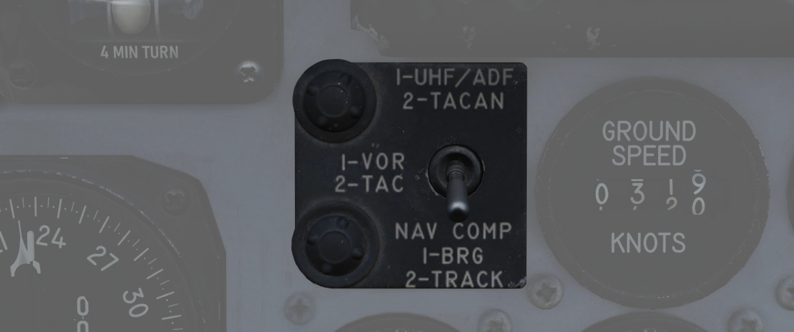
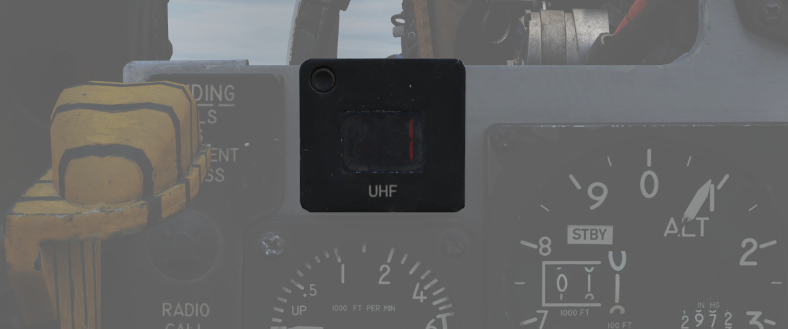

# 前上方指示器

座舱盖前部为 WSO 提供了所有飞行相关的飞行仪表和其它仪表。

## 备用罗盘

标准备用罗盘，用于在主飞行指引系统出现故障时提供备份导航辅助。

罗盘只能在平飞时使用。罗盘偏差卡位于每个驾驶舱右侧座舱盖下边框上方。

## 弹射指令选择手柄

用于根据 WSO 的指令选择单弹射或双弹射。在垂直方向（阀门关闭），WSO 启动弹射时仅弹射后座。当阀门手柄
处于水平（打开）方向时，由 WSO 启动的弹射将同时弹射两名机组人员。

## 航线指示器

[ILS](../../systems/nav_com/vor_ils.md) 进近时使用，以点表示航向和下滑道的偏差 - 一个点相当于 1 1/4
度航向道偏差以及 1/4 度下滑道偏差。

航向指针显示飞机相对选定航线的航向，选定航线使用左下方旋钮来设定。

指示器未连接至 [TACAN](../../systems/nav_com/tacan.md) 或 [VOR](../../systems/nav_com/vor_ils.md)
系统。信号丢失时指示器中将显示 OFF 旗。

### 指点信标灯

如果 [VOR/ILS](../../systems/nav_com/vor_ils.md) 系统已激活，则在飞越指点信标台时亮起。此外，内话系
统还会播放音频提示。

WSO 可转动旋钮来调光或按下按钮进行测试。

详见 [VOR/ILS 系统](../../systems/nav_com/vor_ils.md) 。

## KY-28 模式指示器

两盏指示灯来指示 KY-28 的工作模式，P 表示普通（明文）传输模式，C 表示密文（加密）传输模式。

> 💡 UHF 通信要求系统处于明文模式，即使 > 系统电源已关闭，也禁止使用和守听救生波道。

## 主注意灯

复显飞行员驾驶舱中的 [主注意灯](../../systems/emergency.md#master-caution)，可向 WSO 发出警告，说明
存在需要注意的情况，需要检查 [远传信号灯面板](../../systems/emergency.md#telelight-panel) 来纠正这
种情况。

> 💡 WSO 驾驶舱中没有单独的复位按钮。如果主注意灯亮起，需要飞行员 > 来进行复位。

## SHOOT 灯

在满足导弹发射参数时亮起。在目视拦截（VI）或空对地模式下，指示灯保持熄灭。

## RWR 方位指示器

[雷达告警接收机](../../systems/defensive_systems/radar_warning_receiver.md) 方位指示器显示雷达告警
接收机可见的所有雷达信号源。旋钮用来控制显示屏的亮度。

位于其左侧的是其控制盒，其中包括数个用于控制系统的旋钮。

详情请见 [雷达告警接收机](../../systems/defensive_systems/radar_warning_receiver.md) 章节。

### 面板对比度开关

用来选择 [AGM-65A “幼畜” 和 AGM-65B “幼畜”](../../stores/air_to_ground/missiles/maverick.md) 导引头
截获所使用的合适的对比度条件。

| 名称    | 描述                               |
| ------- | ---------------------------------- |
| WHT/BLK | 编程导引头跟踪暗背景下的亮目标。   |
| AUTO    | 设置导弹使用自动跟踪模式。         |
| BLK/WHT | 导引头设置为跟踪亮背景中的暗目标。 |

> 💡 开关不会改变视频极性而是改变导引头编码。

### ML 音量旋钮

控制导弹发射系统的音量——系统会播放警告 WSO 受到攻击的音调提示。

## 迎角分度器指示灯

位于左右两侧的一对指示器，可根据发光位置和颜色快速确认飞机当前的 AoA 状态。

分度器还可以指示武器转向提示，以及一个用作备份音频提示的音调提示系统。详见
[迎角系统](../../systems/flight_controls_gear/flight_controls.md#angle-of-attack-system) 。

## APX-81A 激活灯

位于两个迎角分度器旁右侧的是 APX-81A “战斗树”系统的指示灯，在探测到主动照射时亮起。

系统每探测到其它飞机问询本机时亮起一次。

> 💡 由于 DCS 限制，游戏中未模拟该功能。

## 距离 (VISIDENT) 指示器

在目视拦截、B NAR 或 B WIDE 模式下锁定时，显示 2 英里（12000 英尺）以内的精确雷达距离信息和 9000 英
尺以内的距离/速度信息。选择 “AIR-GRD” 时，指示器将被禁用。

## 8 日时钟

面板中含有一枚带秒表功能的时钟。转动位于左下角的旋钮可以设置时间。按下位于右上角的按钮即可使用秒表
功能。再次按下右上角的按钮即可复位。

## 加速度表

有效显示区间为负 4 到 正 10 个 G，仪表内有三枚指针——一个指示当前过载，另外两枚显示历史最大正负过载
。按下 PUSH TO SET 按钮了复位最大过载指示到 1 G。

## 转弯仪

4 分钟转弯侧滑仪，使用一个传统的水平安装陀螺仪，精确显示标准转弯率，类似于传统的转弯侧滑仪。

要执行一个标准转弯（360° 转弯用时 4 分钟），使垂直指针对准转弯侧滑仪任一侧（每秒转弯 1.5 度），并确
保底部的侧滑球居中，以防止由于不正确的坡度导致转过度或不足。

## 导航模式选择开关

选择两根 BDHI 指针使用的工作模式。

| 名称 | 指针 1               | 指针 2                   |
| ---- | -------------------- | ------------------------ |
| 向上 | UHF/自动测向仪       | TACAN 台                 |
| 中立 | VOR 台               | TACAN 台                 |
| 向下 | 导航计算机模式：方位 | 导航计算机模式：地面航迹 |

## 地速指示器

以节为单位提供飞机的地速，有效显示区间为 0 至 1999 节。需要 INS 才能精确显示。如果 INS 关闭，则在地
面静止不动时可在 150 节内显示任意数值。

## 真空速表

节为单位显示飞机真空速，校正区间在 150 到 1500 节；低于校正区间的空速不可靠。

## UHF 远程波道显示器

当电台设置到 PRESET 模式时提供当前选择的波道。否则，指示器将在电台数值到手动显示 M、COMM 功能设置到
GUARD/ADF 时 G 或 A-3-2-T 开关设置到 A 时显示 A。

## 垂直速度表

通过静压系统提供爬升或下降速度，单位为千英尺/分钟。

## 高度表

计数器-指针式高度表，计数器窗口以千英尺以及 100 英尺单位显示高度。高度表的绝对测量上限为 80000 英尺
。高度表包括一个气压刻度，可通过仪表上的旋钮设置当地气压。

高度表可在电动（正常工作模式）或气动（STBY）模式下工作，飞行员可通过标有 RESET 和 STBY 的弹簧归中三
档开关进行切换。

将开关保持在 RESET（复位） 3 秒以上，系统将被复位并从移出 STBY 状态。

## 姿态仪

当基准系统选择开关位于 PRIM 或 STBY 档位时，姿态航向基准系统（AHRS）将为后座仪表板上的姿态仪提供姿
态信息。

仪表中的调平旋钮用于调整姿态球以正确反应机身的姿态。

如果仪表或 AHRS 断电，仪表中将显示 OFF 旗。

## 空速马赫数表

空速马赫数表组合可显示 200 节以下的空速读数，并在高速飞行时在外圈显示马赫数。仪表在固定的空速刻度上
使用一个指针，刻度区间为 80 至 850 节，移动的马赫刻度区间为 0.4 至 2.5 马赫。

仪表表面的旋钮上有一对可移动的参考标记，空速参考区间为 80 至 195 节，马赫游标指针可在 225 节和 850
节之间进行设置。

1 号指针和内圈指的是以节为单位的空速。2 号指针和相应的外圈指的是马赫标度。两者均根据空速动态移动。3
区域指的是马赫刻度开始显示之前的空速刻度。

## 方位距离航向指示器 (BDHI)

方位距离航向指示器 (BDHI)，显示 WSO 输入的导航信息，指示器中有两个指针（称为 1 号和 2 号指针）。有
关指针的说明，请参阅 [导航模式选择开关](upfront_indicators.md#navigation-mode-selector-switch)。

当 WSO 将导航模式选择开关拨至向上档位——TACAN/ADF/UHF 时，1 号指针显示 UHF 方位，2 号指针显示 TACAN
方位。如果没有 TACAN 信号，则两个指针均指示 ADF 方位。

选择中间档位——VOR/TAC 时，1 号指针指示 VOR 方位，2 号指针指示 TACAN 方位，测距指示器显示 TACAN 台的
距离。在无 TACAN 信号的情况下，两个指针均指示 VOR 台。

在向下——NAV COMP 档位时，1 号指针指示导航计算机目标坐标的方位，2 号指针指示磁地面航迹。

垂直读数窗口，根据导航模式选择开关的选定档位，距离指示器会显示所选目标的距离。

## 转速表

每台发动机都有一枚百分比转速表，包括一个嵌入式转轮，用于精确显示个位数百分比。慢车正常值为 65%，军
推为 95%，最大加力推力为 105%。

## 座舱盖解锁告警灯

座舱盖解锁时亮起。关闭并锁定后座座舱盖来复位灯光。

## 惯导系统故障灯

当 INS 系统进入故障状态时亮起。阅读 [3.3.2 惯导系统章节](../../systems/nav_com/ins.md) 来复位 INS。

## 雷达 CNI 冷却灯

灯光亮起表示航电设备冷却系统超温，很可能是引气导管故障造成的。

如果指示灯亮起，请降低空速并等待 15 秒。然后按下旁边的 CNI 冷却复位按钮。

如果指示灯保持亮起，请继续降低推力和空速，并在可行的情况下尽快着陆。

## 冷却复位按钮

复位 CNI 冷却系统。
