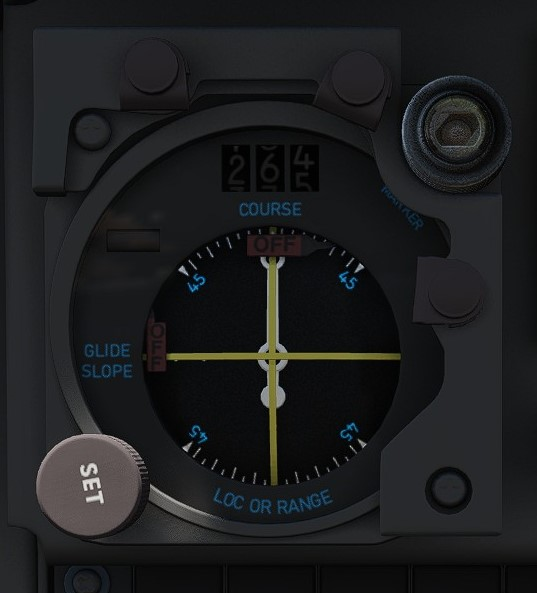

# Upfront Indicators

## Standby Magnetic Compass

A standard magnetic compass for backup navigation assistance should the primary
flight director systems fail. The compass should only be used in level flight. Compass deviation
cards are found above the right canopy sill on each cockpit.

## Command Ejection Select Handle

Used to select single or dual ejection as commanded by the WSO. In the vertical
position (valve closed), initiation of ejection by the WSO ejects only the rear
seat. With the valve handle in the horizontal (open) position, a WSO initiating
ejection will extract both crew members.

## Course Indicator

Used during an ILS approach, displays localizer and glide slope deviations
represented dots—1 dot equals 1 1/4 degrees for course and 1/4 degree for glide
slope. The heading pointer indicates the aircraft's heading relative to the
selected course set by the knob. Does not function with TACAN or VOR. OFF flags
display on signal loss.

## KY-28 Mode Indicator

Two lamp indicator illustrating current KY-28 operating mode- P indicates plain
(unencrypted) mode transmission, whereas C indicates cipher (encrypted) mode
transmission. Note: UHF communications require the system be in Plain mode, even
with system power off, barring usage and monitoring of guard channel.

## Master Caution Light

A repeater of the front cockpit Master Caution light, provides warning to the
WSO that a caution condition exists and the telelight panel needs to be checked
for cause to rectify the situation. Note: There is no reset button for the WSO. The Pilot has to
reset the Master Caution if it occurs

## Shoot Light

Illuminates when missile firing parameters are met. Do not illuminate when in Visual Intercept
or Air-to-Ground modes.

## AN/APR-36 Control Panel

The AN/APR-36 Control Panel controls the Radar Warning Receiver System of the Phantom. The ALR-46
Radar Warning Receiver (subsequently RWR) is the F-4E's passive situational awareness
system for detection of airborne and surface-to-air radar threats. The system captures signals from
a pair of directional antennas installed at the aft of the fuselage. For further information
see the [Radar Warning Receiver](../../systems/radar_warning_receiver.md)

## Angle of Attack Indexer

Provides quick confirmation of current aircraft AoA state based on illuminated
position and color.

## Range (VISIDENT) Indicator

Displays accurate radar range information inside 2 miles (12000ft) and range/rate
information inside 9000ft, when lock-on exists in Visual Intercept, B NAR, or B WIDE mode.
When AIR-GRD is selected, the indicator is disabled.

## 8-Day Clock

A clock is provided for the WSO, including a stopwatch function. The stopwatch is being used
by pressing the top right button and reset by pressing it again. The watch can be set by turning
the knob on the left lower corner.

## Accelerometer

Calibrated from negative 4 to positive 10 in units of G, with three pointers-
one for current applied load, the other two show maximum positive and negative G
applied during the flight. Pressing the PUSH TO SET button will reset the
maximum position indicators to 1 G.

## Ball/Slip and Rate of Turn Indicator

A 4-minute turn indicator, utilizing a conventional horizontally mounted gyro,
accurately displays standard turn rates, resembling a conventional turn and slip
indicator. 4-minute turn indicator refers to 4 minutes for a 360-degree turn.

## Navigation Mode Selector Switch

Selects the respective mode for the two BDHI needles.

| Name   | Needle 1                        | Needle 2                         |
|--------|---------------------------------|----------------------------------|
| Up     | UHF/Automatic Direction Finding | TACAN station                    |
| Center | VOR Station                     | TACAN station                    |
| Down   | Nav Computer mode: Bearing      | Nav Computer mode:  Ground track |

## Ground Speed Indicator

Provides the aircraft's ground speed in knots, and is calibrated from 0 to 1999
knots. Requires INS for accurate presentation. If INS off, can register any
value of up to 150 knots when motionless on ground.

## True Airspeed Indicator

Provides the aircraft's true Airspeed in knots, and is calibrated from 150 to
1500 knots; airspeeds below this range are thus not reliable.

## UHF Remote Channel Indicator

Provides the current selected channel value when the radio is set to PRESET.
Otherwise, the indicator displays M if the radio is set to Manual, G when the
COMM function is set as GUARD/ADF, or A when the A-3-2-T switch is in A.

## Vertical Velocity Indicator

Provides rate of climb or descent via the static pressure system referenced in
thousands of feet per minute.

## Altimeter

A counter-pointer style altimeter, with thousandths in the counter window and
100 foot increments around the face. The altimeter has an absolute range of
80,000 feet. The altimeter includes a barometric scale for setting local
pressure with the knob on the indicator. Works in either electric (normal
operation mode) or pneumatic (STBY) mode, switchable via a spring-loaded three
position switch labelled RESET and STBY. When held in RESET for more than 3 seconds the system will
be reset and moved out of STBY.

## Attitude Indicator

The AHRS provides attitude information to the Attitude Indicator found on the
rear cockpit instrument panel when the Reference System Selector Switch is in
PRIM or STBY. A trim knob provides the ability to adjust the attitude sphere to
reference the aircraft correctly. Should power be disconnected from the
indicator or AHRS, the OFF flag will display.

## Airspeed and Mach Indicator

The combination airspeed and mach number indicator shows airspeed readings below
200 knots, and include Mach numbers on the outer ring at high speed. The indicator uses a single
pointer over a fixed airspeed scale, marked from 80 to 850 knots, with a moving
Mach scale presenting from Mach 0.4 to 2.5. A pair of movable reference markers
is available with the knob on the face of the gauge, with speed reference
available between 80 and 195 knots, and the Mach index pointer being able to be
set between the 225 knot and 850 knot regions relative to the airspeed gauge.

## Bearing Distance Heading Indicator (BDHI)

The Bearing Distance Heading Indicator, or BDHI, presents navigation information
as entered by the WSO, provided with two needles (termed the No 1 and No 2
pointers).
See [Navigation Mode Selector Switch](upfront_indicators.md#navigation-mode-selector-switch) for
Needle Explanation.

When the upper position is selected by the WSO to TACAN/ADF/UHF, the no. 1
pointer indicates UHF bearing, and the no. 2 pointer indicates the TACAN
bearing. If there is no TACAN signal, both pointers indicate the ADF bearing.

With the middle position selected - VOR/TAC, the no. 1 pointer indicates the VOR
bearing, the no. 2 pointer indicates the TACAN bearing, and the range indicator
provides distance to the TACAN station. In the absence of a TACAN signal, both
pointers indicate the VOR station.

In the lower position, NAV COMP, the no. 1 pointer indicates bearing to the
navigation computer target coordinates, and the no. 2 pointer indicates magnetic
ground track. The range indicator notes distance to the selected target depending on the
[Navigation Mode Selector Switch.](upfront_indicators.md#navigation-mode-selector-switch)

## Tachometers

A percentage-noting Tachometer is provided for each engine, including an inset
wheel for accurate display of single digits. Normal values are 65% for idle, 95% in full mil power
and 105% for full afterburner.

## Canopy Unlocked Warning Lamp

Illuminates when canopy is unlocked. To reset the lamp close and lock the rear canopy.

## Inertial Nav Sys Out Lamp

Illuminates when INS system is in a failure state. To reset the INS refer to
the [Inertial Navigation System chapter.](../../systems/nav_com/ins.md)

## Radar CNI Cool Off Lamp

Illuminates to indicate an over-temperature situation in the avionics cooling
system.
