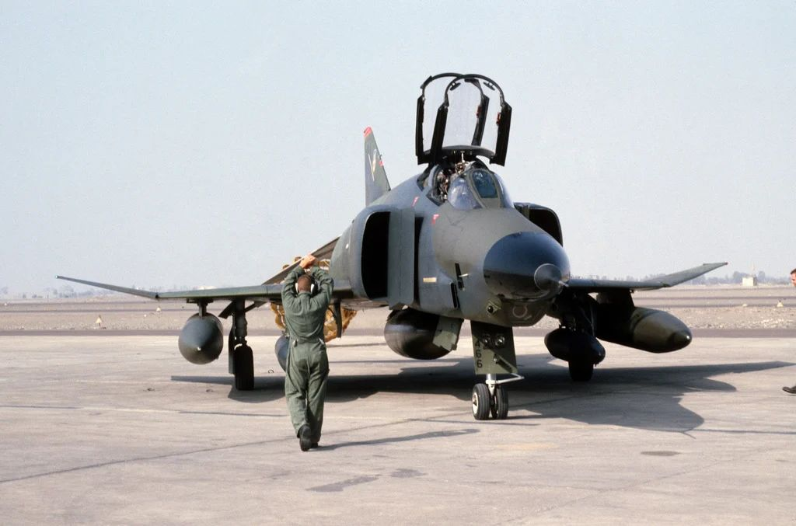

# Crew Chief

*A crew chief signals to the pilot of an RF-4C Phantom II aircraft to stop the aircraft after
taxing into parking position.  The aircraft is being used in support of Exercise FUERZAS UNIDAS PERU'87*

Crew chief (often called "Chief") is the main technician
who is responsible for the assigned aircraft when it's on the ground.
This important role involves not only keeping the aircraft in good shape
by conducting maintenance, but also preparing it for flight.
The preparation for take off begins long before the aircraft crew arrives,
but the chief also directly assists the crew during startup and shutdown.

> 💡 Never upset your crew chief. Make sure you operate your aircraft
> properly and take good care of it, or you will be scrubbing tires
> and packing chutes for the rest of your flying career.

## Features

Our F-4 crew chief has expertise in many fields including:

* External power (provided by ground cart)
* External air (provided by ground cart)
* Engine start cartridges
* Wheel chocks
* Boarding ladder and boarding steps
* Conducting different ground checks (listed below)

*"We'll throw in a start cart, boarding ladder, extra drag chutes.
Inspect your burner cans, change your hydraulic fluid, top off your liquid oxygen,
take SOAP samples and clean the canopies."*

## Ground Checks

### Overview

The F-4 [procedures](../procedures/overview.md) include several ground checks, which objective is to
make sure that certain systems are working and set correctly.
Our F-4 crew chief can assist the pilot during following checks:

* **Pitot Heat**
* **Spoiler Actuator**
* Air Refuelling Door
* Speed Brakes
* Slats and Flaps
* **Flight Controls**
* **ARI Disengage**
* **Stab Aug**
* **Trim Neutral**
* Tail Hook

Some of them are triggered automatically
(e.g. when the chief notices speed brakes extending/retracting, he will announce it).
More advanced checks (**bold ones**) have to be initiated manually.

Some of them can also be conducted without crew chief, by acquiring visual confirmation from the WSO,
but not all of them because of the limited visibility from the cockpit.

### Details

More advanced checks are explained here in detail:

#### Pitot Heat Check

Set the **pitot heat to ON** and wait for the ground crew
to confirm it's warm. After that, put the **pitot heat to OFF**.

> 🟡 CAUTION: Pitot heat should not be used for more than 1
> minute during ground operations.

#### Spoiler Actuator Check

With the right/left engine operating, **slowly deflect
control stick approximately 1 inch to the left/right**.
Have ground crew or rear seat occupant verify
that the spoiler does not fully deflect and that it
returns to a flush position when the stick is
returned to neutral. Abort if the spoiler check is
not good.

#### Flight Controls Check

**The Crew Chief should confirm all flight control
positions.** Slats and Flaps should be **OUT AND DOWN**.

* Pitch trim - 1 TO 3 UNITS NOSE DOWN
* Control stick - PULL FULL AFT AND RELEASE
  * Movement forward should be smooth and free
  of any restriction. The stick may not return to
  the full forward position. The stick should move
  forward at least to the ½ travel position and
  further movement toward the stop should
  require no more than one pound push force.
  (Chief should report stabilator positions)
* Rudder - CHECK FULL TRAVEL LEFT AND RIGHT (Chief should report rudder positions)
* Ailerons/ARI - CHECK
  * Move control stick full left. Confirm left spoiler
  up, right aileron down and rudder slightly left.
  Engage yaw stab aug. Confirm rudder move
  further left (Chief should report "KICK").
  Depress emergency quick release
  lever. Confirm rudder move toward neutral
  (Chief should report).
  Release emergency quick release lever,
  neutralize stick and disengage yaw stab aug.
  Repeat check substituting right for left.

> 💡 The MASTER
> CAUTION and CHK HYD GAGES lights may
> illuminate momentarily during this check. If
> pressure recovers without delay, disregard this
> indication.

#### ARI Disengage Check

Set Slats & Flaps to NORM. Move stick full right and left.
Confirm no rudder movement (Chief should report).

#### Stab Aug Check

Engage each axis of stab aug individually.
Confirm no movement of any control surface
(¼ inch allowable) (Chief should report).
If an aileron/spoiler deflects
during roll stab aug engagement, it may take up
to 4 seconds to resettle after roll stab aug is
disengaged. Allow enough time for the
aileron/spoiler to resettle before reengaging roll
stab aug to check the other aileron/spoiler.

#### Trim Neutral Check

Check operation of the trim indicator.
Receive a signal from the ground crew/rear cockpit
occupant that the ailerons and rudder are **set at neutral**.

## Communication

Both crew-members can communicate with the chief using one of two methods:

* Intercom - crew chief's headset is connected to the aircraft [intercom system](../systems/nav_com/intercom.md)
using a cord providing 2-way communication similar to the communication between Pilot and WSO
* Hand signals - the aircraft crew communicates with the chief in 1-way fashion using hand signals;
when this method is used, the crew chief features are limited;
you will be able to ask for the simpler actions like the wheel chocks removal
but the crew chief won't help you in conducting visual checks

In both modes you can communicate with the crew chief using Jester wheel **"Crew Chief"** menu.
The aircraft has to be stationary.

If the intercom system is set up correctly and powered up and the wheel chocks are placed,
the intercom mode will be active,
otherwise hand signals mode will be used and
the "(hand signals)" text will be added to the "Crew Chief" menu name to indicate that.

> 💡 Since the external intercom is wired in parallel with the WSO's microphone and headset,
> the ground crew and WSO can block each other during simultaneous transmissions.
> In addition, the WSO's function selector switch must be in **HOT MIC** to allow
> aircraft to ground communications.

You can verify the 2-way communication by using "Comms Check" option.

*MAJ Strangler, an F-4 Phantom II aircraft pilot, speaks to his crew chief
about the readiness of the aircraft*
