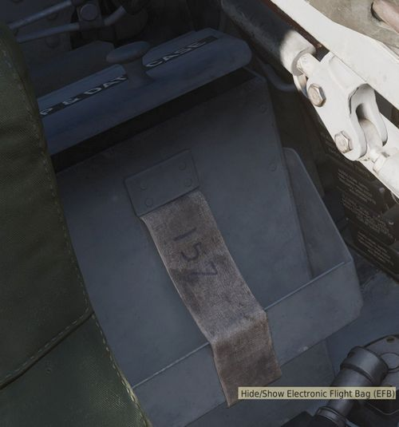

# EFB

游戏内为飞行员和 WSO 提供了电子飞行包（EFB）来查看，深入了解飞机内部系统工作状态
。

默认使用 <kbd>RCTRL</kbd>+<kbd>I</kbd> 来打开和关闭页面。此外，飞行员还可以点击
位于座椅左后方的数据箱来访问页面。

> 💡 任务作者可以在 [任务编辑器](../dcs/mission_editor.md#allow-use-of-efb) 中开
> 关是否允许使用 EFB。

## 燃油页面

燃油页面详情可在[燃油系统](../systems/engines_and_fuel_systems/fuel_system.md)
中阅读。

各个油箱都将显示各自的燃油状态（剩余油量以磅为单位）。顶部的油箱为 1 油箱，也就
是为发动机供油的油箱。

位于左上角的数字表示燃油总量和向左右发供油的燃油流量。

### 油泵

6 个燃油泵使用叶轮符号进行显示。4 油箱和 6 油箱中的符号从左到右分别对应电动泵和
液压泵。

### 燃油流量

燃油流量使用虚线表示。符号中的红色长方块表示阀门关闭，阻断燃油通过管道。

### 旗帜

除开上述符号，页面左下角还会显示以下告示旗：

- AAR; 受油门在
  [空加作业](../systems/engines_and_fuel_systems/fuel_system.md##空中受油系统)
  时打开
- DUMP; 激活
  [放油](../systems/engines_and_fuel_systems/fuel_system.md##放油系统)
- AUTO-XFER; 系统激活
  [自动转输](../systems/engines_and_fuel_systems/fuel_system.md###输油顺序) （燃
  油量低应急系统）

## 电力页面

电力页面详情可在[电力系统](../systems/electrics.md) 中阅读。

页面的上半部分显示电源：左右发电机，地面电源和电池。总线耗电在下半部分。

### 线路

连接发电机和总线的线路表示是否供电以及如何供电，线路颜色代表额定值：

- 红色; 3-相 115V AC
- 绿色; 1-相 14/28V AC
- 蓝色; 1-相 28V DC

### 变压器

用于在进行不同额定电压转换自动变压器使用符号‘A’表示（显示红色表示离线或损坏）。
以及两台提供直流电源的变压器-整流器以同样的方式显示在页面中。

### 电源

页面中将显示准确的发电机和总线的电压和负载（发电机负载单位为瓦特以及总线单位为安
培）。此外，发电机还有一个黑色进度线来指示当前总负载和最大额定负载（30.000 W）的
比值。

总线以同样的方式来指示其总负载和期望最大负载（总线没有保护，所以可以超出 100%）
。另外，总线在页面右侧还有一个目标电压偏差指示条。理想的电压应该处在中间位置。如
果指示条在中线下方，则表示总线出现欠压。超出中线则表示过电压。

### 发电机

发电机同样还能指示故障状态，例如欠压、过电压和欠频，出现这些状态将显示红旗。在发
电机上方显示的是驱动发电机的滑油压力，单位为 PSI，驱动起的 RPM 将显示在右上角。

#### 控制器

两台发电机之间的方框表示对应的发电机控制器——负载同步发电机和调节 BUS TIE。

方框上半部分显示发电机频率偏差，单位为赫兹。分界线左右分别表示 -1 Hz 到 +1 Hz，
分界线表示 0 Hz 偏差。

下半部分表示两台发电机之间的相位差（单位为度）。因此，符号中有三条白线分作为静态
参考别指向 0°、120° 和 240° 来对应其中一台发电机的各相，而红色区域则表示另一台发
电机的相位差。

如果两台发电机的相位差异过大，那么页面将出现一个 **NO SYNC** 不同步旗指示。如果
没出现指示旗，控制器将同步两台发电机来减小差异。

如果两台发电机的频率和相位差接近零，控制器将允许连接至 BUS TIE（总线汇流条）来均
衡两台发电机的负载。
