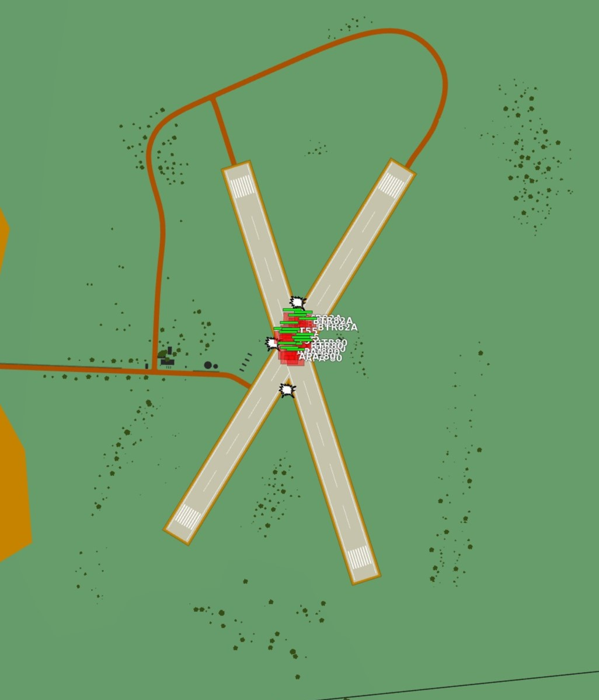
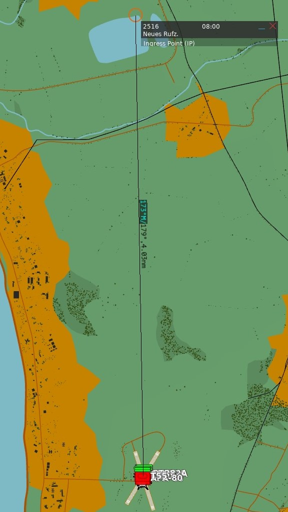
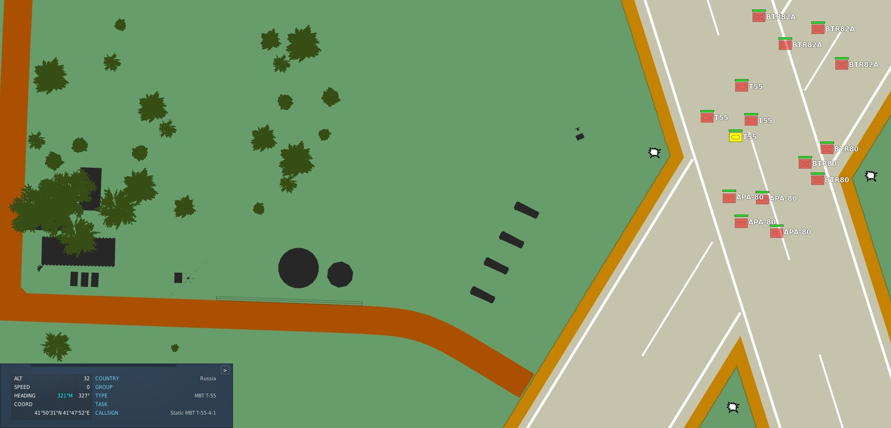
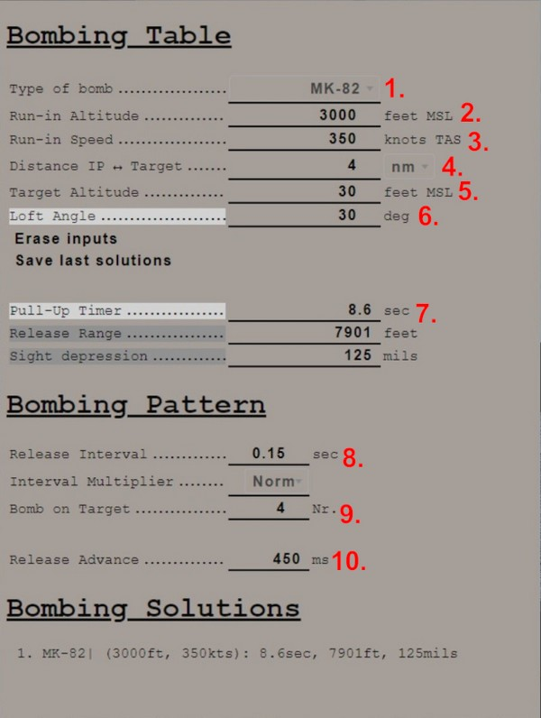

# Bombing Computer

The bombing calculator provides the pilot and WSO with an easy way to calculate the needed values
for the different bombing modes. You can use it to calculate every value (except for drag
coefficient) that you need to drop precise ordinance on your target. It is opened with the hotkey
<kbd>RCTRL</kbd>+<kbd>B</kbd> and can be closed with the same hotkey in-game. You can also bind it
to a desired button in the controls tab.

## Bombing Table

### Type of bomb

At the Type of bomb selection you can choose which ordinance you want to drop. Always choose the
correct ordinance to get correct results. You can select out of the following selection:

- MK-81
- MK-82
- MK-83
- MK-84
- M117
- CBU-87
- MK-82AIR
- MK-82Snakeye
- BLU-107

### Run-in Altitude

Sets the altitude at which you want to start your bombing run. The run-in altitude must be held from
the ingress point till bomb release. You can set it in increments of 100ft per click.

### Run-in Speed

Sets the speed at which you want to fly from the ingress point to bomb release. The speed is the
true air speed and can be set in increments of 5 knots per click.

### Distance IP <-> Target

Sets the distance between the ingress point and the target point. You can select from either setting
it in nautical miles with a 0.1 nautical miles increment or switch the unit to feet with the
drop-down on the right. The increment in feet is in 100ft per click. Unit conversion also converts
your actual input.

### Target altitude

Sets the target altitude in feet above msl. You can set it in increments of 10ft per click.

### Loft angle

Sets the desired lofting angle for the attack run. You can set it in 1° increments per click.
Only used for LABS modes.

### Erase inputs

Resets all inputs to standard values.

### Save last solutions

Saves the actual solution under the Bombing Solutions tab at the end of the page.

### Pull-up timer

Gives you the calculated pull-up timer in seconds that the WSO can put in
the [ARBCS](../systems/weapon_systems/arbcs.md#bombing-timers) computer

### Release range

Gives you the calculated bombing range in feet that the WSO can put in
the [WRCS](../systems/weapon_systems/wrcs.md#release-range-control) panel.

### Sight depression

Gives you the calculated manual sight depression in mils.

## Bombing Pattern

Lets you put in values to calculate
the [release advance](../systems/weapon_systems/wrcs.md#release-advance-control).

### Release Interval

Sets the [release interval](../systems/weapon_systems/awru.md) that the pilot sets. You can set it
in 0.01 increments per click.

### Interval Multiplier

Sets the [interval multiplier](../systems/weapon_systems/awru.md) that the pilot sets. You can
select "Norm" or "x10" in the drop-down.

### Bomb on Target

Lets you select the number of bomb that you want to hit the target. Every bomb before the selected
bomb will hit in front of the target. The rest of the bombs will hit behind the target.

### Release Advance

Gives you the calculated
[release advance](../systems/weapon_systems/wrcs.md#release-advance-control) that the WSO can put
in.

## Bombing Solution

Shows the last saved bombing solutions. The line shows the inputs as following:

- Type of bomb
- Run-in Altitude
- Run-in Speed
- [Pull-Up Timer](../systems/weapon_systems/arbcs.md)
- [Release Range](../systems/weapon_systems/wrcs.md#release-range-control)
- [Sight Depression](../cockpit/pilot/dscg_controls.md#reticle-depression-knob)

## Example run

This is a step-by-step guide for an example loft bombing run with 12 Mk-82s. In our case we want the
fourth bomb to hit the target. The first three should hit in front of the target and the rest should
impact behind the target. For that we will use the release advance.

### First Step

The first step in planning our loft bombing run is to identify and pick a target. In this example
run we want to bombard the red units standing on the X.

### Second Step

In the second step we will take a look at the F10-Map and make out an Ingress Point (IP).

> 💡 The IP should always have a good visibility while flying the plane as optical identification of
> the IP will be the main method of timing the press of the bomb button.

For our target we chose the lake just north of the target as an IP. Now we measure the distance from
our IP to the target and note it down as we need to input that to the bombing calculator. In this
case the distance is 4.03 NM which we will cut off to 4 NM since the bombing calculator can only
take 10ths of a mile.

### Third Step

Now we also need to note the elevation of the target in MSL. To get that information we just click
on a unit and read the altitude out of the box in the lower left corner. In this case the target
elevation is 32 ft which we will cut down to 30 ft since the bombing calculator can only take values
of tens.

> 💡 If the target unit is not visible on the F10 map you can also hover over the position of the
> enemy unit and read the elevation next to the coordinates in the upper left corner of the map.

### Fourth Step

Now that we have all needed values from the map we will put those in the bombing calculator.

(1) Here we select the type of our bomb. In our case Mk-82s.

(2) For our run-in altitude we want it to be at 3000 ft above MSL.

(3) We want to do our run-in at 350 knots true Airspeed.

(4) We measured the distance between our Ingress Point and target earlier at the second step. Now we
will put that in.

(5) We got our target altitude from the F10 map and can put it in now.

(6) We want our Loft Angle to be at 30°, we put that in.

(7) The bombing calculator now gives us back the Pull-Up Timer that the WSO can than put in at a
later step.

(8) We want to drop our bombs with a release Interval of 0.15 seconds, so we put that in

(9) As we decided on the beginning we want the fourth bomb to be on the target.

(10) In the release advance window the bombing calculator now gives us the value that the WSO can
put in later.

### Fifth Step

Now the WSO can put in the Loft Angle at the release angle, the pull-up timer at the bombing timers
and the release advance in the release advance in the WRCS.

### Sixth Step

Now you only need to fly the maneuver for the Loft delivery as precise as possible to make sure
you hit the target right. The more precise you fly, the more precise your bombing run will be.
