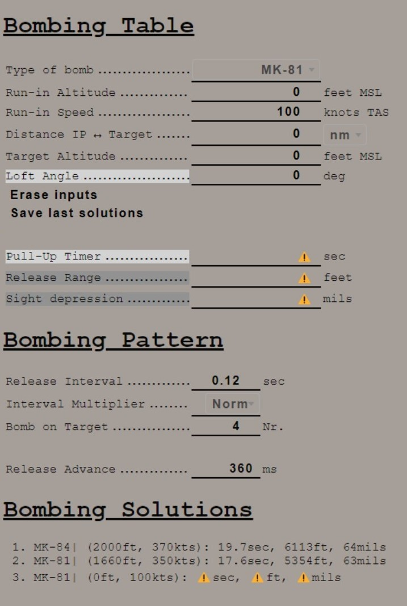

# Bombing Computer

The bombing calculator provides the pilot and WSO with an easy way to calculate the needed values
for the different bombing modes. You can use it to calculate every value (except for drag
coefficient) that you need to drop precise ordinance on your target.

## Bombing Table

### Type of bomb

At the Type of bomb selection you can choose which ordinance you want to drop. Always choose the
correct ordinance to get correct results. You can select out of the following selection:

- MK-81
- MK-82
- MK-83
- MK-84
- M117
- CBU-87
- MK-82AIR
- MK-82Snakeye
- BLU-107

### Run-in Altitude

Sets the altitude at which you want to start your bombing run. The run-in altitude must be held from
the ingress point till bomb release. You can set it in increments of 100ft per click.

### Run-in Speed

Sets the speed at which you want to fly from the ingress point to bomb release. The speed is the
true air speed and can be set in increments of 5 knots per click.

### Distance IP <-> Target

Sets the distance between the ingress point and the target point. You can select from either setting
it in nautical miles with a 0.1 nautical miles increment or switch the unit to feet with the
drop-down on the right. The increment in feet is in 100ft per click. Unit conversion also converts
your actual input.

### Target altitude

Sets the target altitude in feet above msl. You can set it in increments of 10ft per click.

### Loft angle

Sets the desired lofting angle for the attack run. You can set it in 1° increments per click.
Only used for LABS modes.

### Erase inputs

Resets all inputs to standard values.

### Save last solutions

Saves the actual solution under the Bombing Solutions tab at the end of the page.

### Pull-up timer

Gives you the calculated pull-up timer in seconds that the WSO can put in
the [ARBCS](../systems/weapon_systems/arbcs.md#bombing-timers) computer

### Release range

Gives you the calculated bombing range in feet that the WSO can put in
the [WRCS](../systems/weapon_systems/wrcs.md#release-range-control) panel.

### Sight depression

Gives you the calculated manual sight depression in mils.

## Bombing Pattern

Lets you put in values to calculate
the [release advance](../systems/weapon_systems/wrcs.md#release-advance-control).

### Release Interval

Sets the [release interval](../systems/weapon_systems/awru.md) that the pilot sets. You can set it
in 0.01 increments per click.

### Interval Multiplier

Sets the [interval multiplier](../systems/weapon_systems/awru.md) that the pilot sets. You can
select "Norm" or "x10" in the drop-down.

### Bomb on Target

Lets you select the number of bomb that you want to hit the target. Every bomb before the selected
bomb will hit in front of the target. The rest of the bombs will hit behind the target.

### Release Advance

Gives you the calculated
[release advance](../systems/weapon_systems/wrcs.md#release-advance-control) that the WSO can put
in.

## Bombing Solution

Shows the last saved bombing solutions. The line shows the inputs as following:

- Type of bomb
- Run-in Altitude
- Run-in Speed
- [Pull-Up Timer](../systems/weapon_systems/arbcs.md)
- [Release Range](../systems/weapon_systems/wrcs.md#release-range-control)
- [Sight Depression](../cockpit/pilot/dcsg_controls.md#reticle-depression-knob)
