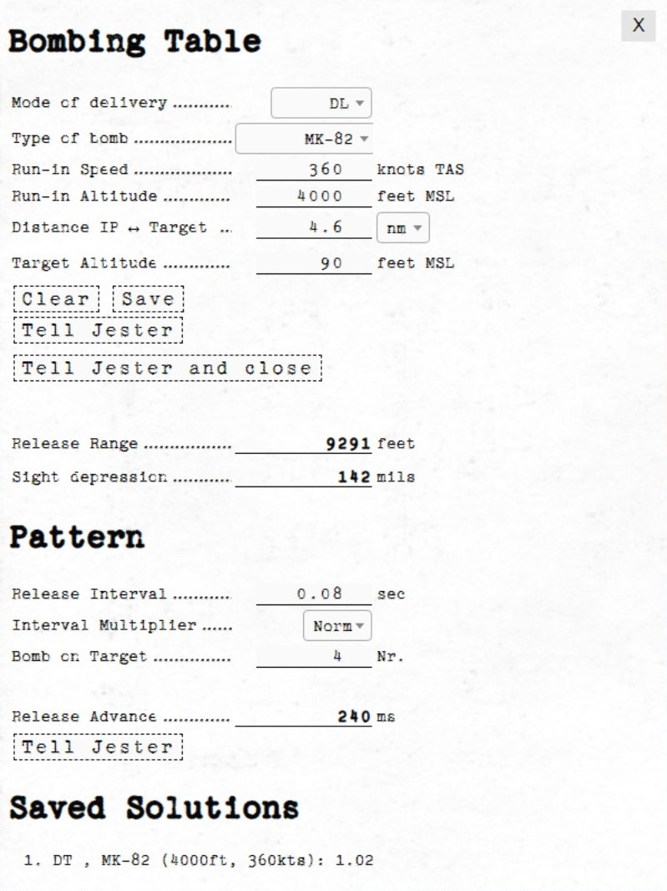
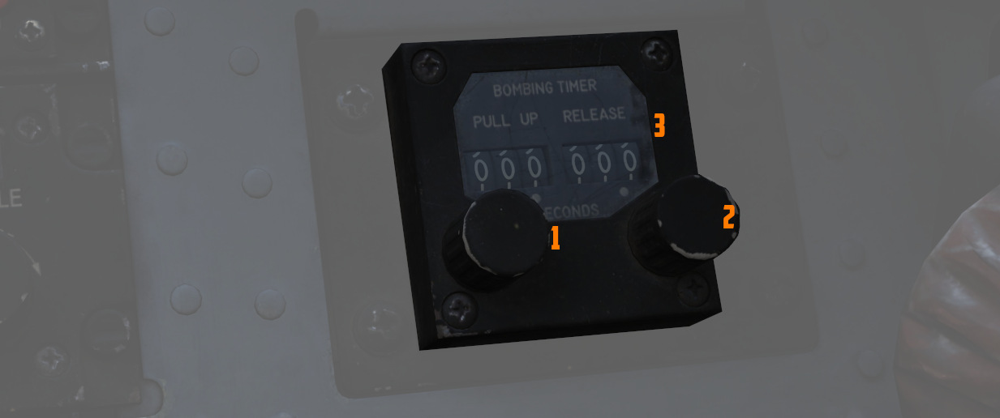
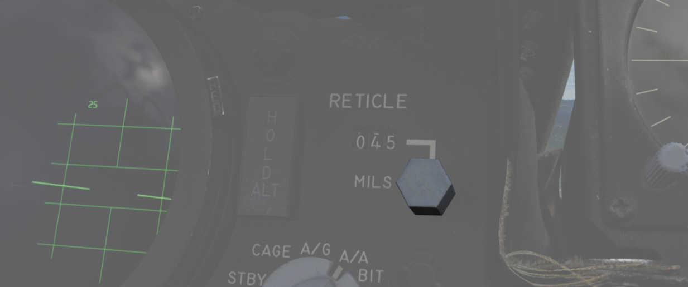

# Bombing Computer

The bombing calculator provides the pilot and WSO with an easy way to calculate
the needed values for the different bombing modes. You can use it to calculate
every value (except for drag coefficient) that you need to drop precise
ordinance on your target. It is opened with the hotkey
<kbd>RCtrl</kbd>+<kbd>B</kbd> and can be closed with the same hotkey in-game.
You can also bind it to a desired button in the controls tab.

## Bombing Table

### Input

#### Mode of Delivery

The first thing that should be selected is the Mode of delivery. You can choose between the
following modes depending on your attack run.

- Direct
- Dive Toss (DT)
- TGT Find
- Dive Laydown (DL)
- Laydown (L)
- Offset
- Loft
- Over-the-shoulder (O/S)
- Over-the-shoulder instantaneous (O/S INST)

#### Type of bomb

At the Type of bomb selection you can choose which ordinance you want to drop.
Always choose the correct ordinance to get correct results. You can select out
of the following selection:

- MK-81
- MK-82
- MK-83
- MK-84
- M117
- CBU-87
- MK-82 AIR
- MK-82 Snakeye (SNK)
- BLU-107

#### Run-in Speed

Sets the speed at which you want to fly from the ingress point to bomb release.
The speed is the true air speed and can be set in increments of 5 knots per
click.

#### Run-in Altitude

Sets the altitude at which you want to start your bombing run. The run-in
altitude must be held from the identification point till bomb release. You can set it
in increments of 100ft per click.

#### Distance IP <-> Target

Sets the distance between the identification point and the target point. You can select
from either setting it in nautical miles with a 0.1 nautical miles increment or
switch the unit to feet with the drop-down on the right. The increment in feet
is in 100ft per click. Unit conversion also converts your actual input.

#### Target altitude

Sets the target altitude in feet above msl. You can set it in increments of 10ft
per click.

#### Dive Angle

Sets the desired dive angle for the attack run. Can be set in 1° increments per click. Needs to be
set in Direct and Dive Toss mode.

#### Loft angle

Sets the desired lofting angle for the attack run. Can be set it in 1°
increments per click. Only used for LABS modes.

Must also be set in the LABS panel.

### Output

In general the Bombing Calculator will only give you the Output you need to set for the selected
attack run.

#### Pull-up timer

Gives you the calculated pull-up timer in seconds that the WSO can put in the
[ARBCS](../systems/weapon_systems/arbcs.md#bombing-timers) computer.

#### Release range

Gives you the calculated bombing range in feet that the WSO can put in the
[WRCS](../systems/weapon_systems/wrcs.md#release-range-control) panel.

#### Sight depression

Gives you the calculated manual sight depression in mils.

This can be put into the sight depression knob in order to align the reticle
with the target for a manual MIL bombing solution.

#### Drag Coefficient

Gives you the Drag Coefficient that the WSO then can set in
the [WRCS](../systems/weapon_systems/wrcs.md#release-range-control) panel.

#### N/S WRCS and E/W WRCS

Gives you the calculated offset distance values that the WSO then can set in
the [WRCS](../systems/weapon_systems/wrcs.md#release-range-control) panel.

### Controls

#### Clear

Resets all inputs to standard values.

#### Save

Saves the actual solution under the Bombing Solutions tab at the end of the
page.

#### Tell Jester and Tell Jester and close

With this button the values calculated by the bombing calculator can be transferred to Jester. He
will either confirm the input or tell you "can't do" when the input is not correct.

## Pattern

Lets you put in values to calculate a
[release advance](../systems/weapon_systems/wrcs.md#release-advance-control).

### Pattern Input

#### Release Interval

Sets the [release interval](../systems/weapon_systems/awru.md) that the pilot
sets. You can set it in 0.01 increments per click.

#### Interval Multiplier

Sets the [interval multiplier](../systems/weapon_systems/awru.md) that the pilot
sets. You can select "Norm" or "x10" in the drop-down.

#### Bomb on Target

Lets you select the number of bomb that you want to hit the target. Every bomb
before the selected bomb will hit in front of the target. The rest of the bombs
will hit behind the target.

### Pattern Output

#### Release Advance

Gives you the calculated
[release advance](../systems/weapon_systems/wrcs.md#release-advance-control)
that the WSO can put in.

## Bombing Solution

Shows the last saved bombing solutions. The line shows the inputs as following:

- Mode of Delivery
- Type of bomb
- Run-in Altitude
- Run-in Speed

Depending on mode it will also save the corresponding solutions that are needed to fly the attack
run.

## Example run

This is a step-by-step guide for an example loft bombing run with 12 Mk-82s. In
our case we want the fourth bomb to hit the target. The first three should hit
in front of the target and the rest should impact behind the target. For that we
will use the release advance.

### Planning: Advance

The first step in planning our loft bombing run is to identify and pick a
target. In this example run we want to bombard the red units standing on the X.

### Planning: IP

In the second step we will take a look at the F10-Map and make out an Identification
Point (IP).

> 💡 The IP should always have a good visibility while flying the plane as
> optical identification of the IP will be the main method of timing the press
> of the bomb button.

For our target we chose the lake just north of the target as an IP. Now we
measure the distance from our IP to the target and note it down as we need to
input that to the bombing calculator. In this case the distance is 4.03 NM which
we will cut off to 4 NM since the bombing calculator can only take 10ths of a
mile.

### Planning: Target

Now we also need to note the elevation of the target in MSL. To get that
information we just click on a unit and read the altitude out of the box in the
lower left corner. In this case the target elevation is 32 ft which we will cut
down to 30 ft since the bombing calculator can only take values of tens.

> 💡 If the target unit is not visible on the F10 map you can also hover over
> the position of the enemy unit and read the elevation next to the coordinates
> in the upper left corner of the map.

### Solution

Now that we have all needed values from the map we will put those in the bombing
calculator.

(<num>1</num>) Here we can select the mode of delivery which is LOFT in our example.

(<num>2</num>) Here we select the type of our bomb. In our case Mk-82s.

(<num>3</num>) We want to do our run-in at 350 knots true Airspeed.

(<num>4</num>) For our run-in altitude we want it to be at 3000 ft above MSL.

(<num>5</num>) We measured the distance between our Ingress Point and target
earlier at the second step. Now we will put that in.

(<num>6</num>) We got our target altitude from the F10 map and can put it in
now.

(<num>7</num>) We want our Loft Angle to be at 30°, we put that in.

(<num>8</num>) The bombing calculator now gives us back the Pull-Up Timer that
the WSO can than put in at a later step. Alternatively it can be transferred via the "Tell Jester
and close" or the "Tell Jester" Button.

(<num>9</num>) The bombing calculator also gives us the Pullup Range. This is only as pilot
information.

(<num>10</num>) Further as a pilot information the bombing calculator gives us our release range.

(<num>11</num>) We want to drop our bombs with a release Interval of 0.15
seconds, so we put that in

(<num>12</num>) As we decided on the beginning we want the fourth bomb to be on
the target.

(<num>13</num>) In the release advance window the bombing calculator now gives
us the value that the WSO can put in later.

### Setup

Now the WSO can put in the Loft Angle at the release angle, the pull-up timer at
the bombing timers and the release advance in the release advance in the WRCS.

### Execution

Now you only need to fly the maneuver for the Loft delivery as precise as
possible to make sure you hit the target right. The more precise you fly, the
more precise your bombing run will be.
