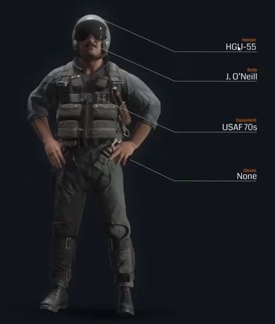
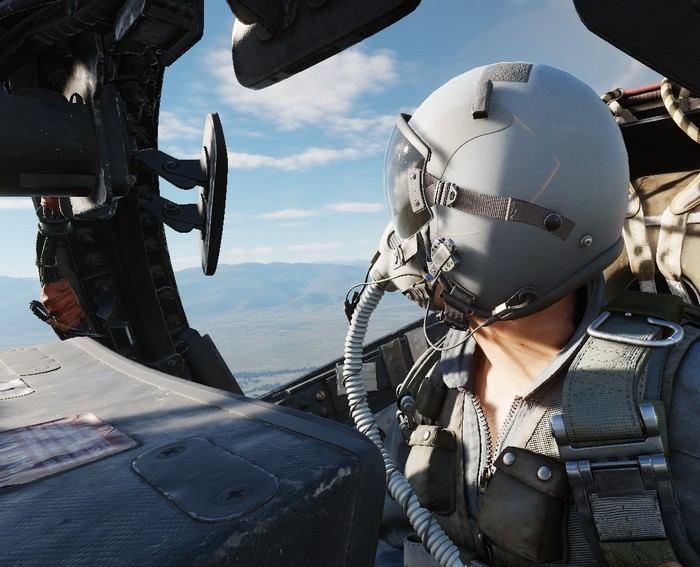

# Character

## Customization

The pilot and WSO character can be customized through an in-game menu, for
example selecting one of the many available helmets.

> 🚧 Character customization will be made available later during Early-Access.

## Selfie Mode

To enable great screenshots, a special _Selfie Mode_ can be entered via an
assignable special bind.

In this mode, the character model is rendered even though the player is
currently in First-Person-View (<kbd>F1</kbd>).

The camera can then be moved for example to the front via standard DCS controls:

- <kbd>RCtrl</kbd> + <kbd>RShift</kbd> + <kbd>8</kbd> (Numpad): Move up
- <kbd>RCtrl</kbd> + <kbd>RShift</kbd> + <kbd>2</kbd> (Numpad): Move down
- <kbd>RCtrl</kbd> + <kbd>RShift</kbd> + <kbd>4</kbd> (Numpad): Move left
- <kbd>RCtrl</kbd> + <kbd>RShift</kbd> + <kbd>6</kbd> (Numpad): Move right

The view can be turned back to face the pilot by using <kbd>LAlt</kbd> +
<kbd>C</kbd> and then using the mouse.

Additionally, another special bind exists to freeze the character model
movement.
