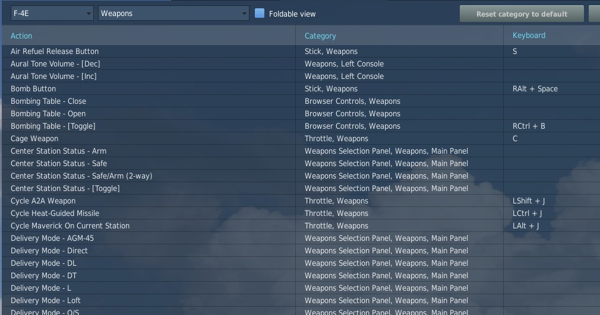

# Controls

Available control binds for the Phantom are exhaustive. For any switch, knob or button, you can
choose between direct position-binds, increment or decrement binds, a toggle or next option,
special binds for 2-way or 3-way switches and assignable axis.

In total, both cockpits feature around 1000 assignable binds and 200 axis each.

As example, the **Speed Brake** switch provides 8 binds:

* Speed Brake - In
* Speed Brake - Stop
* Speed Brake - Out (Hold)
* Speed Brake - [Aft]
* Speed Brake - [Forward]
* Speed Brake - [Next]
* Speed Brake - In/Stop (3-way up)

The _Out_-position is marked _(Hold)_ to signal that the position is
spring-loaded and will return to center once released.

Binds _[Aft]_ and _[Forward]_ are directional binds that move the switch
from the current position into the given direction.

_[Next]_ is similar,
but will not stop at the last position and wrap over to the first position again.
Likewise, 2-way switches provide a _[Toggle]_ bind that flips the switch between
either position.

The _(3-way up)_-bind is intended to be used with actual 3-way hardware switches,
such as present on many external devices.
They send a signal on either position (up and down), but not signal on the center position.
Hence, the bind will return the switch back to the center when no signal is send.

> 💡 The _(3-way down)_-bind is skipped for the Speed Brake, since it would be
> identical with the spring-loaded _Out (Hold)_-bind.

All binds are generally assigned at least two searchable categories,
the **system** the bind belongs to and its **location** in the cockpit.
The **Master Arm** switch for example has categories:

* Weapons
* Main Panel
* Weapon Selection Panel

## Sim-Pit

Additionally to regular binds, special _[SimPit]-binds_ are provided that allow controlling
any switch or knob via an axis input.

For example, a switch with 2 positions ON and OFF can be controlled with an axis,
while the switch changes its position as soon as the axis is pushed beyond its center position.

This is especially useful for builders of cockpit replicas, working mainly
with hardware switches whose electronic components send normalized inputs
through the entire movement range.
