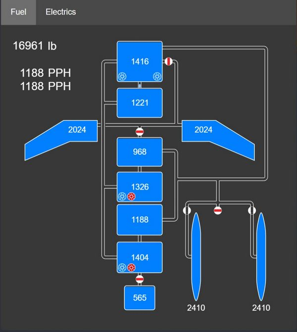

# EFB

The Electronic Flight Bag (EFB) provides both the pilot and the WSO detailed
insights on the aircraft's internal systems.

It can be opened and closed by default with <kbd>RCTRL</kbd>+<kbd>I</kbd>.
Further, the pilot can also access it by clicking on the data-case on the left
side behind the seat.

> 💡 Mission designers can toggle allowing the use of the EFB in the
> [Mission Editor](../dcs/mission_editor.md#allow-use-of-efb).

## Engine Page

The engine page provides details on both
[Engines](../systems/engines_and_fuel_systems/engines.md).

### Gearbox

The top left shows the current RPM of the gear shaft that rotates the compressor,
as well as the turbine assembly.

`NG` (Gas Generator Speed) represents the speed at which the compressor
section rotates, expressed in percentage of the desired maximum.

The shaft in the center of the engine also visually rotates accordingly.

### Inlet

The inlet area visualizes outside airflow, quantized in lb/s and
displays its temperature.

### Compressor

Airflow is visualized as it moves through the 17 compressor stages.
Its temperature at the end of the last stage is shown,
as well as the compression ratio.

### Combustion Chamber

The chambers generally have three states:

* Unlit
* Lit
* Surge (e.g. during a compressor stall)

Further, an ignition spark is shown to confirm correct operation of the igniter
plugs operated during initial engine ignition.

The temperature of the mixture is displayed as it leaves the chambers.

### Afterburner

The afterburner section consists of a spray bar that injects more
fuel into the air (visualized as yellow cones), as well as a
torch that ignites the mixture.

The air temperature is shown right after the torch.

### Exhaust

The last section shows the final exhaust temperature, as well as the
thrust produced by the engine.

### Engine Fuel System

Between both engines is a representation of the system feeding both engines with fuel.

It features the Fuel Cell 1 with its current amount of fuel, as well as both
fuel boost pumps. The pumps are colored red should they be deactivated.

> 💡 The fuel in tank 1 is not the total fuel remaining, tank 1 is
> constantly refilled from the remaining fuel tanks.

Right after the boost pumps is the Engine Fuel Shutoff Valve,
shut if the respective throttle is in the OFF position.

From there, fuel is further boosted by a pump and reaches the combustion chambers.
These pumps are controlled by the Engine Master Switches.

Further, a two valves and another pump for each engine are used to
optionally supply fuel to the Afterburner Spray Bars, as well as to the Torch.

### Oil

The engines use oil as lubricant, coolant fluid, as well as hydraulic fluid
to operate the nozzles. For that, both feature a tank with 4 gallons of oil.

Should the oil leak and the tanks deplete, pressure to operate the nozzles will drop
and eventually the engine will suffer severe and irreparable damage.

## Fuel Page

The fuel page provides details on the
[Fuel system](../systems/engines_and_fuel_systems/fuel_system.md).

Each tank is shown with its individual fuel state (fuel left measured in lb).
The tank on the top is cell 1, which is supplying the engines with fuel.

The numbers on the top left indicate total fuel and fuel flow to the left and
right engine respectively.

### Pumps

The 6 fuel pumps are indicated by impeller symbols. For cell 4 and 6 the symbols
indicate from left to right the electric and the hydraulic pump respectively.

### Flow

Fuel flow is indicated by dashed pipes. A closed valve shows a red rectangle,
blocking flow through the pipe.

### Flags

Further, the following flags can be displayed in the lower left corner:

- AAR; the door for
  [air-to-air-refueling](../systems/engines_and_fuel_systems/fuel_system.md#air-refueling-system)
  is open
- DUMP;
  [fuel dumping](../systems/engines_and_fuel_systems/fuel_system.md#fuel-dump-system)
  is active
- AUTO-XFER; the system for
  [automatic-transfer](../systems/engines_and_fuel_systems/fuel_system.md#transfer-sequence)
  is active (a low fuel emergency system)

## Electrics Page

The electrics page provides details on the
[Electrics system](../systems/electrics.md).

The upper half displays the power sources: the left and right generator,
external power and the battery. Consumers consisting of buses are on the lower
half.

### Wires

Wires connecting the generators and buses indicate if and how power is supplied,
with color representing the rating:

- Red; 3-phased 115V AC
- Green; 1-phased 14/28V AC
- Blue; 1-phased 28V DC

### Transformers

The auto-transformers converting between different ratings are shown with `A`
symbols (colored red if offline or damaged). The two Transformer-rectifiers
providing DC power are displayed in a similar way.

### Power

Generators and buses show their exact voltages and loads in text (load is
measured in Watt for the generators and Ampere for the buses). Further, the
generators have a black horizontal filling indicating the current total load
versus the maximum rated load (30.000 W).

In a similar fashion buses indicate their current total load versus the expected
maximum load (buses are not protected, so this can go beyond 100%).
Additionally, buses have vertical bars on the right side visualizing the
deviation from the target voltage. The ideal setting is in the center. If the
bar is below center, the bus has under-voltage. Above center means over-voltage.

### Generators

Generators also indicate fault states, such as under-voltage, over-voltage or
under-frequency as red flags. The number above them shows the oil pressure in
PSI driving the generators, yielding the RPM shown in their top right corner.

#### Controller

The box between both generators represents the generator controller, taking care
of syncing the generators and governing the BUS TIE.

The upper half shows the deviation of the generators frequency in Hertz. The
horizontal bar displays this from -1 Hz to +1 Hz from left to right, with 0 Hz
being in the center.

The lower half visualizes the phase difference between both generators (in
degrees). Therefore, the three white bars placed at 0°, 120° and 240°
respectively represent the phase of one generator as static reference, while the
red areas show the offset to that reference by the other generator.

A **NO SYNC** flag indicates that the differences between both generators are
still too large. If the flag is not shown, the controller synchronizes both
generators in an attempt to reduce the delta values.

If both, the frequency and the phase differences are close to zero, the
controller allows connecting the BUS TIE to balance load between them.
