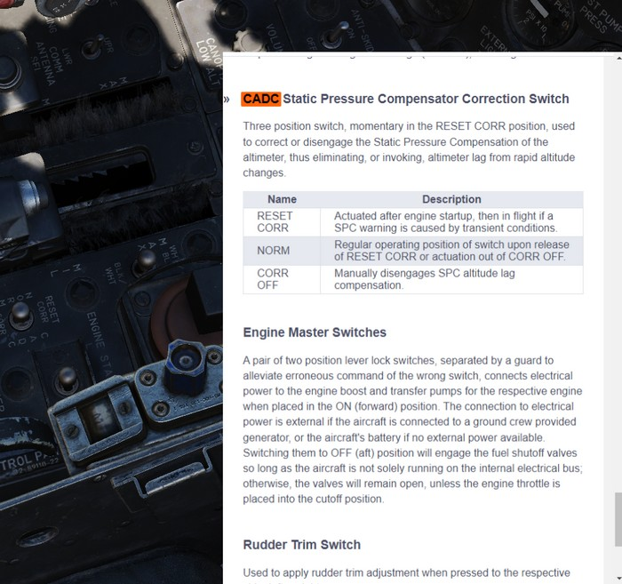

# Embedded Manual

This manual is embedded into the game and can be read while flying.

It also offers a way to explain switches in the cockpit directly by opening the
manual scrolled right to the spot explaining the corresponding switch.

## Controls

The default bind <kbd>M</kbd> can be used to toggle the manual. When holding it
down while clicking a switch in the cockpit, the manual will automatically open
and scroll to the section explaining that switch.

Additionally, the following binds are available as well:

- <kbd>RSHIFT</kbd> + <kbd>M</kbd> - open the manual
- <kbd>RCTRL</kbd> + <kbd>M</kbd> - close the manual
- <kbd>RALT</kbd> + <kbd>M</kbd> - toggle the manual

> 💡 In order to close the manual, make sure to first remove keyboard focus from
> it by clicking anywhere else in the cockpit.
