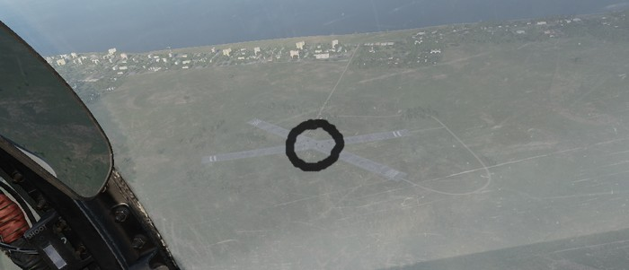

# Grease Pencil

Both crew members can use a grease pencil to draw on the side of their canopy.

The interface can be opened by clicking on the corresponding spot on the right
front side of the canopy.

Holding down left click allows drawing, while right click will use the eraser.

After closing the window by clicking on the canopy spot again, the results are rendered on the canopy.

> 💡 Due to engine limitations, the image is not synchronized
> in multiplayer and is not visible from external view.

## Spotting Circle

To aid in crew coordination, during startup and planning, a commonly employed
technique is to select an static object at distance, such as a building, vehicle
or tree, and drawing a circle around it.

The circle drawn by the Pilot and the WSO will now roughly point in the same
direction and, once in air, can be used to enhance coordination.

For example, if the Pilot spots a target, they can tell the WSO:

> "There is a target 100m right to the circle."

The WSO can now use his circle marker to locate the right spot.

