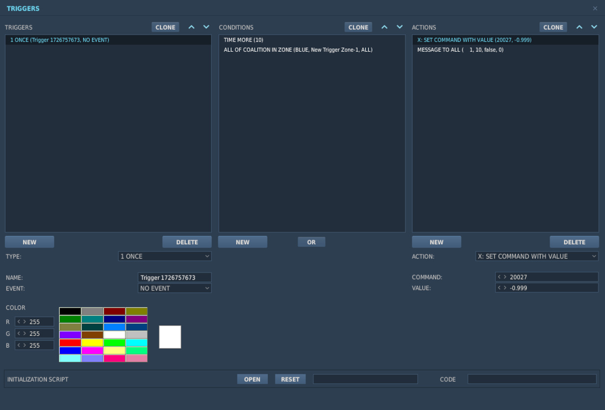

# 任务编辑器

F-4 在任务编辑器中有数个专用选项。

## 状态和磨损

_"您猜怎么着，自从 Cal 加入后，这架飞机只在经过批准的跨国飞行和周末演习时使用。
崭新出厂，伙计们，没有超过载。"_

飞机的所有组件都单独地模拟了磨损，每次部署时都会拥有独特的体验，但磨损也取决于
F-4 的飞行方式。

一般情况下，磨损分为 **状态** 和 **磨损**，两者在部署时都为动态变化且在整个任务
过程中会受到各种因素的影响，如过载、温度和战斗损伤。

飞机上有成千上万的组件都会受到磨损系统的影响。一个具体的例子是 Pave Spike 瞄准吊
舱升仰角环架电机的速度。在完美状态下，它的速度应该是每秒 60 度。然而，工厂一般无
法确保始终一致，因此会接受一定的误差，例如误差必须在 1% 以内。

在数学上，我们用 **正态分布** 模拟误差，由以下参数组成

- μ (Mu, 平均数)
- 它在完美状态下的值
- σ (标准差)
- 误差值

大约 70% 的情况下，数值会在 σ 的一个标准差以内；95% 的情况下，数值会在 σ 的两个
标准差以内。超过 3 个标准差 σ 的极端情况也有可能发生，但非常少见。

例如，上述电机的 σ 值为 3%，约为每秒 60 度，这意味着绝大多数瞄准吊舱将使用能以每
秒 58 至 62 度之间移动仰角环架的电机。

> 💡 误差是双向的，玩家的鬼怪也可能比它应有的速度更快。

### 飞机状态

飞机的状态一般指其出厂和生产质量。例如，在战争时期，工厂可能会出现供应短缺，并在
生产过程中降低验收标准，这通常会增加单个组件的性能出现。

任务设计者可以通过 **飞机状态** 滑块来控制这方面的情况，该滑块表示的质量从 0%（
低质量）到 100% （高质量）不等。

例如 Pave Spike 电机，当设置为 0% 时，其速度误差 σ 将从 3% 增加到 8%，从而导致大
多数吊舱的转动速度介于每秒 55 至 65 度之间。

飞机状态始终处于制造商可以合理接受的区间内。飞机始终是完全正常工作的。

### 飞机磨损

除生产质量外，飞机上的组件在服役期间也会因上次大修后的时间、温度和天气等外部因素
、机身过载较大的激进飞行以及战斗损伤而退化。

任务设计者可以使用飞机磨损滑块控制这方面的情况，显示从 0%（无磨损）到 100% （大
量磨损）甚至更高的磨损程度。对于一架刚修理好并刚刚退役的飞机来说，0% 是合适的
。100% 指的是飞机被送回维修的最晚时间点，因为在实战中它开始变得不那么有效。超过
100% 的数值，比如 500%——可用来表示飞行员被迫驾驶一架运行性能远低于预期水平的飞机
的情况。这种情况下，飞机在一定程度上仍然可用，没有任何组件直接损坏，只是组件的性
能不再符合可接收的参数。

> 💡 任务编辑器中无法设置超过 100% 数值，但空中可实现。

例如 Pave Spike 电机，磨损设置到 100%，其速度误差 σ 将额外增加 20%。假设初始起动
状态良好，此时电机的工作速度可能在每秒 45 到 75 度之间。

### 基准飞机

如果需要，任务设计者可以通过该复选框来关闭初始部署时的误差系统。组件将以其平均数
μ 开始，不含任何误差。

也就是说，勾选选项后，状态设置以及磨损都将被忽略和禁用。飞机启动时的所有属性都将
完全按照资料与制造商的规定进行设置，不会有任何误差。

基准飞机在赛事中尤为重要，为了公平起见，比赛双方应在相同的状态下开始比赛。或者在
进行测试和计算性能曲线时，飞机应始终以完全相同的数值开始。

> 💡 即使是基准飞机，在飞行过程中也会出现磨损。在赛事活动中，如果拉大过载，玩家
> 的飞机的组件属性就会与对手产生差异。

## INS 预存航向对准

通过这一复选框可以大大减少冷启动时正确对准 INS 所需的时间。

因此，地勤人员需要提前起动飞机并执行完整的对准，然后再次关闭飞机，同时存储部分对
准数据。

详见 [INS 部分](../systems/nav_com/ins.md#heading-memory-alignment) 来学习如何执
行预存航向对准。

## 允许 Jester 编程

勾选后，玩家可根据用户制作模组来定制其 Jester。详见
[9.12.1.2 Lua API](modding/jester/lua_api.md#user-mods)。

取消后，将忽略所有 Jester 模组并自动使用原版 Jester 行为。

> 💡 该选项不在 DCS 集成检查（IC）系统范围内，也就是说，服务器可强制使用 IC 同时
> 允许用户使用 Jester 模组。

## 允许使用 EFB

勾选后，玩家可访问 [EFB](../dcs/efb.md) 页面，来深入了解飞机内部系统工作。例如各
个油箱中的燃油油量。

真机并不存在电子飞行包功能。

## 允许使用夜视仪

虽然 F-4E 机组实际上从未使用过 NVG，但该选项允许任务设计者创建现代或虚构的场景，
让 鬼怪机组可以使用此类设备。

## 战斗树可欺骗系统

选择可被
[战斗树系统](../systems/identification_systems.md#anapx-81a-combat-tree) 欺骗的
应答机系统。

- 所有; 所有敌机都可被欺骗
- 史实; 任何装备了被逆向工程的应答机系统的航空器都可被欺骗
- 无; 战斗树无效果

_史实_ 设置适用于 DCS 中的以下航空器：

- MiG-15
- MiG-19
- MiG-21
- MiG-23
- Su-17
- Tu-142
- Yak-40
- KA-27

> 💡 受限于游戏引擎，受影响的航空器无法通过例如关闭应答机等手段规避战斗树。

## TACAN 选项

允许在部署刚开始时设置塔康波道和波段。

## VOR/ILS 选项

允许在部署刚开始时设置 VOR/ILS 频率。

## KY-28 加密密钥

允许设置 KY-28 密话系统使用的加密密钥。

当使用 ED-VOIP 或 SRS 等工具模拟电台设备加密时，该设置尤为重要。

详见 [KY-28 系统](../systems/nav_com/encryption.md)。

## 双箔条布撒

提供给地勤人员的一个 AN/ALE-40 对抗措施布撒器可用选项。

勾选后，每个箔条布撒信号将同时在两侧布撒箔条。

详见
[AN/ALE-40 系统](../systems/defensive_systems/countermeasures.md#chaff-double-cd)。

## IFF 模式 2 选项

允许预选 IFF 系统模式 2 的编码。

## 激光选项

允许为瞄准吊舱和激光制导武器预设激光编码。

## 电台选项

编辑器允许预设 UHF 电台的所有 18 个 COMM 和 20 个 AUX 波道的频率：

任务设计者可以在任务编辑器中设置一个台来用于 ADF 导航。为此，需要在地图上放置一
个单位，如地面台。然后，该设备应执行命令调谐到所需的 AM 频率（执行命令 > 设置频
率）。最后，该设备必须在整个任务期间持续发送信息，这就需要将信息设置为循环（执行
命令 > 发送消息）。

并且，任务触发器还提供了读取当前激活的 UHF 电台频率的无线电频率参数：

| 参数        | 描述              |
| ----------- | ----------------- |
| `COMM_FREQ` | Comm 频率单位 MHz |
| `AUX_FREQ`  | Aux 频率单位 MHz  |

## Flight Plan Preparation

The waypoints set in the Mission Editor will automatically be loaded into
Jesters Primary Flight Plan. Special waypoint types can be assigned by adding
specific capitalized phrases to the waypoint's name field. Recognized phrases
are:

- **VIP** (Nav Fix) - **IP** - **TGT** (Target) - **F-IN** (Fence In) -
  **F-OUT** (Fence Out) - **HB** (Homebase) - **ALT** (Alternate) - **CAP**

The phrase **HOLD** enables the _Holding option_ for the waypoint.

See [5.2. Jester Navigation](../jester/navigation.md#flight-plan) for details on
how these waypoint types influence Jesters behavior.

## SetCommands

The F-4E features a list of set commands that can be used by mission makers. All
commands are executed silently as in Jester will neither deny nor confirm any
commands. The SetCommands with the Command ID, name and Values can be found in
the table below:

| Command ID | Name                        | Value                          |
| ---------- | --------------------------- | ------------------------------ |
| 20010      | Jester_silent               | 0-1                            |
| 20011      | Jester_pause                | 0-1                            |
| 20015      | Jester_tune_ARC_164_channel | 0.XX                           |
| 20016      | Jester_tune_TACAN_channel   | s0.XXXY                        |
| 20017      | Jester_deviate_to_tgt_zone  | 0.XX                           |
| 20018      | Jester_add_wpt_after        | 0.TTXXY                        |
| 20020      | Jester_resume_flightplan    | 0.XXY                          |
| 20021      | Jester_designate_wpt        | 0.DXXY                         |
| 20022      | Jester_set_cap_time         | 0.XX                           |
| 20023      | Jester_eject_WSO            | 0-1                            |
| 20025      | Jester_unlock_tgt           | 0-1                            |
| 20026      | Jester_radar_power          | 0.00 - 1.00 in 0.2 increments  |
| 20027      | Jester_radar_polar          | 0-1                            |
| 20028      | Jester_radar_range          | 0.00 - 1.00 in 0.2 increments  |
| 20029      | Jester_radar_maneuver       | 0-1                            |
| 20030      | Jester_radar_scan           | 0-1                            |
| 20031      | Jester_radar_aspect         | 0.00 - 1.00 in 0.2 increments  |
| 20032      | Jester_radar_rcvr_fine      | 0.00 - 1.00                    |
| 20033      | Jester_radar_rcvr_coarse    | 0.00 - 1.00                    |
| 20034      | Jester_radar_track          | 0.00 - 1.00 in 0.33 increments |
| 20035      | Jester_radar_display        | 0.00 - 1.00 in 0.2 increments  |
| 20036      | Jester_radar_man_vc         | 0.00 - 1.00 in 0.1 increments  |
| 20037      | Jester_radar_pulse          | 0-1                            |
| 20038      | Jester_radar_mode           | 0.00 - 1.00 in 0.2 increments  |
| 20039      | Jester_dispense             | 0-1                            |
| 20040      | Jester_air_to_air           | 0-1                            |
| 20041      | Jester_video_select         | 0-1                            |
| 20042      | Jester_context_short        | 0-1                            |
| 20043      | Jester_context_long         | 0-1                            |
| 20044      | Jester_context_double       | 0-1                            |
| 20045      | Jester_set_laser_code       | 0.XXXX                         |
| 20046      | Jester_set_wrcs_drag        | 0.XXX                          |
| 20047      | Jester_set_wrcs_alt_range   | 0.XXX                          |
| 20048      | Jester_set_wrcs_ew_dist     | s0.XXX                         |
| 20049      | Jester_set_wrcs_ns_dist     | s0.XXX                         |
| 20050      | Jester_set_wrcs_advance     | 0.XXX                          |
| 20051      | Jester_set_wrcs_range       | 0.XXX                          |

### Usage of SetCommands

This chapter will explain the use of the different SetCommands that have more
complex values.

#### Jester_tune_ARC_164_channel

The value follows the format "0.XX," where "XX" is the two-digit channel number.

#### Jester_tune_TACAN_channel

The value follows the format "s0.XXXY," where "s" is an optional minus sign. Use
negative values for A/A (Air-to-Air) and positive for T/R (Transmit/Receive).
"XXX" represents the three-digit channel number, with leading zeros required for
channels below 100. "Y" indicates the mode: "0" for X-mode and "1" for Y-mode.
For example, "0.0630" corresponds to channel 63X in T/R mode, while "-0.0081"
indicates channel 8Y in A/A mode.

#### Jester_deviate_to_tgt_zone

The value follows the format "0.XX," where "XX" is the WaypointZone number. Note
that the trigger zone must be named "WaypointZone." For example, "0.02"
corresponds to "WaypointZone02."

#### Jester_add_wpt_after

The value follows the format "0.TTXXY," where "TT" is the waypoint zone number,
"XX" is the waypoint number, and "Y" is the flight plan number.

#### Jester_resume_flightplan

The value follows the format "0.XXY," where "XX" is the waypoint number (e.g.,
"01" for waypoint 1, "12" for waypoint 12), and "Y" is the flight plan number
(default is 1 if not specified). Examples include "0.05," which refers to turn
point 5 in flight plan 1, and "0.102," which refers to turn point 10 in flight
plan 2.

#### Jester_designate_wpt

The value follows the format "0.DXXY," where "D" is the waypoint designation,
"XX" is the waypoint number (e.g., "01" for waypoint 1, "12" for waypoint 12),
and "Y" is the flight plan number (default is 1 if not specified). The waypoint
designations are as follows:

- 0 -> Default - 1 -> CAP - 2 -> IP - 3 -> Target - 4 -> VIP - 5 -> Silent VIP -
  6 -> Fence IN - 7 -> Fence Out - 8 -> Homebase - 9 -> Alternate

For example, "0.005" indicates turn point 5 in flight plan 1 with a Default
designation, while " 0.3102" represents turn point 10 in flight plan 2 with a
Target designation.

#### Jester_set_cap_time

The value sets the CAP time for the active CAP pair in the format "0.XX," where
"XX" represents the number of minutes. For example, "0.05" corresponds to 5
minutes, and "0.12" corresponds to 12 minutes.

#### WRCS Entries and Laser Code

The WRCS Entries are used from 0.999 to 0.000 where 0.999 is the biggest value
the WRCS can feature. For Jester_set_wrcs_ew_dist and Jester_set_wrcs_ns_dist
the s is for - . When a negative value is entered it will put in West or South
values respectively.

The laser code can be set by entering a valid laser code for XXXX. Note that
Jester will not enter invalid codes and will not respond in any way other than
not entering the laser code.
