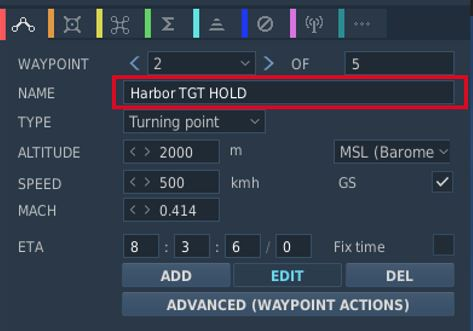

# Mission Editor

The F-4 has several special options selectable in the Mission Editor.

## Condition and Wear

_"And I'll tell you what, since Cal's on it, it's only flown on approved
cross-countries and drill weekends. Mint condition, folks, no over-Gs."_

All components of the aircraft simulate wear individually, yielding a unique
experience on each spawn, but also based on how the F-4 is flown.

It is generally differentiated between **Condition** and the **Wear and Tear**,
both are dynamic at spawn and can be influenced throughout a mission by various
factors such as forces, temperature and also combat damage.

The aircraft has thousands of components that are subject to this system. One
concrete example would be the speed of the Pave Spike Targeting Pod elevation
gimbal motor. Under perfect condition, it is supposed to have a speed of 60
degrees per second. However, a factory generally can not ensure this to always
be the case and accepts a variance, for example it must be within 1% error.

Mathematically, variance is simulated as **normal distribution**, consisting of
the parameters

- μ (Mu, mean) - the value it would have under perfect condition
- σ (Sigma) - the variance of the value

Around 70% of times the value will be within one unit of σ, in 95% of cases it
will be within 2 units of σ. Extreme cases above 3 units of σ are possible, but
very rare.

Said motor has for example a σ value of 3% around 60 degrees per second, meaning
that the vast majority of targeting pods will be produced with a motor capable
of moving the elevation gimbal between 58 and 62 degrees per second.

> 💡 Variance goes in both directions, your Phantom can also be faster than it
> is supposed to be.

### Aircraft Condition

An aircraft's condition generally refers to its factory and production quality.
For example, during war times a factory might run out of supplies and reduce
their acceptance criteria during production, generally increasing variance in
individual component performance.

Mission designers can control this aspect with the **Aircraft Condition**
slider, indicating quality from 0% (poor quality) to 100% (high quality).

For the Pave Spike motor this means that, when set to 0%, its speed variance σ
will increase from 3% to 8%, causing majority of pods to be produced with a
speed between 55 and 65 degrees per second instead.

Aircraft condition will always still be within limits that a manufacturer might
find reasonably acceptable. The aircraft is always still fully functional and
operational.

### Aircraft Wear and Tear

Additionally to production quality, components can degrade during service based
on time since the last overhaul, external factors like temperature and weather,
aggressive flying involving a lot of forces on the airframe, as well as combat
damage.

Mission designers can control this aspect with the **Aircraft Wear and Tear**
slider, indicating wear from 0% (no wear) to 100% (a lot of wear), or even
beyond that. For an aircraft that was just repaired and came fresh out of
service, 0% is appropriate. 100% refers to the latest point at which an aircraft
would reasonably be send back for maintenance, as it starts being less effective
in practice. Values beyond, such as 500%, can be used to represent scenarios in
which pilots are forced to fly an aircraft that operates exceptionally below its
expected performance level. It is still somewhat usable, nothing is straight out
broken, but components just do not behave within acceptable parameters anymore.

> 💡 Values beyond 100% cannot be set in the Mission Editor, but are achievable
> in-flight.

For the Pave Spike motor this means that, when set to 100% wear, its speed
variance σ will additionally increase by 20%. Assuming a good initial starting
condition, the motor will at that point likely operate between 45 and 75 degrees
per second.

### Reference Aircraft

The variance system at initial spawn can be turned off with this checkbox, if
desired. Components will then start with their mean value μ, without any
variance.

That is, with the option checked the setting for condition, as well as wear and
tear are ignored and disabled. The aircraft will spawn with all properties set
exactly as specified by the manufacturer and according to documentation, without
any variance.

This is especially interesting for competitions, where both sides should start
with the same conditions for fairness. Or when performing tests and computing
performance charts, where the aircraft should always start with the exact same
values.

> 💡 Even the reference aircraft is still subject to wear and tear during
> flight. In a competition, if you pull high Gs, your aircraft's component
> properties will deviate from your opponents.

## INS Reference Alignment Stored

This checkbox allows significant reduction of the time needed for a proper INS
alignment during cold-start.

Therefore, the ground crew would previously have started the aircraft and
executed a full alignment, then shut it down again, while memorizing parts of
the alignment data.

See the [INS section](../systems/nav_com/ins.md#heading-memory-alignment) for
details on how to execute a stored alignment.

## Allow Night Vision Goggles

Although F-4E crews never actually operated with NVGs, this option allows
mission designers to create modern or fictional scenarios where Phantom crews
might have access to such devices.

## TACAN Options

Allows to set the TACAN channel and band set when spawning initially.

## VOR/ILS Options

Allows to set the VOR/ILS frequency when spawning initially.

## KY-28 Encryption Key

Allows to set the encryption key used by the KY-28 communication encryption
system.

This setting is especially important when using tools such as ED-VOIP or SRS
that simulate encryption while using the radio equipment.

See the [KY-28 System](../systems/nav_com/encryption.md) for details.

## Chaff Double Dispense

An option available to the ground-crew on the AN/ALE-40 countermeasure
dispensers.

When selected, each signal to release chaff instead releases chaff on both sides
simultaneously.

See the
[AN/ALE-40 system](../systems/defensive_systems/countermeasures.md#chaff-double-cd)
for details.

## IFF Mode 2 Options

Allows to preselect a Mode 2 code for the IFF system.

## Laser Options

Allows to preselect a laser code for the targeting pod and laser-guided weapons.

## Radio Options

The editor allows to preset all 18 COMM and 20 AUX channels of the UHF radio:

It is possible to set up a station in the Mission Editor for use in ADF
navigation. To do this, a unit, such as a ground station, needs to be placed on
the map. This unit should then execute a command to tune into the desired AM
frequency (_Perform Command > Set Frequency_). Finally, the unit must transmit a
message continuously throughout the mission, which requires setting the message
to loop (_Perform Command > Transmit Message_).

Also, radio frequency parameters to read currently active UHF Radio frequencies
are provided for mission triggers:

| Parameter   | Description           |
|-------------|-----------------------|
| `COMM_FREQ` | Comm frequency in MHz |
| `AUX_FREQ`  | Aux frequency in MHz  |

## Flight Plan Preparation

The waypoints set in the Mission Editor will automatically be loaded into
Jesters Primary Flight Plan. Special waypoint types can be assigned by adding
specific capitalized phrases to the waypoint's name field. Recognized phrases
are:

- **VIP** (Nav Fix)
- **IP**
- **TGT** (Target)
- **F-IN** (Fence In)
- **F-OUT** (Fence Out)
- **HB** (Homebase)
- **ALT** (Alternate)
- **CAP**

See [5.2. Jester Navigation](../jester/navigation.md#flight-plan) for details on
how these waypoint types influence Jesters behavior.

## SetCommands

The F-4E features a list of set commands that can be used by mission makers. All commands are
executed silently as in Jester will neither deny nor confirm any commands. The SetCommands with
the Command ID, name and Values can be found in the table below:

| Command ID | Name                        | Value                          |
|------------|-----------------------------|--------------------------------|
| 20010      | Jester_silent               | 0-1                            |
| 20011      | Jester_pause                | 0-1                            |
| 20015      | Jester_tune_ARC_164_channel | 0.XX                           |
| 20016      | Jester_tune_TACAN_channel   | s0.XXXY                        |
| 20017      | Jester_deviate_to_tgt_zone  | 0.XX                           |
| 20018      | Jester_add_wpt_after        | 0.TTXXY                        |
| 20020      | Jester_resume_flightplan    | 0.XXY                          |
| 20021      | Jester_designate_wpt        | 0.DXXY                         |
| 20022      | Jester_set_cap_time         | 0.XX                           |
| 20023      | Jester_eject_WSO            | 0-1                            |
| 20025      | Jester_unlock_tgt           | 0-1                            |
| 20026      | Jester_radar_power          | 0.00 - 1.00 in 0.2 increments  |
| 20027      | Jester_radar_polar          | 0-1                            |
| 20028      | Jester_radar_range          | 0.00 - 1.00 in 0.2 increments  |
| 20029      | Jester_radar_maneuver       | 0-1                            |
| 20030      | Jester_radar_scan           | 0-1                            |
| 20031      | Jester_radar_aspect         | 0.00 - 1.00 in 0.2 increments  |
| 20032      | Jester_radar_rcvr_fine      | 0.00 - 1.00                    |
| 20033      | Jester_radar_rcvr_coarse    | 0.00 - 1.00                    |
| 20034      | Jester_radar_track          | 0.00 - 1.00 in 0.33 increments |
| 20035      | Jester_radar_display        | 0.00 - 1.00 in 0.2 increments  |
| 20036      | Jester_radar_man_vc         | 0.00 - 1.00 in 0.1 increments  |
| 20037      | Jester_radar_pulse          | 0-1                            |
| 20038      | Jester_radar_mode           | 0.00 - 1.00 in 0.2 increments  |
| 20039      | Jester_dispense             | 0-1                            |
| 20040      | Jester_air_to_air           | 0-1                            |
| 20041      | Jester_video_select         | 0-1                            |
| 20042      | Jester_context_short        | 0-1                            |
| 20043      | Jester_context_long         | 0-1                            |
| 20044      | Jester_context_double       | 0-1                            |
| 20045      | Jester_set_laser_code       | 0.XXXX                         |
| 20046      | Jester_set_wrcs_drag        | 0.XXX                          |
| 20047      | Jester_set_wrcs_alt_range   | 0.XXX                          |
| 20048      | Jester_set_wrcs_ew_dist     | s0.XXX                         |
| 20049      | Jester_set_wrcs_ns_dist     | s0.XXX                         |
| 20050      | Jester_set_wrcs_advance     | 0.XXX                          |
| 20051      | Jester_set_wrcs_range       | 0.XXX                          |

### Usage of SetCommands

This chapter will explain the use of the different SetCommands that have more complex values.

#### Jester_tune_ARC_164_channel

The value follows the format "0.XX," where "XX" is the two-digit channel number.

#### Jester_tune_TACAN_channel

The value follows the format "s0.XXXY," where "s" is an optional minus sign. Use negative values for
A/A (Air-to-Air) and positive for T/R (Transmit/Receive). "XXX" represents the three-digit channel
number, with leading zeros required for channels below 100. "Y" indicates the mode: "0" for X-mode
and "1" for Y-mode. For example, "0.0630" corresponds to channel 63X in T/R mode, while "-0.0081"
indicates channel 8Y in A/A mode.

#### Jester_deviate_to_tgt_zone

The value follows the format "0.XX," where "XX" is the WaypointZone number. Note that the trigger
zone must be named "WaypointZone." For example, "0.02" corresponds to "WaypointZone02."

#### Jester_add_wpt_after

The value follows the format "0.TTXXY," where "TT" is the waypoint zone number, "XX" is the waypoint
number, and "Y" is the flight plan number.

#### Jester_resume_flightplan

The value follows the format "0.XXY," where "XX" is the waypoint number (e.g., "01" for waypoint
1, "12" for waypoint 12), and "Y" is the flight plan number (default is 1 if not specified).
Examples include "0.05," which refers to turn point 5 in flight plan 1, and "0.102," which refers to
turn point 10 in flight plan 2.

#### Jester_designate_wpt

The value follows the format "0.DXXY," where "D" is the waypoint designation, "XX" is the waypoint
number (e.g., "01" for waypoint 1, "12" for waypoint 12), and "Y" is the flight plan number (default
is 1 if not specified). The waypoint designations are as follows:

- 0 -> Default
- 1 -> CAP
- 2 -> IP
- 3 -> Target
- 4 -> VIP
- 5 -> Silent VIP
- 6 -> Fence IN
- 7 -> Fence Out
- 8 -> Homebase
- 9 -> Alternate

For example, "0.005" indicates turn point 5 in flight plan 1 with a Default designation, while "
0.3102" represents turn point 10 in flight plan 2 with a Target designation.

#### Jester_set_cap_time

The value sets the CAP time for the active CAP pair in the format "0.XX," where "XX" represents the
number of minutes. For example, "0.05" corresponds to 5 minutes, and "0.12" corresponds to 12
minutes.

#### WRCS Entries and Laser Code

The WRCS Entries are used from 0.999 to 0.000 where 0.999 is the biggest value the WRCS can feature.
For Jester_set_wrcs_ew_dist and Jester_set_wrcs_ns_dist the s is for - . When a negative value is
entered it will put in West or South values respectively.

The laser code can be set by entering a valid laser code for XXXX. Note that Jester will not enter
invalid codes and will not respond in any way other than not entering the laser code.