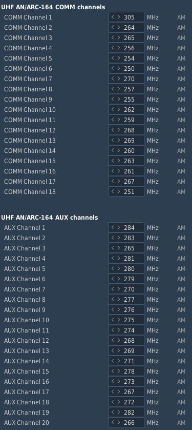

# Mission Editor

The F-4 has several special options selectable in the Mission Editor.

## Condition and Wear

All components of the aircraft simulate wear individually, yielding a unique
experience on each spawn, but also based on how the F-4 is flown.

It is generally differentiated between **Condition** and the **Wear and Tear**,
both are dynamic at spawn and can be influenced throughout a mission by various
factors such as forces, temperature and also combat damage.

The aircraft has thousands of components that are subject to this system. One
concrete example would be the speed of the Pave Spike Targeting Pod elevation
gimbal motor. Under perfect condition, it is supposed to have a speed of 60
degrees per second. However, a factory generally can not ensure this to always
be the case and accepts a variance, for example it must be within 1% error.

Mathematically, variance is simulated as **normal distribution**, consisting of
the parameters

- μ (Mu, mean) - the value it would have under perfect condition
- σ (Sigma) - the variance of the value

Around 70% of times the value will be within one unit of σ, in 95% of cases it
will be within 2 units of σ. Extreme cases above 3 units of σ are possible, but
very rare.

Said motor has for example a σ value of 3% around 60 degrees per second, meaning
that the vast majority of targeting pods will be produced with a motor capable
of moving the elevation gimbal between 58 and 62 degrees per second.

> 💡 Variance goes in both directions, your Phantom can also be faster than it
> is supposed to be.

### Aircraft Condition

An aircraft's condition generally refers to its factory and production quality.
For example, during war times a factory might run out of supplies and reduce
their acceptance criteria during production, generally increasing variance in
individual component performance.

Mission designers can control this aspect with the **Aircraft Condition**
slider, indicating quality from 0% (poor quality) to 100% (high quality).

For the Pave Spike motor this means that, when set to 0%, its speed variance σ
will increase from 3% to 8%, causing majority of pods to be produced with a
speed between 55 and 65 degrees per second instead.

Aircraft condition will always still be within limits that a manufacturer might
find reasonably acceptable. The aircraft is always still fully functional and
operational.

### Aircraft Wear and Tear

Additionally to production quality, components can degrade during service based
on time since the last overhaul, external factors like temperature and weather,
aggressive flying involving a lot of forces on the airframe, as well as combat
damage.

Mission designers can control this aspect with the **Aircraft Wear and Tear**
slider, indicating wear from 0% (no wear) to 100% (a lot of wear), or even
beyond that. For an aircraft that was just repaired and came fresh out of
service, 0% is appropriate. 100% refers to the latest point at which an aircraft
would reasonably be send back for maintenance, as it starts being less effective
in practice. Values beyond, such as 500%, can be used to represent scenarios in
which pilots are forced to fly an aircraft that operates exceptionally below its
expected performance level. It is still somewhat usable, nothing is straight out
broken, but components just do not behave within acceptable parameters anymore.

For the Pave Spike motor this means that, when set to 100% wear, its speed
variance σ will additionally increase by 20%. Assuming a good initial starting
condition, the motor will at that point likely operate between 45 and 75 degrees
per second.

### Reference Aircraft

The variance system at initial spawn can be turned off with this checkbox, if
desired. Components will then start with their mean value μ, without any
variance.

That is, with the option checked the setting for condition, as well as wear and
tear are ignored and disabled. The aircraft will spawn with all properties set
exactly as specified by the manufacturer and according to documentation, without
any variance.

This is especially interesting for competitions, where both sides should start
with the same conditions for fairness. Or when performing tests and computing
performance charts, where the aircraft should always start with the exact same
values.

> 💡 Even the reference aircraft is still subject to wear and tear during
> flight. In a competition, if you pull high Gs, your aircraft's component
> properties will deviate from your opponents.

## INS Reference Alignment Stored

This checkbox allows significant reduction of the time needed for a proper INS
alignment during cold-start.

Therefore, the ground crew would previously have started the aircraft and
executed a full alignment, then shut it down again, while memorizing parts of
the alignment data.

See the [INS section](../systems/nav_com/ins.md#heading-memory-alignment) for
details on how to execute a stored alignment.

## Allow Night Vision Goggles

Although F-4E crews never actually operated with NVGs, this option allows
mission designers to create modern or fictional scenarios where Phantom crews
might have access to such devices.

## TACAN Options

Allows to set the TACAN channel and band set when spawning initially.

## VOR/ILS Options

Allows to set the VOR/ILS frequency when spawning initially.

## KY-28 Encryption Key

Allows to set the encryption key used by the KY-28 communication encryption
system.

This setting is especially important when using tools such as ED-VOIP or SRS
that simulate encryption while using the radio equipment.

See the [KY-28 System](../systems/nav_com/encryption.md) for details.

## Chaff Double Dispense

An option available to the ground-crew on the AN/ALE-40 countermeasure
dispensers.

When selected, each signal to release chaff instead releases chaff on both sides
simultaneously.

See the
[AN/ALE-40 system](../systems/defensive_systems/countermeasures.md#chaff-double-cd)
for details.

## IFF Mode 2 Options

Allows to preselect a Mode 2 code for the IFF system.

## Laser Options

Allows to preselect a laser code for targeting pod and laser-guided weapons.

## Radio Options

The editor allows to preset all 18 COMM and 20 AUX channels of the UHF radio:

It is possible to set up a station in the Mission Editor for use in ADF
navigation. To do this, a unit, such as a ground station, needs to be placed on
the map. This unit should then execute a command to tune into the desired AM
frequency (_Perform Command > Set Frequency_). Finally, the unit must transmit a
message continuously throughout the mission, which requires setting the message
to loop (_Perform Command > Transmit Message_).

Also, radio frequency parameters to read currently active UHF Radio frequencies
are provided for mission triggers:

| Parameter   | Description           |
| ----------- | --------------------- |
| `COMM_FREQ` | Comm frequency in MHz |
| `AUX_FREQ`  | Aux frequency in MHz  |

