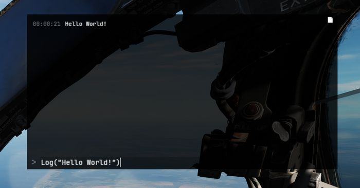
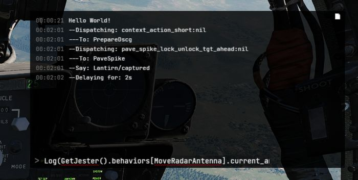

# Lua API

This gives a quick overview of Lua, which Jester is primarily coded in; and
explains the Jester API itself.

## Get started with Lua

Useful links:

- Lua Doc: <https://www.lua.org/docs.html>

### Tables

Lua in itself is a fairly simple language with not too many features. It
primarily revolves around the use of tables. Tables can be compared to arrays,
lists and dictionaries, or maps.

```lua
-- dictionary
local person = {
  name = "John",
  age = 20,
}

-- array/list
local fruits = { "Orange", "Apple", "Lemon" }
```

Arrays also implicitly decay to dictionaries with ascending keys `1`, `2`, etc.

Access can be either in a lookup-style `person["age"] = 21`, or like fields
`person.age = 21`.

In Lua, indices start **counting at 1:**

```lua
print(fruits[1]) -- Orange
```

The length of a table can be accessed using `#`:

```lua
-- appending to a table
fruits[#fruits + 1] = "Cherry"
```

Anything not explicitly set is given the value `nil`.

### Syntax example

```lua
function ageCheck(name, age)
  if age < 18 then
    print("Sorry", name)
  else
    print("Okay", name)
  end
end
```

### Classes

Lua itself does not provide classes. However, we created a framework to add
class-like structures to Lua:

```lua
local Class = require('base.Class')

local Person = Class()
Person.name = nil -- fields
Person.age = nil

function Person:Constructor(name, age)
  self.name = name
  self.age = age
end

Person:Seal() -- Prevent adding/removing more values/functions to it
```

The framework also supports inheritance:

```lua
local Class = require('base.Class')
local Behavior = require('base.Behavior')

local AssistAAR = Class(Behavior) -- inherits from Behavior
```

## Debugging

Unfortunately, we do not have any Lua debugger setup. One has to rely on caveman
debugging with prints.

To aid in that, Jester offers an in-game console UI (<kbd>RCTRL</kbd>+<kbd>L</kbd>).
This console displays any string logged via `Log(...)`.

Further, it offers a console prompt allowing execution of Lua code.



The prompt can also be used to inspect the running code, for example by entering
a command such as

```lua
Log(GetJester().behaviors[require('radar.MoveRadarAntenna')].current_antenna_degrees.value)
```



> 🚧 HB UI does not support the full keyboard yet, for example `().[]:"'` cannot be entered.
> It is thus recommended to prepare the prompt in an external text editor and simply
> copy-paste it into the UI instead.

We also provide a Lua playground in `WizardJester.lua`, which is always executed
directly on startup.

It is also possible to edit Lua files while DCS runs, without restarting the
game. Simply edit a LUA file and then reload the DCS mission with
<kbd>CTRL</kbd>+<kbd>R</kbd> and the new Lua file will be effective.

## Jester API

Jesters logic is divided into 6 layers of abstraction:

- Intention (_WIP_)
- Plan (_WIP_)
- Situation
- Behavior
- Task
- Action

Code is placed in the Mod-Folder, for example:

`G:\DCS World OpenBeta\Mods\aircraft\F-4E\Jester`

### Example

As an example that touches most of the layers, we want to create a feature that
lets Jester report the current speed every couple of seconds during flight.

Therefore, we start with a Situation. A situation needs an activation and
deactivation **Condition:**

```lua
-- Airborne.lua
local Class = require 'base.Class'
local Condition = require 'base.Condition'

local Airborne = {}
Airborne.True = Class(Condition)
Airborne.False = Class(Condition)

function IsAirborne()
  -- details on observations later
  return GetJester().awareness:GetObservation("airborne") or false
end

function Airborne.True:Check()
  return IsAirborne() -- activation condition
end

function Airborne.False:Check()
  return not IsAirborne() -- deactivation condition
end

Airborne.True:Seal()
Airborne.False:Seal()
return Airborne
```

Activation and deactivation conditions do not necessarily have to be the same.

Now, we can use this condition in our `Flight` situation and add our desired
behavior:

```lua
-- Flight.lua
local Class = require 'base.Class'
local Situation = require 'base.Situation'
local Airborne = require 'conditions.Airborne'
local ReportSpeed = require 'behaviors.ReportSpeed'
-- behavior will be defined in the next step

local Flight = Class(Situation)

-- it simply expects a class with a :Check() method
Flight:AddActivationConditions(Airborne.True:new())
Flight:AddDeactivationConditions(Airborne.False:new())

function Flight:OnActivation()
  self:AddBehavior(ReportSpeed) -- start our behavior
end

function Flight:OnDeactivation()
  self:RemoveBehavior(ReportSpeed) -- stop our behavior
end

Flight:Seal()
return Flight
```

The situation also has to be registered in `F-4E_WSO.lua` (_WIP_):

```lua
-- in F-4E_WSO.lua
...
function CreateF4E_WSOJester()
  ...
  wso::AddSituations(Flight:new())
  ...
end
```

Now, we can define our behavior:

```lua
-- ReportSpeed.lua
local Class = require('base.Class')
local Behavior = require('base.Behavior')
local SaySpeed = require('tasks.common.SaySpeed')
-- Task will be defined in the next step

local ReportSpeed = Class(Behavior)

function ReportSpeed:Constructor()
  Behavior.Constructor(self)
end

function ReportSpeed:Tick()
  -- this is called periodically
  local task = SaySpeed:new(...) -- access to speed explained later
  GetJester():AddTask(task)
end

ReportSpeed:Seal()
return ReportSpeed
```

Now, this would let Jester say something on every tick, a bit too verbose. To
improve on this, the Urge-system has been created. We can wrap our task in an
`Urge` and it will only be called on a set interval (which is automatically
applied some variance based on Jesters fixation and stress level):

```lua
-- ReportSpeed.lua
local Class = require('base.Class')
local Behavior = require('base.Behavior')
local Urge = require('base.Urge') -- added
local StressReaction = require('base.StressReaction') -- added
local SaySpeed = require('tasks.common.SaySpeed')

local ReportSpeed = Class(Behavior)

function ReportSpeed:Constructor()
  Behavior.Constructor(self)

  -- logic of the behavior
  local say_speed = function ()
    -- very simple in this case,
    -- but could also trigger multiple tasks based on conditions, if desired
    local task = SaySpeed:new(...)
    GetJester():AddTask(task)
    return {task}
  end

  -- define the urge
  self.urge = Urge:new({
    time_to_release = s(10), -- baseline interval (10s now)
    on_release_function = say_speed, -- what to execute
    stress_reaction = StressReaction.ignorance, -- how important is this to Jester
  })
  self.urge:Restart() -- start it
end

function ReportSpeed:Tick()
  -- we could also modify the urge now, if desired
  -- for example increasing the stress level
  self.urge:Tick() -- tick it
end

ReportSpeed:Seal()
return ReportSpeed
```

The next step is to create the actual Task that will take care of reporting the
given speed:

```lua
-- SaySpeed.lua
local Class = require('base.Class')
local Task = require('base.Task')
local SayAction = require('actions.SayAction')

local SaySpeed = Class(Task)

function SaySpeed:Constructor(speed)
  Task.Constructor(self)

  local on_activation = function()
    if speed < kt(500) then
      -- see PhrasesList.txt for all supported voice lines
      self:AddAction(SayAction('awareness/wereslow'))
    else
      self:AddAction(SayAction('awareness/werefast'))
    end
  end

  self:AddOnActivationCallback(on_activation)
end

SaySpeed:Seal()
return SaySpeed
```

The last part is the final `Action`, in our case `SayAction`. Actions are
usually very generic and basic. In most cases, the existing `SayAction` will be
all thats needed. Refer to `SayAction.lua` for how it works.

If a behavior has no extra need for a specific task and just wants to say a
phrase, one can also directly use `SayTask`:

```lua
-- in a Behaviors logic
...
local task = SayTask:new('misc/outoffuel')
GetJester():AddTask(task)
...
```

### LReal and units

A very common need is to work with real values and units, such as speed or time.
Therefore, we have `LReal`s, with units defined in `LUnit`.

```lua
local time = min(15)
local speed = kt(500)
local fuel = lb(12000)

if time > s(10) then
  print("foo")
end

time = time - s(40)
```

Careful when doing scalar operations:

```lua
-- correct
time *= 2

-- incorrect
time *= s(2)
```

Latter would result in an invalid `LReal`, which can be checked for using
`time:IsValid()`.

If necessary, values can be converted to another unit:

```lua
local timeInSeconds = time:ConvertTo(s)
print("Time:", timeInSeconds)
```

`time.value` would access the raw underlying number.

### Accessing properties

Lua has full access to all `Property`s defined in our components and can access
them easily with `GetProperty`:

```lua
function GetTotalFuelQuantity()
  local gauge_readout = GetProperty(
    "/Pilot Fuel Quantity Indicator/Fuel Meter", -- path
    "Internal Fuel Quantity Indication" -- property name
  ).value

  return gauge_readout or lb(10000)
end
```

`GetProperty` expects the full path to the component within the component-tree
(that are all names of parent components), they must start with `/` to
indicate an absolute path.

The returned value is a wrapper `Property` object. Access to the underlying
value (in this case a `LReal` with unit `Pounds`) is given by
`GetProperty(...).value`.

### Observations and Senses

Additionally to direct property access, Jester has an Observation-System. The
system allows to make frequently used data accessible in an easy way, or also to
provide more complex data, i.e. coming from the DCS SDK.

Observations are part of `Sense`s, of which Jester has several (eyes, ears, …).
As of now, most of them are _WIP_.

```lua
local isAirborne = GetJester().awareness:GetObservation("airborne") or false
```

## Interactions

One key aspect of Jester is that he can interact with the cockpit by clicking
switches, buttons and turning knobs.

Therefore, the API offers two approaches.

### Component Interactions

The preferred way to interact with the cockpit is via the component system.

To allow interaction, a manipulator has to be registered at `F_4E_WSO_Cockpit.lua`:

```lua
-- ChaffMode: OFF, SGL, MULT, PROG
self:AddManipulator(
  "Chaff Mode",
  {component_path = "/WSO Cockpit/WSO Left Console/AN_ALE-40 CCU/Chaff Mode Knob"}
)
```

After that, it can easily be interacted with, for example:

```lua
task:AddAction(SwitchAction:new("Chaff Mode", "MULT"))
-- or in short
task:Click("Chaff Mode", "MULT")
```

or reading its current value:

```lua
local cockpit = GetJester():GetCockpit()
local chaff_mode = cockpit:GetManipulator("Chaff Mode"):GetState()
```

### Raw Interactions

If the desired switch does not support the component interface yet,
one can instead fall back on a raw interface that invokes DCS commands directly,
as if the player would have triggered a bind manually.

```lua
-- sends value 1 via command WSO_EJECT_INSTANT to device EJECTION_SEAT_SYSTEM
ClickRaw(devices.EJECTION_SEAT_SYSTEM, device_commands.WSO_EJECT_INSTANT, 1)

-- sends the value corresponding to position 2 on a 7-position knob
ClickRawKnob(devices.HUD_AN_ASG_26, device_commands.HUD_SelectHUDMode, 2, 7)
```

See `devices.lua` for all available devices and likewise `command_defs.lua` for
the commands.

In general, Knobs and 2-pos switches use the range `[0, 1]` for values, while
3-pos switches often (but not always) use `[-1, +1]`. For 3-pos switches `-1` is
usually used to move a 3-pos switch down, `+1` to move it up - but some switches
have a different orientation. See `default.lua` and `clickabledata.lua` to learn
more about a specific switch and how it reacts to values.

## Events

Next to clicking switches, Jester can react to events send either from C++ or
also from within Lua. The system follows a simple observer/listener pattern:

```lua
ListenTo("go_silent", "Radar", function(task)
  task:Click("Radar Power", "STBY")
end)
```

with:

```lua
if is_aar then
  DispatchEvent("go_silent")
end
```

## Task API

A core aspect of writing logic for Jester revolves around using the `Task` class.
Tasks consist of a sequence of `Action`s. A task can be paused, resumed or cancelled entirely by
the system if necessary.

Actions are, by design, executed asynchronously. Executing a click will take some time and
not execute instantly. In particular, adding a click action to a task will not block the code,
it simply gets added to the chain of actions to execute eventually.

This concept is similar to Future-APIs in other languages and `Task` offers a fluent-API to deal
with it conveniently.

Consider the following example:

```lua
local task = Task:new()
task:Roger()
  :Click("Radar Power", "OPER")
  :Wait(min(4))
  :Click("Screen Mode", "radar")
  :Say("phrases/radar_ready")
  :Then(function()
    self.scan_for_bandits = true
  end)
```

Among other functions, the API offers:

- `AddAction` - any `Action`, basis for the API
- `Then` - anonymous function
- `Wait` - time
- `WaitUntil` - predicate
- `Say` - phrase
- `Roger`
- `CantDo`
- `Click` - name, state
- `ClickFast` - name, state
- `ClickShort` - name, state
- `ClickShortFast` - name, state

Refer to `Task.lua` for details.

## UI

Jester provides two types of user interfaces. A wheel with selectable options
and a dialog with questions and selectable answers that are shown on demand. See
[Wheel UI](wheel_ui.md) and [Dialog UI](dialog_ui.md) for more.
