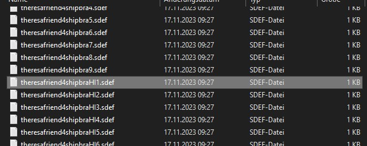

# Voice Files

Jesters entire library of phrases can be found in the Mod-Folder, for example:

`G:\DCS World OpenBeta\Mods\aircraft\F-4E\Sounds\Jester`

When editing sounds, it is necessary to restart DCS. Just reloading the mission
is not enough for changes to take effect.

## sdef

For DCS to understand the files, sound-definition-files (sdef) are located in:

`G:\DCS World OpenBeta\Mods\aircraft\F-4E\Sounds\sdef\Jester`

A sdef-file is a plain text-file that can be edited with any text-editor. Next to locating the
actual sound file, it can define properties such as gain or fade-in/-out effects,
as well as positioning the sound effect within the world when played.

```ini
wave = "Jester/Contacts/theresafriend4shipbraHI1"
inner_radius = 10
outer_radius = 100
position = {0.0, 0.0, 0.0}
gain = 2
streaming = false
preload = false
```

## Variations



When placing multiple sound files with the same name, suffixed by an incrementing number,
DCS will automatically play any of the files randomly.

That way, variations can be created, to prevent always playing the exact same sound.

## Mood

Jester sounds can be suffixed with `HI` to indicate variants that should only be played
when Jester is in a stressed mood. `HI` files might for example have Jester
screaming instead of talking calm.
