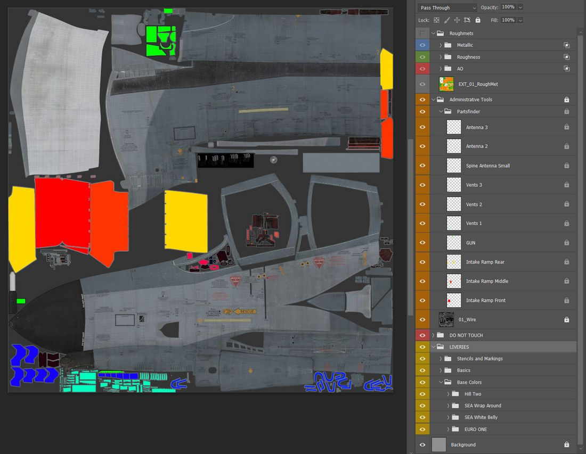
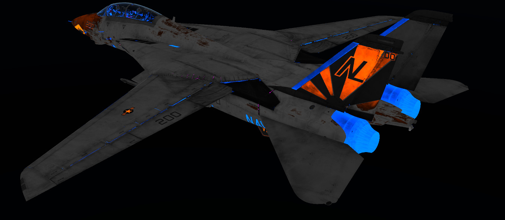

# Liveries

*"We got them in two-tone gray. We got them in two-tone green.
We can get them in hot fuchsia pink."*

Creating Liveries for our F-4E can be tedious work.

Typically, the largest chunk of time goes into researching on the web and in
books to provide the most accurate, realistic Liveries.

With the release of the F-4E Phantom II, we want to see what you have in store
for the F-4. To support you in your creative ways of recreating your favorite
Livery, there is a few things to learn regarding the jet and how it is
represented in DCS.

## Paintkit



The Paintkit has been created with ease of use in mind. It allows unwrapping the
3D Object onto a 2D space.

To provide the highest quality available, the Paintkit comes in **Linear Color
Space** and **16 Bit Color depth**. Bear in mind that not every Graphics Suite
will handle this correctly. The Paintkit was created using Adobe Photoshop.
Saving in 16 Bit Color depth will take a while, so be patient when hitting
_Save_ in your Graphics Application.

The kit also provides a layer stack _Administrative Tools_, which also contains
the _Wireframe unwrap_ helping to aligning your art.

The folder called _Partsfinder_ helps identify pieces that belong together on
the _UV Unwrap_ for certain parts. There is no padding applied there, so if you
use them for your selection, you might want to expand your selection by a few
pixels to get rid of artifacts on the seams.

> 💡 You can link files in Photoshop. This means you can create art, save it as
> a file and then link it in your Paintkit file. This makes for a non
> destructive workflow which allows you to changes things afterwards if you are
> not satisfied with your result.

## PBR Rendering and RoughMet File

Next to your _Albedo File_ which you create by exporting your custom Livery out
of the Paintkit, you will need the _RoughMet File_ to make the most out of your
custom livery.

We provide you the uncompressed RoughMet files within the Paintkit files. DCS
uses **Physical Based Rendering** to create the picture you see on your monitor
or through your VR Headset.

The RoughMet files makes use of the three RGB Channels:

- Red -> Ambient Occlusion (pre baked Shadows)
- Blue -> Metallic (Defines if a Surface is metallic or not)
- Green -> Roughness (is the Surface super smooth or really rough)

Since the Roughmet File is in the **8Bit RGB Range of Colors**, per channel, you
get 255 Values to define the named attributes. Visually this is represented per
channel with a value of 0 for Black and a value of 255 for White.



### Avoid bright or dark colors

Together with what is defined in the RoughMet, the DCS engine renders the
picture. You must avoid using very bright or dark and 100% saturated Colors, as
otherwise that leads to DCS not being able to create proper effects when the
surface is hit by direct sunlight.

Mathematically, the engine can not render a color greater than the available
color space. So if you want a bright yellow marking on your jet, reduce the
saturation by around 15% as well as the brightness.

Ultimately you can check if your textures are withing the **PBR Spectrum** by
loading up your Custom Livery in the DCS _Modelviewer_ and hit <kbd>F8</kbd>
which reveals the issue in the **Material Errors View**. If you see an orange or
magenta color here, it means that the Renderer cannot draw the full effects on
it since the base color (**Albedo**) is too bright or saturated.

> 💡 There are many great sources out there to learn more about Physical Based
> Rendering and you're always welcome to ask us directly in our
> [Discord](https://discord.com/servers/heatblur-simulations-1071433028045377637)
> or on the [Forum](https://forum.dcs.world/forum/919-dcs-f-4-phantom/).

## Character Customization

The Phantom features [Character Customization](../character.md#customization).

Until the feature and its UI is fully available at a later point during Early
Access, some of its features can already be accessed directly by modifying the
`description.lua` file of your Livery.

Here's a snipped of the area you need to look at:

```lua
custom_args =
{
  [512] = 0.3, -- 0 is no mirrors, 0 - 0.4 is both mirrors (mickey mouse) and 0.5+ is top mirror only.
  [2008] = 0.95, --WSO Helmet, 0.95 is HGU-55
  [2006] = 0.95, --Pilot Helmet, 0.95 is HGU-55 (expand list of draw args)
}
```

Find the `custom_args` section which is usually towards the bottom of the file.
The numbers inside `[]` represents the **Draw Argument** used by DCS to tell the
model what your Pilot (and also the aircraft itself) wears.

Draw Argument `[512]` represents the **Mirrors on the WSO Canopy**. It can be
set to a value between 0.0 to 1.0, representing the animation range of the Draw
Argument.

This value is used to give your pilot a certain helmet, gloves or similar. Or
even to define the gender of the pilot model.

`[2006]` is the Draw Argument for the Pilot Helmet. Set it to `0.1` and your
pilot will wear an old school HGU-2 helmet. Set it to `0.95` and he will be
wearing a more modern HGU-55.

## Applying Custom Paints

To apply a custom texture to the jet, copy an existing and replace the files
while keeping the names. You can find a small library of textures to cut down on
the overall size of a Livery in the _commons_ folder under
`\CoreMods\aircraft\F-4E\Liveries\F-4E-45MC\commons`.

Trying to keep folder depth shallow this at first might look a bit messy but it
actually makes it easier to apply the texture in your `description.lua` and does
not bloat it too much with long folder paths.

### Example

The Folder _ALQ131_g_ contains a Livery for the ALQ-131 Pod in Olive/Green
colors. You can tell your `description.lua` to use this texture instead of the
default white color from DCS when equipping the ALQ-131 to the Phantom in-game
by putting the following line of code into your `description.lua` file for both
the Albedo and the Roughmet Texture:

```lua
{ "ALQ_131", 0, "../commons/alq131_g/alq_131_diff", false };
{ "ALQ_131", ROUGHNESS_METALLIC, "../commons/alq131_g/alq_131_diff_roughmet", false };
```

The first value after the `{` in Brackets `""` is the Material Name, in this
case the `"ALQ_131"`. It can be a bit tricky to find these Material names
through DCS. Feel free to ask in our
[Discord](https://discord.com/servers/heatblur-simulations-1071433028045377637)
in the **#liveries-lair** channel for help on this.

Using the same principle, you can apply custom Flight Suit textures to your
Pilot as well as a HGU-2 Texture. Here is an example of a German Luftwaffe F-4F
Pilot and the WSO being equipped with German Luftwaffe Flight Suits and Grey
HGU-2 Helmets:

```lua
{ "PILOT_HGU-2_Helmet", 0, "../commons/HGU2_g/HGU-2_Helmet", false };
{ "PILOT_HB_Char_RobinOlds_CWU", 0, "../commons/LGFS/hb_char_robinolds_cwu", false };
{ "PILOT_HB_Char_RobinOlds_overall", 0, "../commons/LGFS/hb_char_robinolds_overall", false };
{ "PILOT_HB_Char_RobinOlds_overall", NORMAL_MAP,
  "../commons/LGFS/hb_char_robinolds_overall_nrm", false };
{ "PILOT_HB_Char_RobinOlds_roughmet", ROUGHNESS_METALLIC,
  "../commons/LGFS/hb_char_robinolds_overall_roughmet", false };

{ "WSO_HGU-2_Helmet", 0, "../commons/HGU2_g/HGU-2_Helmet", false };
{ "WSO_HB_Char_RobinOlds_CWU", 0, "../commons/LGFS/hb_char_robinolds_cwu", false };
{ "WSO_HB_Char_RobinOlds_overall", 0, "../commons/LGFS/hb_char_robinolds_overall", false };
{ "WSO_HB_Char_RobinOlds_overall", NORMAL_MAP,
  "../commons/LGFS/hb_char_robinolds_overall_nrm", false };
{ "WSO_HB_Char_RobinOlds_roughmet", ROUGHNESS_METALLIC,
  "../commons/LGFS/hb_char_robinolds_overall_roughmet", false };
```
