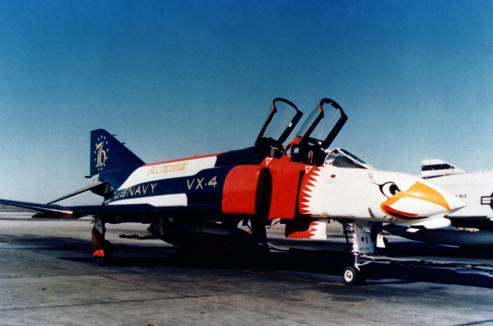

# DCS

This chapter contains systems, settings and interfaces specific to
the simulation of the Phantom inside DCS.

Of special note is a [modding guide](modding/overview.md) and explanation available
to [mission designers](mission_editor.md).

*Bicentennial themed F-4 Phantom II*
