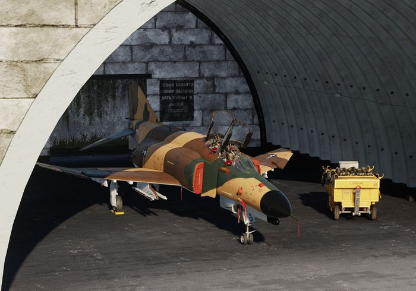

# Persistence

The module features a persistence system that allows saving the aircraft's
current state, making it available for a subsequent flight - even across
missions.

> 💡 Aircraft persistence can be a great feature for **campaign builders**,
> simulating that the pilot has to re-use the same aircraft across several
> missions of the campaign.

The aircraft state includes all its properties, as well as its components
[wear, tear and condition](mission_editor.md#condition-and-wear). This also
includes positions of switches and knobs. Damaged components are **automatically
repaired** between flights.

> 💡 Depending on the spawn type, the ground crew might change some switches and
> knobs while preparing the aircraft for the pilot in advance. Important switches
> are placed in their correct initial positions, regardless of how the player
> left them previously.

With persistence enabled, the state of the aircraft will be automatically saved
when the aircraft is **successfully left on ground** (for example not in-flight
or after a crash).

## Aircraft Key

A persisted aircraft is saved as file located in the **Saved Games** folder. A
possible path might for example look like:

`C:\Users\John Doe\Saved Games\DCS_F4E\cache\persistent_ac`

The name of the file is the _aircraft key_ used to identify a particular
persisted aircraft.

These keys are either automatically generated based on **Livery** and **Tail
Number** of the aircraft, or set explicitly by the author of a mission through
Mission Editor settings.

## Enable

There are two ways to enable the persistence system to save and load the
aircraft state.

### Special Setting

The user can setup persistency in their Special Settings by checking
[Persistent Aircraft (by livery and tail number)](special_options.md#persistent-aircraft-by-livery-and-tail-number).

The bind **Initialize Persistent Aircraft State** (<kbd>LCTRL</kbd>+<kbd>P</kbd>)
must be pressed on first use to start tracking this particular aircraft.

The aircraft is tracked by its livery and tail number. Any subsequent mission
flown with the same combination of livery and tail number, while aircraft
persistence is enabled, will load this particular aircraft.

### Mission Editor

The author of a mission can overrule any user made special settings for their
mission by enabling or disabling the persistence systems through Mission Editor
settings.

The option [Spawn Type: Persistent](mission_editor.md#persistent) enables the
system and [Persistent Aircraft Key](mission_editor.md#persistent-aircraft-key)
is used determine which particular tracked aircraft is flown in this mission.

> 💡 If the livery and/or tail number is changed in-game via the Rearm menu,
> the aircraft will not automatically load the persistent state for the new choice.
> Press **Reload Aircraft** (<kbd>LCTRL</kbd>+<kbd>R</kbd>) bind to load the state for the newly selected
> livery/tail number. Reloading the aircraft will return cockpit switches and knobs
> to their initialization state.
> It is recommended to change livery/tail number and reload at the very beginning
> of the flight.