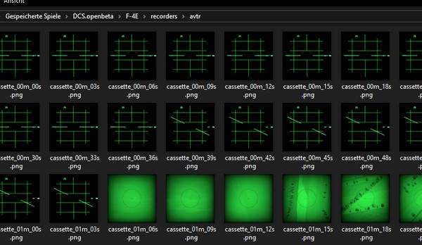

# 录像设备

飞机上配备了多种录像设备，如 AVTR 或照相枪。

设备可以录制游戏中的画面，这些画面可以在游戏外的 **保存的游戏** 文件夹中访问。 例如，可能的路径如下
：

`C:\用户\John Doe\保存的游戏\DCS_F4E\recorders\`

## 机载录像机

AVTR 录制的图像在

`C:\用户\John Doe\保存的游戏\DCS_F4E\recorders\avtr\`

文件夹中，开始录制后，系统将每三秒保存一次 PNG 格式图片。单盒磁带最长可录制 20 分钟音像并且如果倒带
的话，将会擦除先前录制的音像。

> 💡 录制限制在最多 400 个文件，两种文件分别为 50 KB（雷达）到 400 KB（电视），总计最高 160 MB。

详见
[2.1.10.3 AVTR 系统](../cockpit/pilot/right_console/aft_section.md#airborne-video-tape-recorder) 和
[2.2.2 AVTR 控制](../cockpit/wso/left_sub_panel.md#avtr-control) 来了解如何操作设备。
