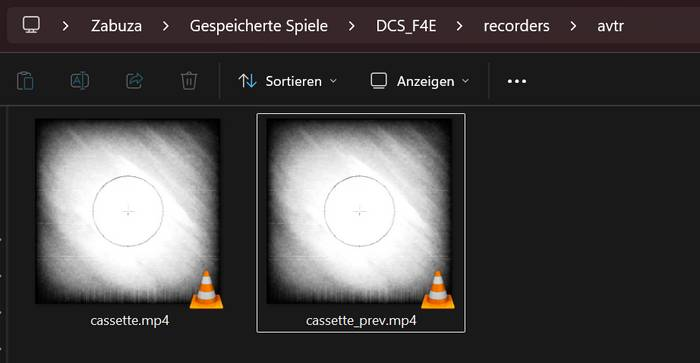

# Recorders

The aircraft is equipped with multiple recording devices, such as the AVTR or
the Gun Camera.

They are capable of recording in-game footage, which is accessible outside of
the game in the **Saved Games** folder. A possible path might for example look
like:

`C:\Users\John Doe\Saved Games\DCS_F4E\recorders\`

## Airborne Video Tape Recorder

The AVTR records footage into folder

`C:\Users\John Doe\Saved Games\DCS_F4E\recorders\avtr\`

as an `mp4` video file. The folder holds up to two recordings, `cassette.mp4`
and `cassette_prev.mp4`. Any subsequent footage will then overwrite the
existing.

See
[2.1.10.3 AVTR System](../cockpit/pilot/right_console/aft_section.md#airborne-video-tape-recorder)
and [2.2.2 AVTR Control](../cockpit/wso/left_sub_panel.md#avtr-control) for
details on how to operate the device.
